## 1. 이 패키지는 무엇인가

### 한 줄 소개

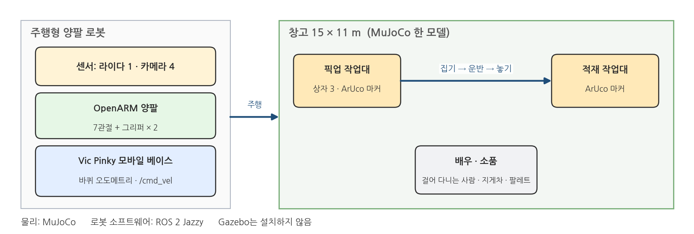{width=1000}

### 물리 엔진은 MuJoCo, 로봇 소프트웨어는 ROS 2

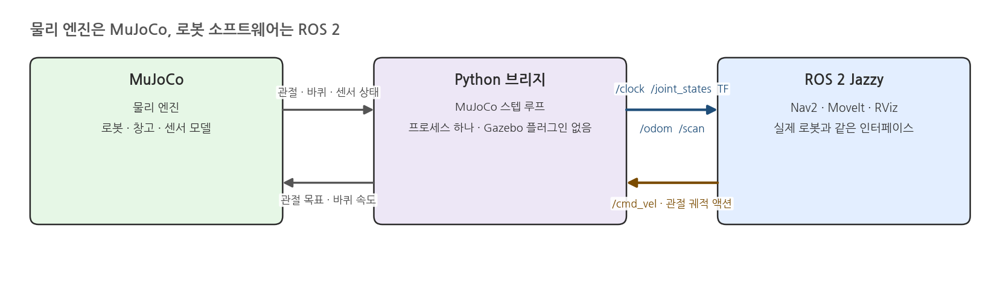{width=1000}

### 주행

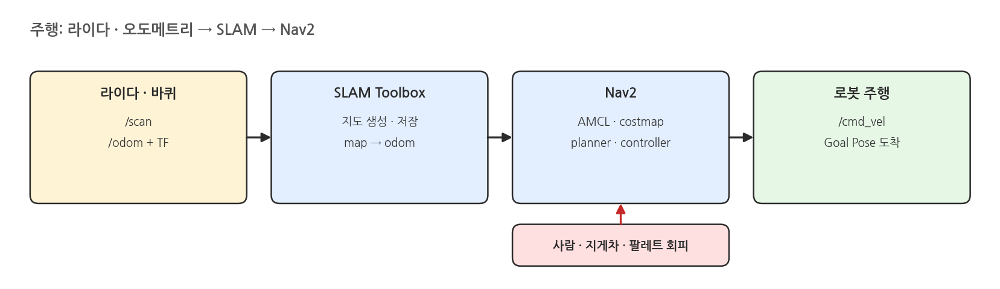{width=1000}

### 양팔 Manipulation

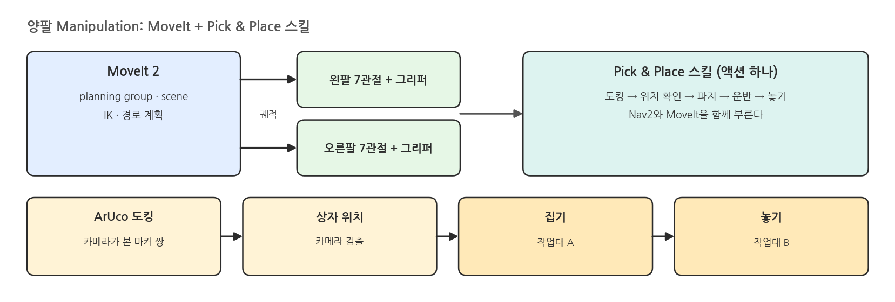{width=1000}

### 카메라는 Python 직접 수신

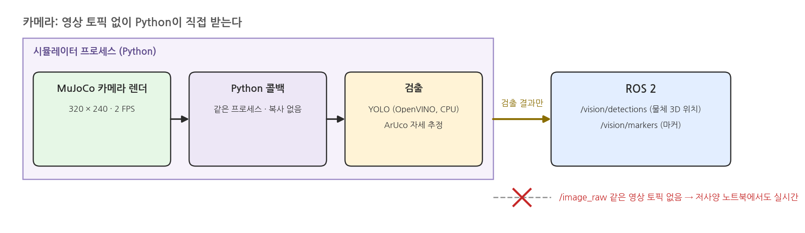{width=1000}

### LMM 연결

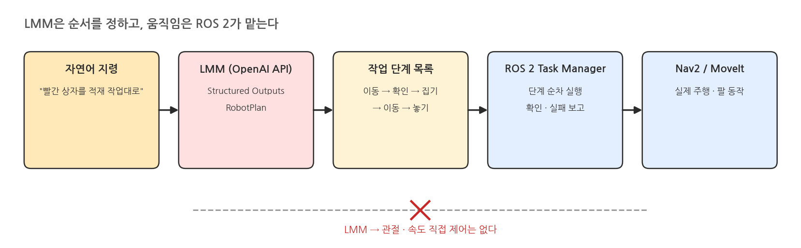{width=1000}

### 전체 구조

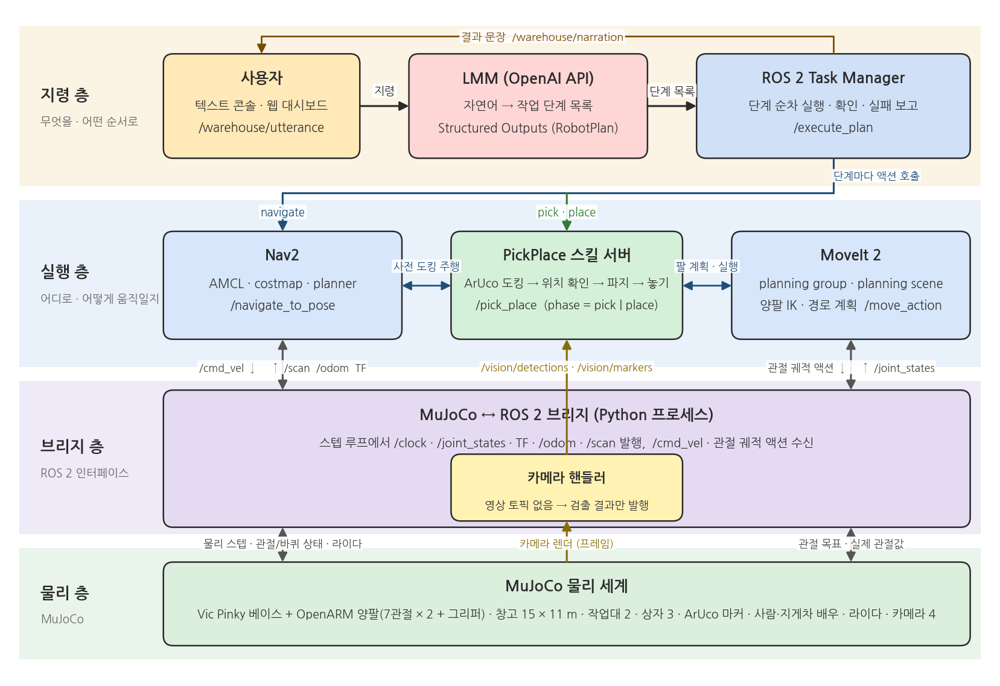{width=1000}

### 네 층의 역할

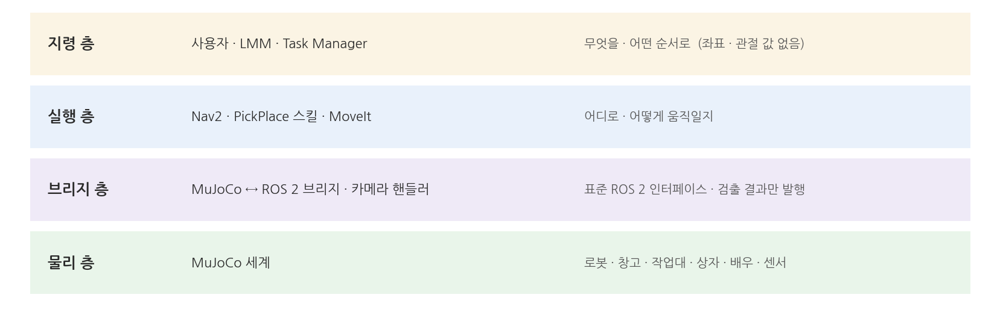{width=1000}

### 한 줄 요약

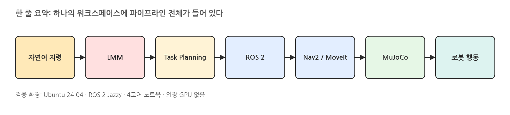{width=1000}

- **자연어 지령 → LMM → Task Planning → ROS 2 → Nav2 / MoveIt → MuJoCo → 로봇 행동**
- 전체 파이프라인이 하나의 워크스페이스에 포함
- 검증 환경: Ubuntu 24.04, ROS 2 Jazzy, 외장 GPU 없는 4코어 노트북

## 2. 수업 형식: 단기 과정

### 수업의 성격

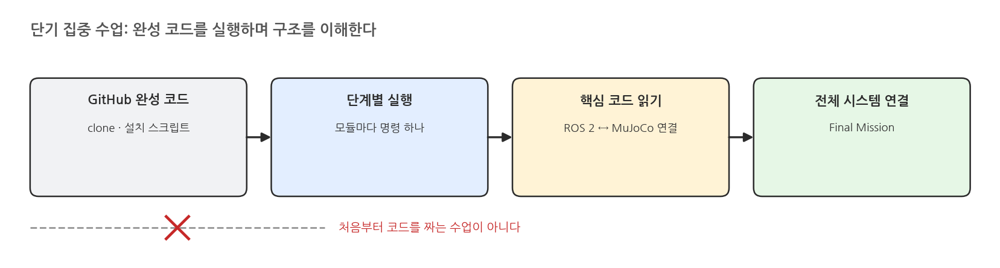{width=1000}

### 대상과 환경

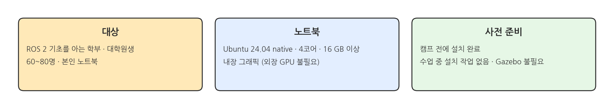{width=1000}

### 모듈 진행 방식

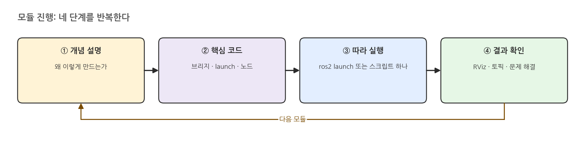{width=1000}

- 모듈별 진행 순서: 개념 설명 → 핵심 코드 설명 → 따라 실행 → 결과 확인 · 문제 해결
- 각 모듈은 `ros2 launch` 또는 스크립트 명령 하나로 실행

### 전반부 · 후반부 목표

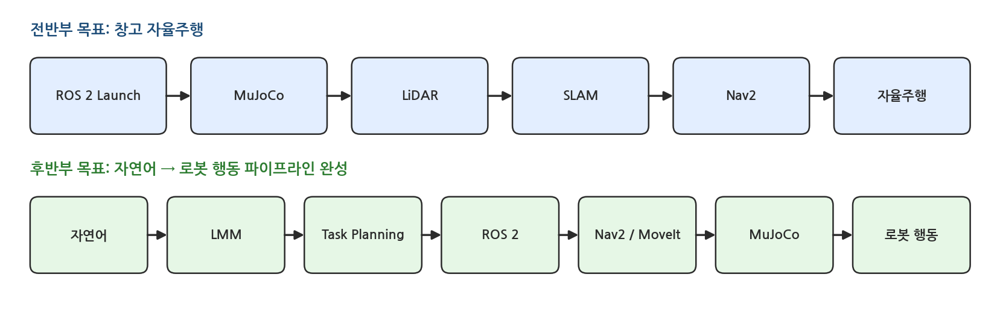{width=1000}

- 전반부: ROS 2 Launch → MuJoCo → LiDAR → SLAM → Nav2 연결 → 양팔 로봇의 창고 자율주행
- 후반부: 자연어 명령 → LMM → Task Planning → ROS 2 → Nav2 / MoveIt → MuJoCo → 로봇 행동 파이프라인 완성

## 3. 커리큘럼

### 전반부 — MuJoCo(비 Gazebo) + ROS 2 로봇 시스템 구축

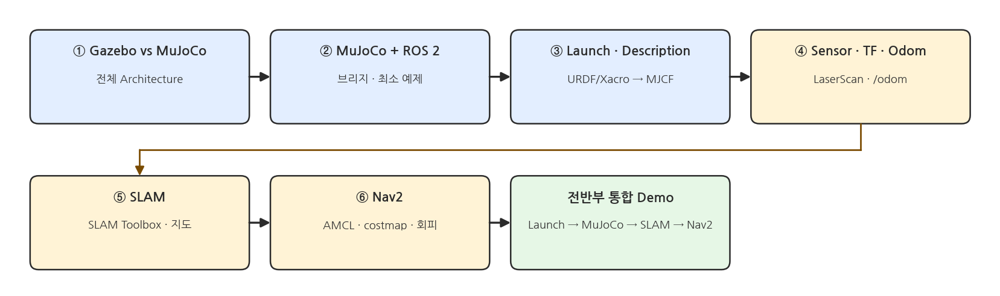{width=1000}

### 후반부 — MoveIt + Mobile Manipulation + LMM

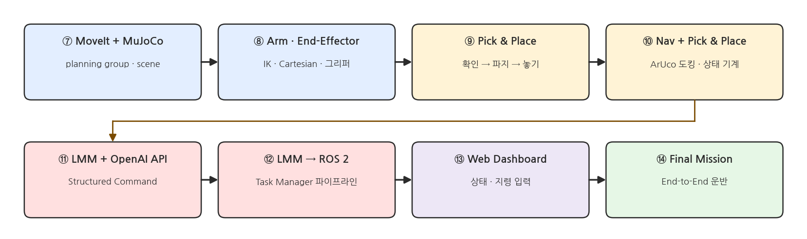{width=1000}

### 핵심 파이프라인

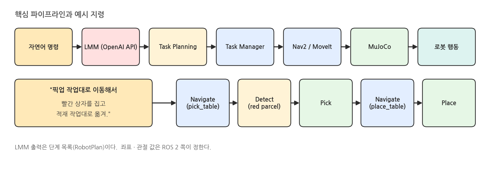{width=1000}

## 4. 이 과정에서 익히는 기술 스택

### A. 시뮬레이션 · ROS 2 · 모델 · 센서 (모듈 ①~④)

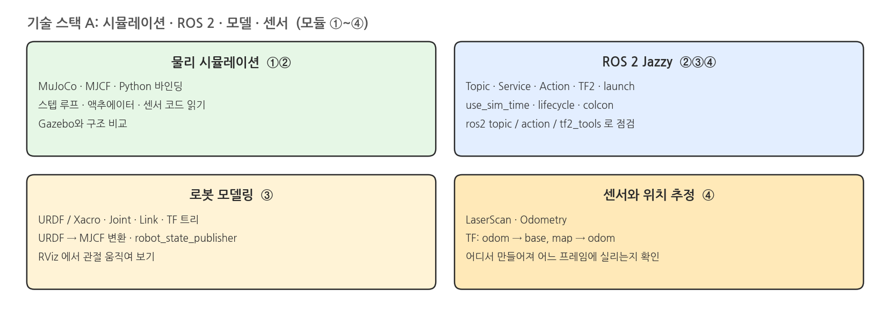{width=1000}

### B. 주행 · Manipulation · 인지 · Pick & Place (모듈 ⑤~⑩)

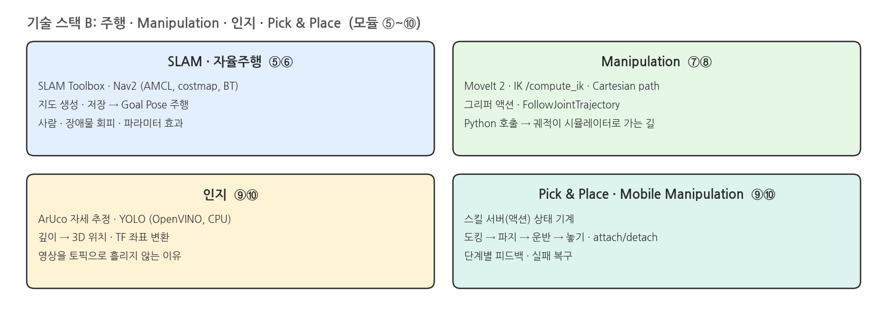{width=1000}

### C. LMM · Task Planning · UI · 개발 도구 (모듈 ⑪~⑭)

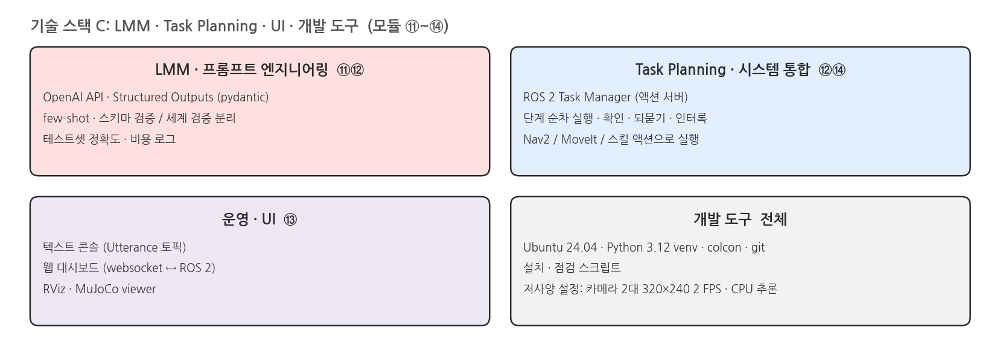{width=1000}

### 쌓이는 순서

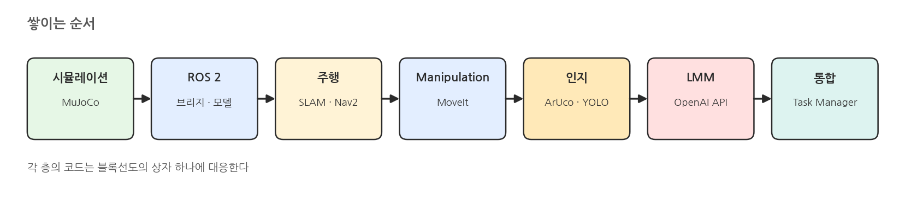{width=1000}

## 5. 코드 저장소

### 저장소 구성

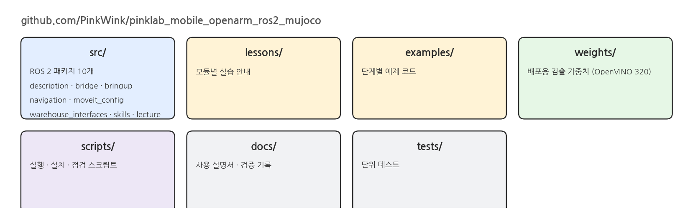{width=1000}

- 완성 코드 GitHub 공개 저장소: **https://github.com/PinkWink/pinklab_mobile_openarm_ros2_mujoco**
- `src/`: ROS 2 패키지 10개 (로봇 description, MuJoCo 브리지, bringup, navigation, moveit_config, warehouse_interfaces / skills / lecture)
- `lessons/`: 모듈별 실습 안내 · `examples/`: 단계별 예제 · `weights/`: 배포용 검출 가중치
- `scripts/`: 실행 · 설치 스크립트 · `docs/`: 사용 설명서와 검증 기록 · `tests/`: 단위 테스트

### 설치와 문의

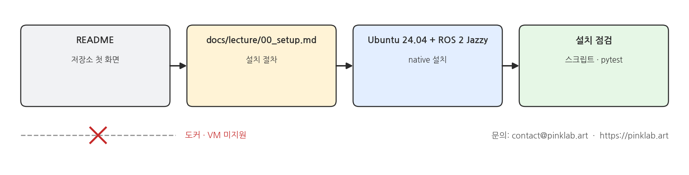{width=1000}

- 설치 절차: 저장소 README와 `docs/lecture/00_setup.md` 참조
- 기준 환경: Ubuntu 24.04 + ROS 2 Jazzy(native) · 도커 · VM 미지원
- 교육 · 협업 문의: contact@pinklab.art (https://pinklab.art)
