## 1. Gazebo vs MuJoCo

### 두 시뮬레이터

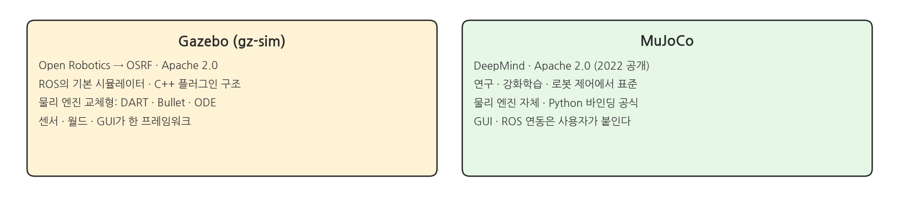{width=1000}

- Gazebo는 ROS의 기본 시뮬레이터다. 서버 · 플러그인 · GUI가 한 프레임워크에 들어 있다.
- MuJoCo는 물리 엔진이다. 연구 · 강화학습 · 로봇 제어에서 표준으로 쓰인다.
- 둘 다 Apache 2.0 오픈소스다. 차이는 "얼마나 많은 것을 대신 해 주는가"에 있다.

### 구조 비교

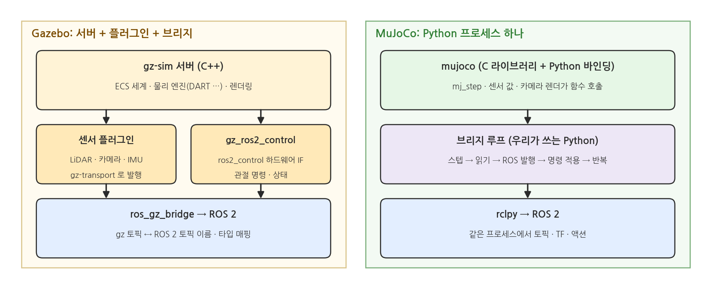{width=1000}

- Gazebo: gz-sim 서버가 세계를 돌린다. 센서 플러그인과 gz_ros2_control이 값을 낸다. ros_gz_bridge가 ROS 2 토픽으로 바꾼다.
- MuJoCo: Python 프로세스 하나다. `mj_step`을 부르고, 값을 읽고, rclpy로 발행한다.
- Gazebo는 층이 셋이다. MuJoCo는 우리가 쓴 루프 하나다.

### 물리 연산 방식

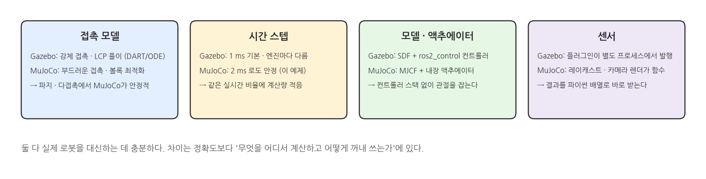{width=1000}

- 접촉: Gazebo(DART · ODE)는 강체 접촉을 LCP로 푼다. MuJoCo는 부드러운 접촉을 볼록 최적화로 푼다. 파지처럼 접촉이 많을 때 MuJoCo가 안정적이다.
- 시간 스텝: MuJoCo는 2 ms로도 안정하다. 같은 실시간 비율에서 계산량이 적다.
- 액추에이터: MuJoCo는 위치 · 속도 · 힘 액추에이터가 모델 안에 있다. 컨트롤러 스택 없이 관절을 잡는다.
- 센서: MuJoCo의 레이캐스트와 카메라 렌더는 함수 호출이다. 결과가 파이썬 배열로 온다.

### ROS 2 연동 방식

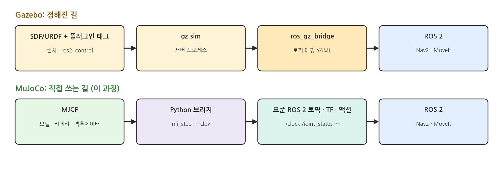{width=1000}

- Gazebo: URDF/SDF에 플러그인 태그를 넣는다. gz-sim을 띄운다. ros_gz_bridge에 토픽 매핑 YAML을 준다.
- MuJoCo: MJCF를 만든다. Python 브리지가 표준 토픽 · TF · 액션을 낸다. Nav2와 MoveIt은 브리지가 Gazebo인지 MuJoCo인지 모른다.
- 브리지를 직접 쓰는 대신, 무엇이 언제 나가는지 코드 한 화면에서 다 보인다.

### 장단점

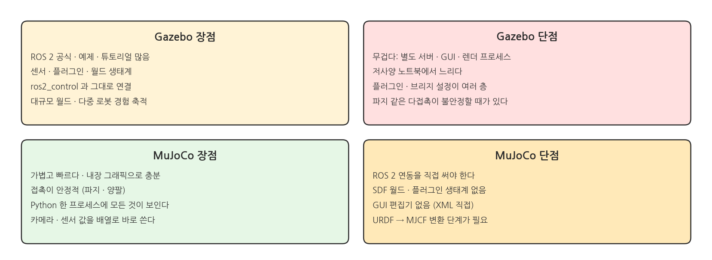{width=1000}

- Gazebo는 생태계가 넓다. 대신 무겁고, 저사양 노트북에서 느리다.
- MuJoCo는 가볍고 접촉이 안정적이다. 대신 ROS 2 연동과 월드를 직접 만든다.

### 이 과정에서 MuJoCo를 쓰는 이유

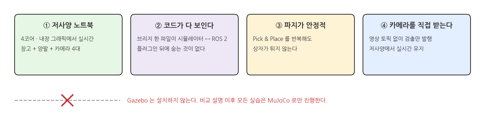{width=1000}

- 저사양 노트북에서 창고 + 양팔 + 카메라 4대가 실시간으로 돈다.
- 시뮬레이터 ↔ ROS 2 연결 코드가 파일 하나에 다 보인다. 이 페이지의 예제가 그 축소판이다.
- Pick & Place를 반복해도 상자가 튀지 않는다.
- 카메라를 Python에서 직접 받아 검출 결과만 발행한다.
- Gazebo는 설치하지 않는다. 비교 설명 이후 모든 실습은 MuJoCo로만 진행한다.

## 2. MuJoCo와 ROS 2 연결하기: 최소 브리지

### 예제 로봇: 2링크 팔 + 팔 끝 카메라

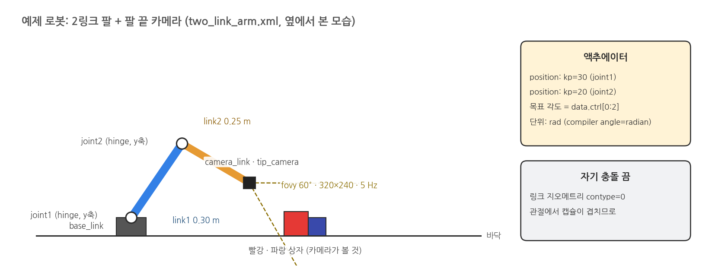{width=1000}

- 폴더: `lessons/01_mujoco_ros2/`. 파일 두 개다.
- `two_link_arm.xml`: MJCF. hinge 관절 2개, 위치 액추에이터 2개, 팔 끝 카메라 `tip_camera`, 바닥의 빨강 · 파랑 상자.
- `minimal_bridge.py`: 브리지 노드. 136줄이다.
- 관절 단위는 rad다. MJCF 기본은 도(degree)라서 `compiler angle="radian"`을 넣었다.
- 링크끼리는 충돌하지 않게 했다. 관절에서 캡슐이 겹치기 때문이다.

### 브리지가 주고받는 것

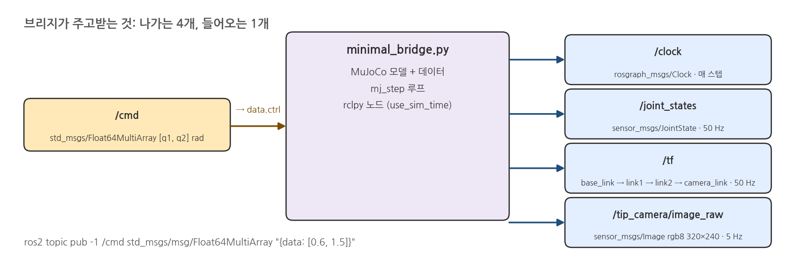{width=1000}

- 나가는 것: `/clock`, `/joint_states`(50 Hz), `/tf`(base_link → link1 → link2 → camera_link), `/tip_camera/image_raw`(320×240, 5 Hz).
- 들어오는 것: `/cmd`(`Float64MultiArray` [q1, q2] rad). 값이 `data.ctrl`에 들어가면 위치 액추에이터가 관절을 잡는다.
- 브리지 노드는 `use_sim_time`을 켠다. 시간은 `data.time`에서 온다.

### 스텝 루프

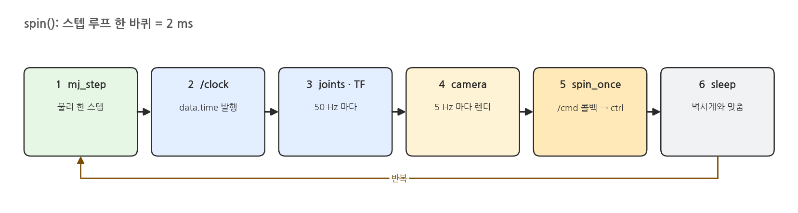{width=1000}

### 스텝 루프 def spin 코드

```python
def spin(self):
    wall0 = time.monotonic()
    while rclpy.ok():
        mujoco.mj_step(self.model, self.data)             # 1. physics step
        t = self.data.time
        self.clock_pub.publish(Clock(clock=stamp(t)))     # 2. sim time out
        if t >= self.next_joint:                          # 3. joint states + TF at 50 Hz
            self.publish_joints(t); self.next_joint += self.joint_period
        if t >= self.next_camera:                         # 4. camera image at 5 Hz
            self.publish_camera(t); self.next_camera += self.camera_period
        rclpy.spin_once(self, timeout_sec=0)              # 5. deliver /cmd callbacks
        lag = wall0 + t - time.monotonic()                # 6. keep real time
        if lag > 0:
            time.sleep(lag)
```

- 한 바퀴가 시뮬레이션 2 ms다. 발행 주기는 시뮬레이션 시간으로 센다.
- 마지막 `sleep`이 벽시계와 맞춘다. 이걸 빼면 CPU가 허용하는 만큼 빨리 돈다.
- Gazebo에서는 이 일을 gz_ros2_control과 센서 플러그인이 한다.

### 실행

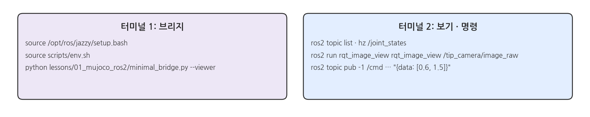{width=1000}

### 실행: 터미널 1 (브리지)

```bash
source /opt/ros/jazzy/setup.bash
source scripts/env.sh
python lessons/01_mujoco_ros2/minimal_bridge.py --viewer     # MuJoCo 창 포함
```

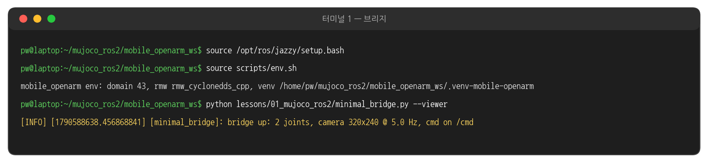{width=1000}

### minimal_bridge.py 의 실행 결과

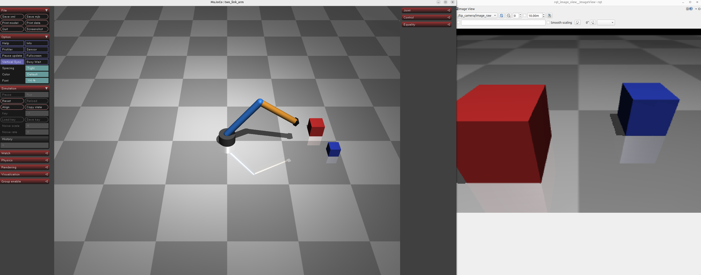{width=1000}

### 터미널 2: 환경 설정

```bash
source /opt/ros/jazzy/setup.bash
source scripts/env.sh
```

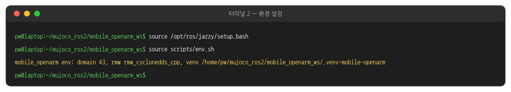{width=1000}

### 터미널 2: ros2 topic list

```bash
ros2 topic list
```

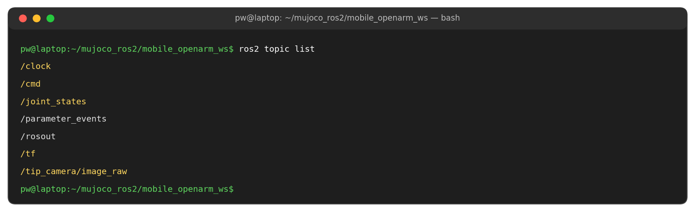{width=1000}

### 터미널 2: ros2 topic hz /joint_states

```bash
ros2 topic hz /joint_states
```

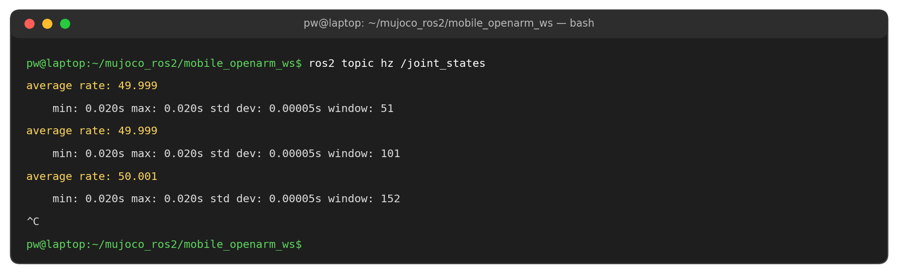{width=1000}

### 터미널 2: tf2_echo base_link camera_link

```bash
ros2 run tf2_ros tf2_echo base_link camera_link
```

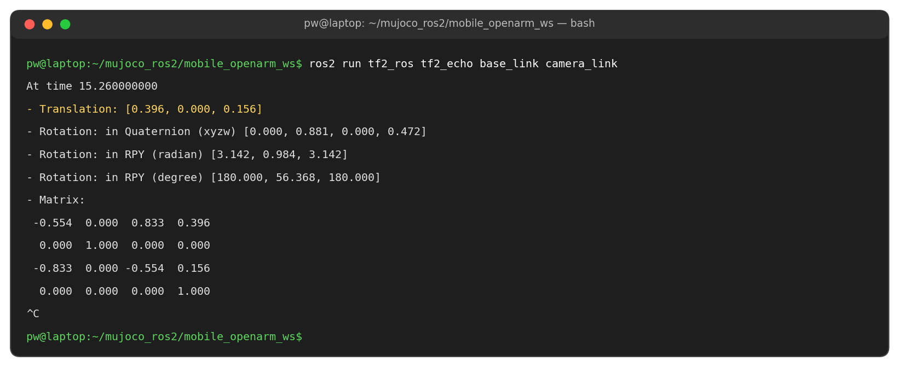{width=1000}

### 터미널 2: rqt_image_view /tip_camera/image_raw

```bash
ros2 run rqt_image_view rqt_image_view /tip_camera/image_raw
```

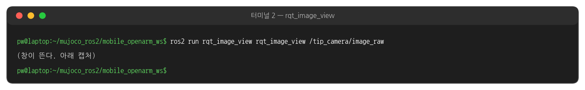{width=1000}

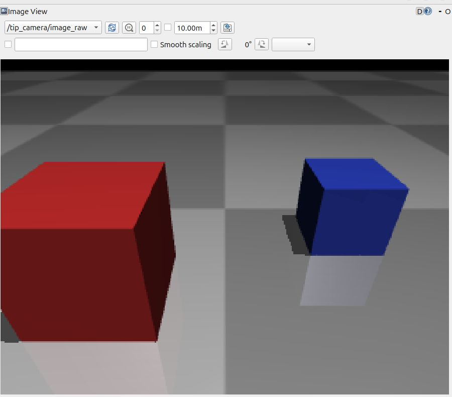{width=600}

### 터미널 2: ros2 topic pub /cmd [0.6, 1.5]

```bash
ros2 topic pub -1 /cmd std_msgs/msg/Float64MultiArray "{data: [0.6, 1.5]}"
ros2 topic echo --once /joint_states
```

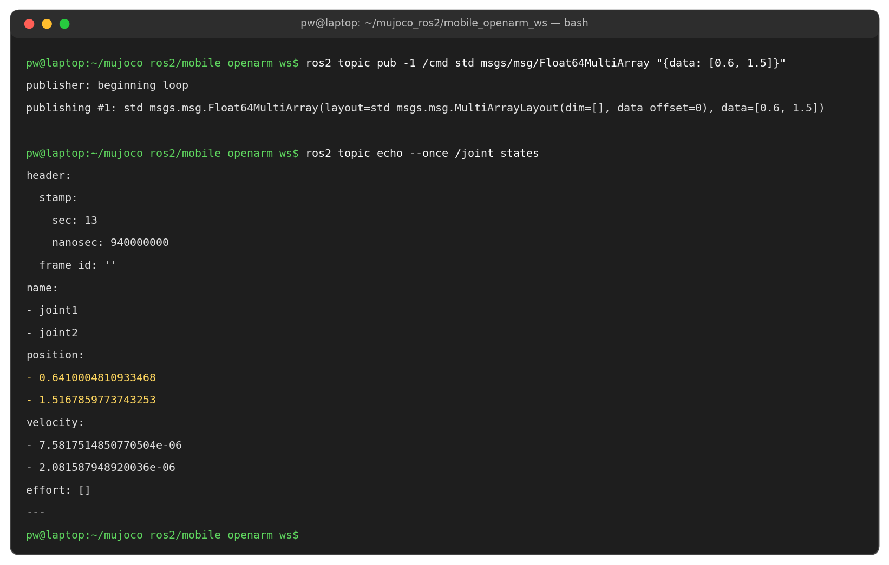{width=1000}

### [0.6, 1.5] 를 보내기 전후의 MuJoCo 창과 카메라 영상

- 아래는 같은 순간의 MuJoCo 창과 팔 끝 카메라 영상이다. 왼쪽이 보내기 전, 오른쪽이 보낸 뒤다.
- 보내기 전 카메라 영상이 검은 것은 정상이다. 초기 자세에서는 팔이 수직이라 카메라가 하늘을 본다.

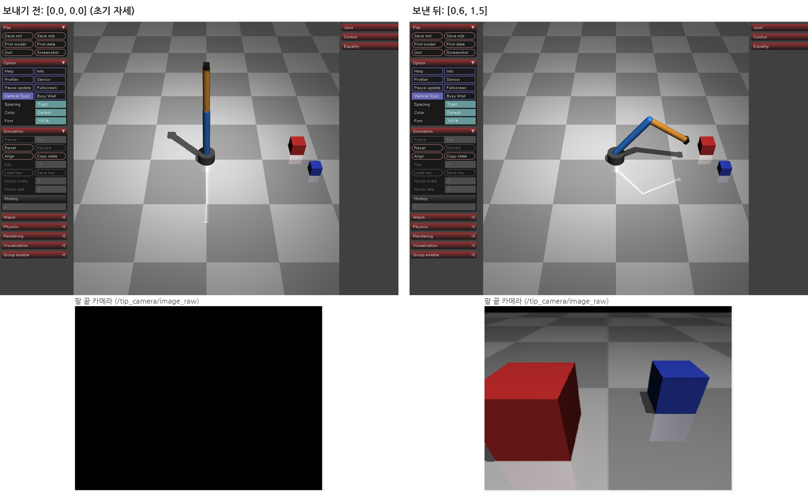{width=1000}

### 터미널 2: ros2 topic pub /cmd [0.0, 0.0]

```bash
ros2 topic pub -1 /cmd std_msgs/msg/Float64MultiArray "{data: [0.0, 0.0]}"
```

![ros2 topic pub /cmd [0.0, 0.0]](lesson01_t2_pub2.png){width=1000}

### [0.0, 0.0] 을 보내기 전후의 MuJoCo 창

- 왼쪽이 보내기 전, 오른쪽이 보낸 뒤다. 팔이 초기 자세로 돌아온다.

![topic pub [0.0, 0.0] 전후의 MuJoCo 창](lesson01_pub2_motion.png){width=1000}

### 터미널 2: ros2 topic echo /tip_camera/image_raw

```bash
ros2 topic echo --once /tip_camera/image_raw --no-arr
```

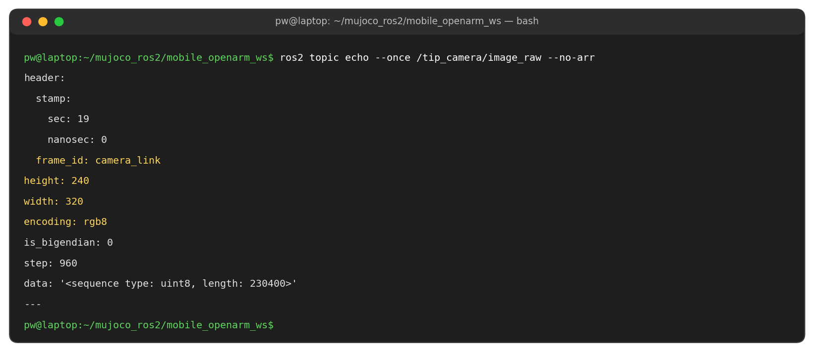{width=1000}

### TF 트리

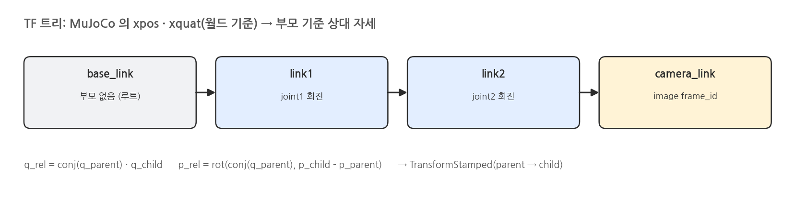{width=1000}

- MuJoCo는 모든 body의 자세를 월드 기준(`xpos`, `xquat`)으로 준다.
- TF는 부모 → 자식 상대 자세다. `mju_negQuat`, `mju_mulQuat`, `mju_rotVecQuat` 세 함수로 바꾼다.
- 영상의 `frame_id`가 `camera_link`다. 그래서 검출 결과를 TF로 다른 프레임에 옮길 수 있다.

### 노드 초기화 - __init__ 함수

```python
self.model = mujoco.MjModel.from_xml_path(str(XML))
self.data = mujoco.MjData(self.model)
self.joints = ["joint1", "joint2"]
self.bodies = ["base_link", "link1", "link2", "camera_link"]

self.clock_pub = self.create_publisher(Clock, "/clock", 10)
self.joint_pub = self.create_publisher(JointState, "/joint_states", 10)
self.image_pub = self.create_publisher(Image, "/tip_camera/image_raw", 2)
self.tf_pub = TransformBroadcaster(self)
self.create_subscription(Float64MultiArray, "/cmd", self.on_cmd, 10)

self.renderer = mujoco.Renderer(self.model, height=240, width=320)
self.joint_period, self.camera_period = 1.0 / joint_hz, 1.0 / camera_hz
```

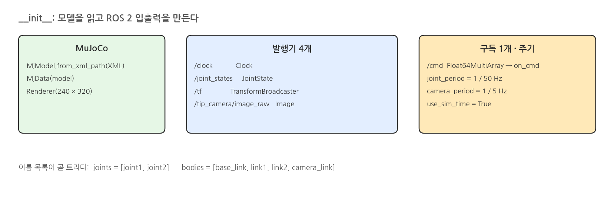{width=1000}

- MuJoCo 쪽은 모델 · 데이터 · 렌더러 셋이다. ROS 2 쪽은 발행기 넷과 구독 하나다.
- `joints`와 `bodies` 이름 목록이 곧 발행 순서와 TF 트리다. 링크를 추가하면 이 두 줄에 이름만 더한다.
- 노드는 `use_sim_time=True`로 만든다. 시간은 이 노드가 내는 `/clock`을 따른다.

### Joint State 발행 - publish_joints 함수 (앞부분)

```python
def publish_joints(self, t):
    js = JointState()
    js.header.stamp = stamp(t)
    js.name = self.joints
    js.position = [float(self.data.qpos[self.model.joint(j).qposadr[0]]) for j in self.joints]
    js.velocity = [float(self.data.qvel[self.model.joint(j).dofadr[0]]) for j in self.joints]
    self.joint_pub.publish(js)
```

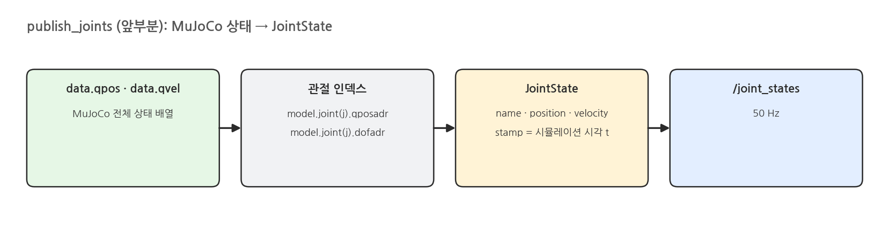{width=1000}

- MuJoCo는 모든 관절 값을 `qpos` · `qvel` 배열 하나에 담는다. 관절 이름으로 인덱스(`qposadr`, `dofadr`)를 찾아 꺼낸다.
- 시각은 시뮬레이션 시간 `t`다. `/clock`과 같은 시각이라 다른 노드가 맞춰 쓸 수 있다.
- 50 Hz마다 불린다. 주기는 `spin()`이 시뮬레이션 시간으로 센다.

### TF 발행 - publish_joints 함수 (뒷부분)

```python
    tfs = []
    for parent, child in zip(self.bodies[:-1], self.bodies[1:]):
        p, c = self.model.body(parent).id, self.model.body(child).id
        # child pose expressed in the parent body frame: q_rel = conj(q_parent) * q_child
        q_parent_inv, q_rel, pos_rel = np.zeros(4), np.zeros(4), np.zeros(3)
        mujoco.mju_negQuat(q_parent_inv, self.data.xquat[p])
        mujoco.mju_mulQuat(q_rel, q_parent_inv, self.data.xquat[c])
        mujoco.mju_rotVecQuat(pos_rel, self.data.xpos[c] - self.data.xpos[p], q_parent_inv)
        tf = TransformStamped()
        tf.header.stamp, tf.header.frame_id, tf.child_frame_id = stamp(t), parent, child
        tf.transform.translation.x, tf.transform.translation.y, tf.transform.translation.z = map(float, pos_rel)
        tf.transform.rotation.w, tf.transform.rotation.x, tf.transform.rotation.y, tf.transform.rotation.z = map(float, q_rel)
        tfs.append(tf)
    self.tf_pub.sendTransform(tfs)
```

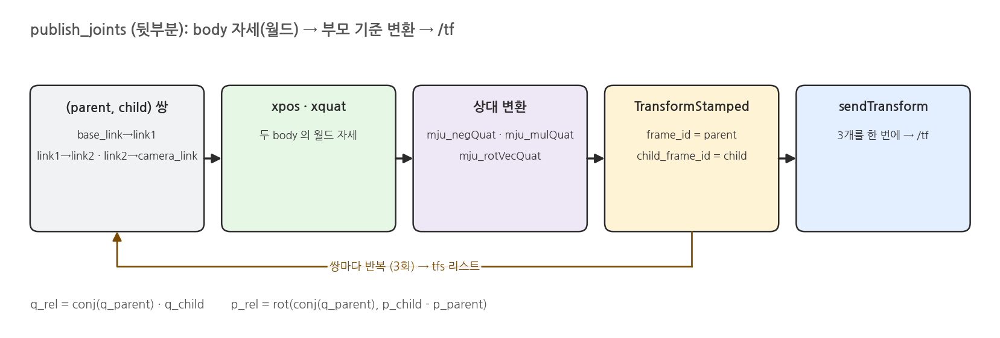{width=1000}

- `bodies` 목록에서 이웃한 두 이름을 (부모, 자식) 쌍으로 묶는다. 쌍이 셋이니 변환도 셋이다.
- MuJoCo의 `xpos` · `xquat`은 월드 기준이다. 부모 쿼터니언의 역(`mju_negQuat`)을 곱해 부모 기준 상대 자세로 바꾼다.
- 변환 셋을 리스트에 모아 `sendTransform`으로 한 번에 보낸다. `/joint_states`와 같은 함수, 같은 시각이다.
- MuJoCo 쿼터니언은 (w, x, y, z) 순서다. ROS 메시지 필드에 넣을 때 순서를 맞춘다.

### 카메라 영상 발행 - publish_camera 함수

```python
def publish_camera(self, t):
    self.renderer.update_scene(self.data, camera="tip_camera")
    rgb = self.renderer.render()
    img = Image()
    img.header.stamp, img.header.frame_id = stamp(t), "camera_link"
    img.height, img.width, img.encoding, img.step = rgb.shape[0], rgb.shape[1], "rgb8", rgb.shape[1] * 3
    img.data = rgb.tobytes()
    self.image_pub.publish(img)
```

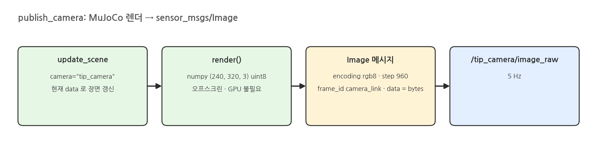{width=1000}

- 렌더는 MuJoCo 함수 두 줄이다. 결과는 (240, 320, 3) numpy 배열이다.
- `Image` 메시지는 배열을 바이트로 그대로 담는다. `step`은 한 줄의 바이트 수(320 × 3)다.
- `frame_id`가 `camera_link`라서 TF로 다른 프레임에 옮길 수 있다.
- 5 Hz다. 영상 토픽은 크기가 커서 창고 브리지는 이 단계 대신 검출 결과만 발행한다.

### 명령 수신 - on_cmd 함수

```python
def on_cmd(self, msg):
    if len(msg.data) == self.model.nu:
        self.data.ctrl[:] = np.clip(msg.data, self.model.actuator_ctrlrange[:, 0], self.model.actuator_ctrlrange[:, 1])
```

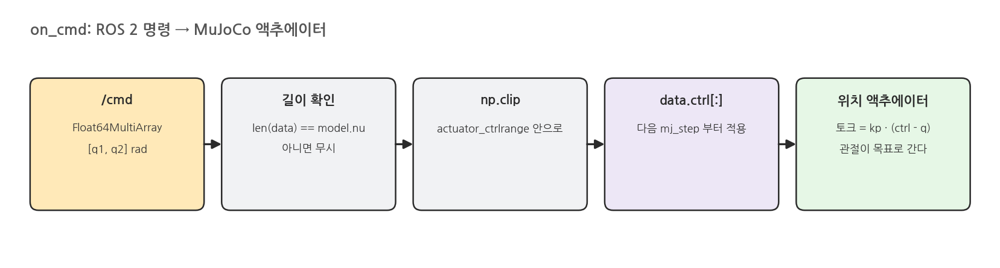{width=1000}

- 콜백은 `spin()`의 `spin_once`가 부른다. 스텝 사이에만 실행되므로 물리 계산과 겹치지 않는다.
- 값의 개수가 액추에이터 수(`nu`)와 다르면 무시한다. 범위 밖 값은 `ctrlrange`로 자른다.
- `data.ctrl`에 넣으면 끝이다. 다음 `mj_step`부터 위치 액추에이터가 `kp · (ctrl - q)` 토크를 낸다.

### 시뮬레이션 시각 - stamp 함수와 /clock

```python
def stamp(t):
    """float seconds -> builtin_interfaces/Time"""
    return Time(sec=int(t), nanosec=int((t - int(t)) * 1e9))

# spin() 안에서 매 스텝
self.clock_pub.publish(Clock(clock=stamp(t)))
```

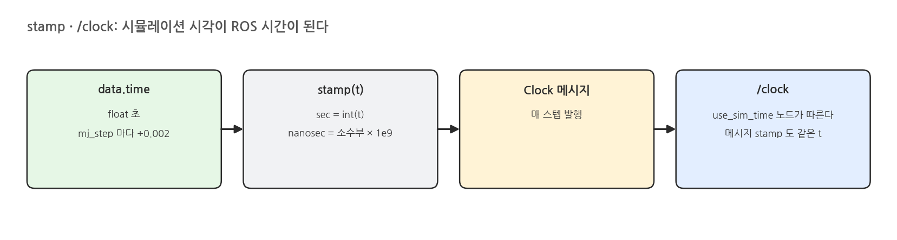{width=1000}

- `data.time`은 `mj_step`마다 `timestep`(2 ms)씩 늘어나는 float 초다.
- `stamp()`가 초와 나노초로 나눠 ROS 시간 형식으로 바꾼다. 모든 메시지 헤더가 이 함수를 쓴다.
- `/clock`을 매 스텝 내므로 `use_sim_time` 노드는 시뮬레이션 시간으로 움직인다. 시뮬레이터를 멈추면 그 노드들의 시간도 멈춘다.

### 창고 브리지와의 관계

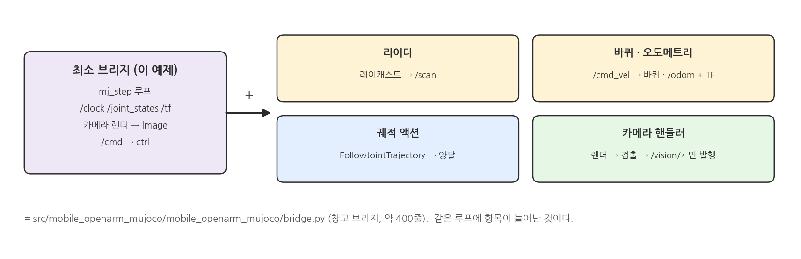{width=1000}

- 창고 패키지의 브리지(`src/mobile_openarm_mujoco/mobile_openarm_mujoco/bridge.py`)는 같은 루프다.
- 더해진 것: 라이다 레이캐스트 → `/scan`, 바퀴 → `/odom` + TF, `/cmd_vel` 수신, FollowJointTrajectory 액션, 카메라 핸들러.
- 카메라 핸들러는 영상을 토픽으로 내지 않는다. 같은 프로세스에서 검출하고 `/vision/*`만 낸다.

### 해 볼 것

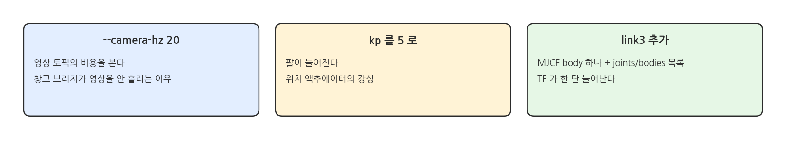{width=1000}

- `--camera-hz 20`으로 올리고 CPU 사용량을 본다. 창고 브리지가 영상을 안 흘리는 이유가 보인다.
- `two_link_arm.xml`의 `kp`를 5로 낮춘다. 팔이 늘어진다.
- `link3`을 하나 더 붙이고 `joints` · `bodies` 목록에 넣는다. TF가 한 단 늘어난다.
