## 1. Gazebo vs MuJoCo

### 두 시뮬레이터

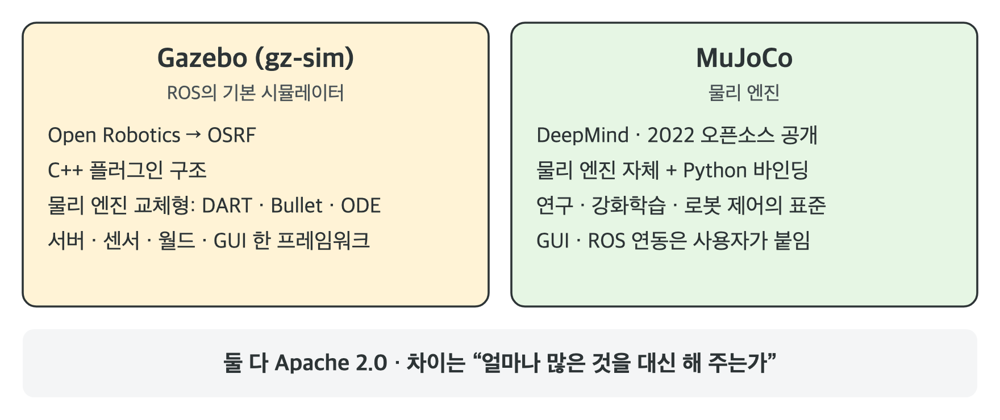{width=1000}

### 구조 비교

{width=1000}

### 물리 연산 방식

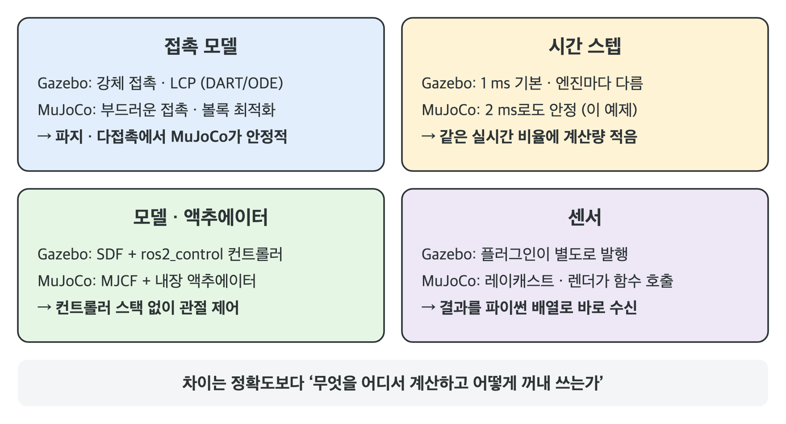{width=1000}

### ROS 2 연동 방식

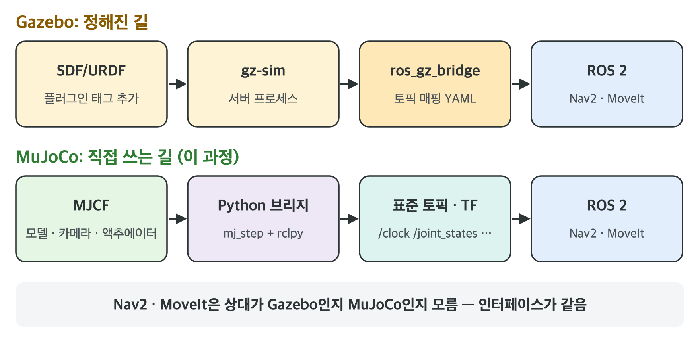{width=1000}

### 장단점

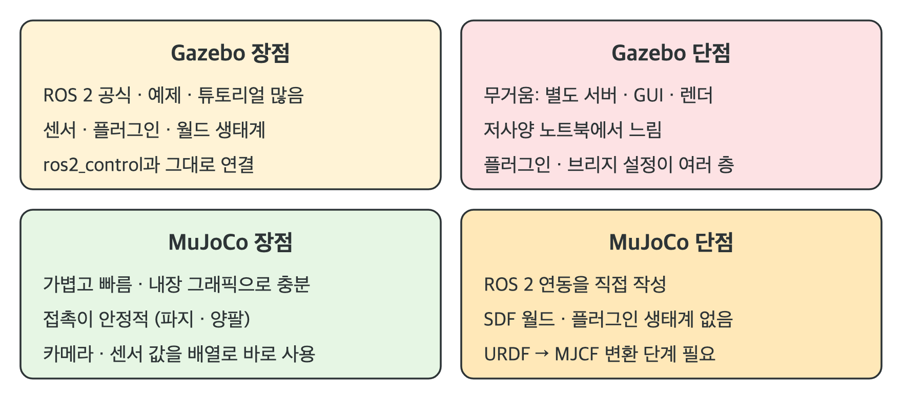{width=1000}

### 이 과정에서 MuJoCo를 쓰는 이유

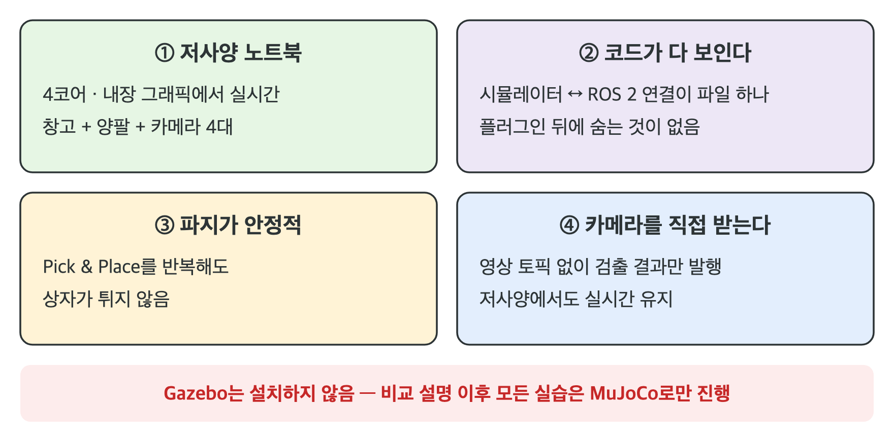{width=1000}

## 2. 로봇 모델 파일: two_link_arm.xml

### 로봇을 적는 두 형식: URDF와 MJCF

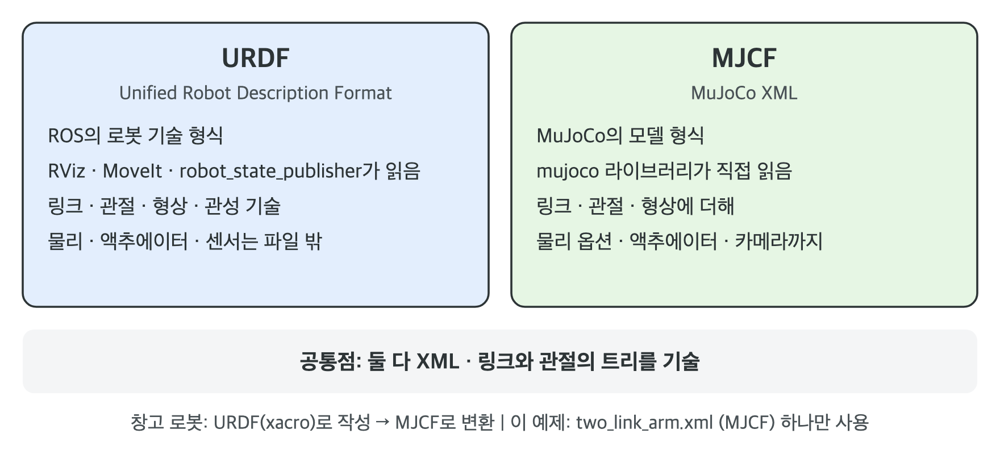{width=1000}

### 트리를 적는 방법이 다르다

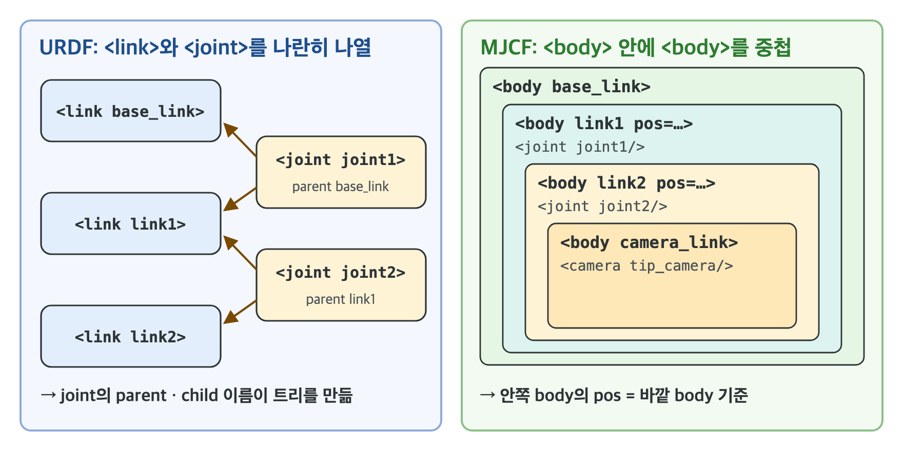{width=1000}

### 파일 안에 담기는 것이 다르다

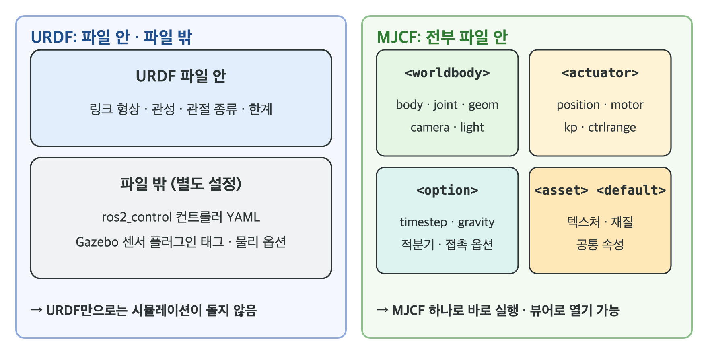{width=1000}

### 단위와 기본값이 다르다

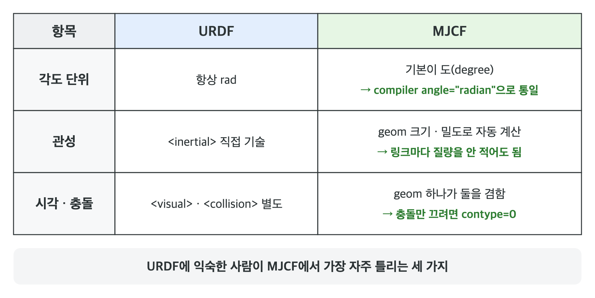{width=1000}

### 모델만 먼저 보기: mujoco.viewer

```bash
source /opt/ros/jazzy/setup.bash
source scripts/env.sh
python -m mujoco.viewer --mjcf=lessons/01_mujoco_ros2/two_link_arm.xml
```

### mujoco.viewer 실행 화면: 두 링크 팔과 상자

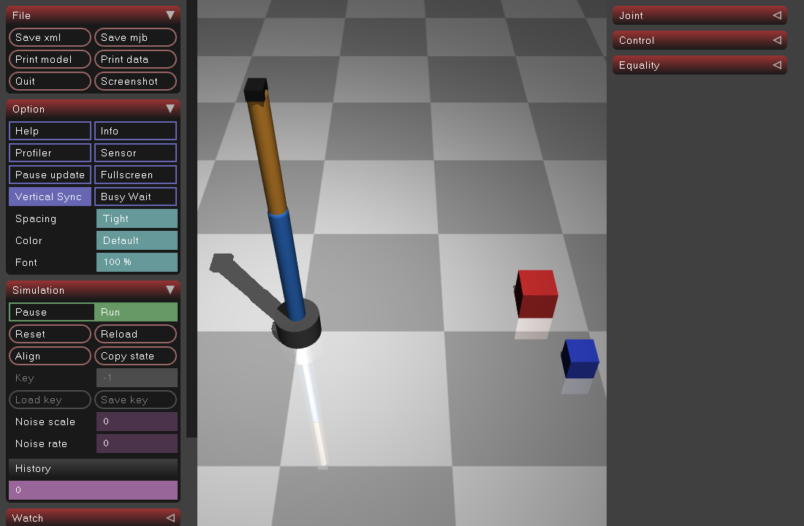{width=1000}

### 파일 전체 구조: 최상위 요소 7개의 역할

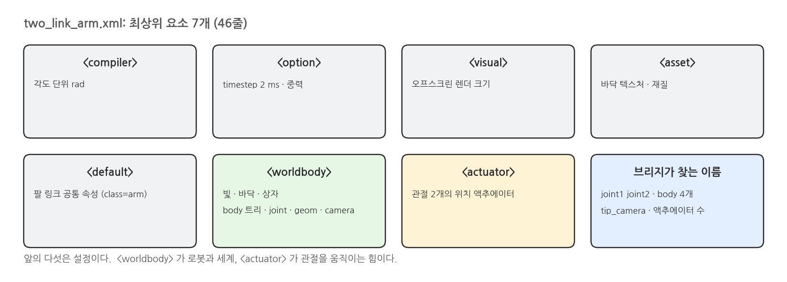{width=1000}

### 파일 전체 구조 (코드)

```xml
<mujoco model="two_link_arm">
  <compiler angle="radian"/>
  <option timestep="0.002" gravity="0 0 -9.81"/>
  <visual> ... </visual>
  <asset> ... </asset>
  <default> ... </default>
  <worldbody> ... </worldbody>
  <actuator> ... </actuator>
</mujoco>
```

### compiler · option - 단위와 물리 스텝

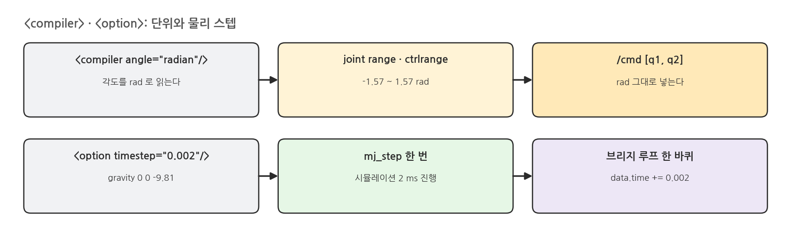{width=1000}

### compiler · option - 단위와 물리 스텝 (코드)

```xml
<compiler angle="radian"/>
<option timestep="0.002" gravity="0 0 -9.81"/>
```

### visual · asset - 렌더 크기와 바닥 무늬

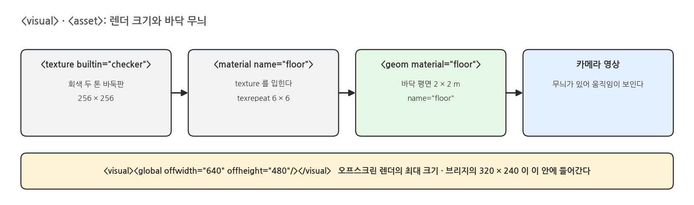{width=1000}

### visual · asset - 렌더 크기와 바닥 무늬 (코드)

```xml
<visual>
  <global offwidth="640" offheight="480"/>
</visual>
<asset>
  <texture name="grid" type="2d" builtin="checker" rgb1="0.85 0.85 0.85" rgb2="0.65 0.65 0.65" width="256" height="256"/>
  <material name="floor" texture="grid" texrepeat="6 6" reflectance="0.1"/>
</asset>
```

### default - 팔 링크의 공통 속성

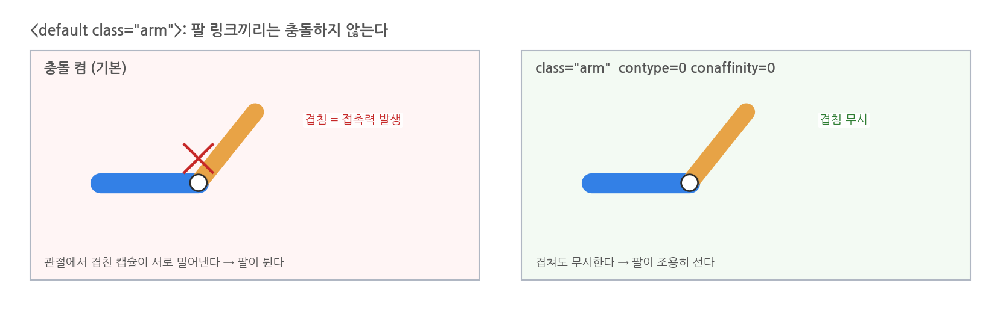{width=1000}

### default - 팔 링크의 공통 속성 (코드)

```xml
<default>
  <!-- arm geoms do not collide with each other (capsules overlap at the joints) -->
  <default class="arm"><geom contype="0" conaffinity="0"/></default>
</default>
```

### worldbody - 빛 · 바닥 · 상자

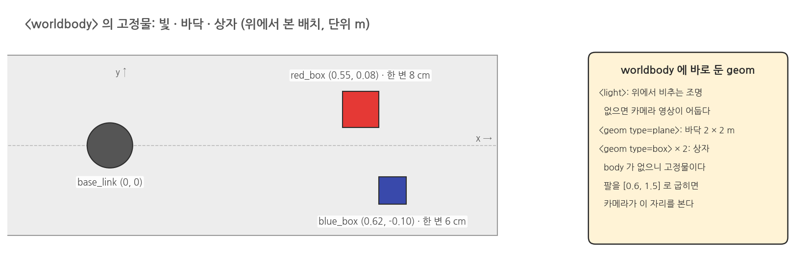{width=1000}

### worldbody - 빛 · 바닥 · 상자 (코드)

```xml
<worldbody>
  <light pos="0.5 -0.5 2.0" dir="-0.3 0.3 -1"/>
  <geom name="floor" type="plane" size="2 2 0.05" material="floor"/>
  <geom name="red_box" type="box" pos="0.55 0.08 0.04" size="0.04 0.04 0.04" rgba="0.9 0.2 0.2 1"/>
  <geom name="blue_box" type="box" pos="0.62 -0.10 0.03" size="0.03 0.03 0.03" rgba="0.2 0.3 0.9 1"/>
  ...
</worldbody>
```

### body 트리 - base_link → link1 → link2 → camera_link

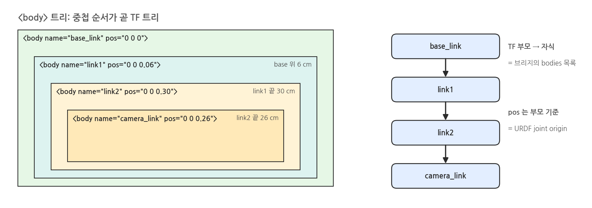{width=1000}

### body 트리 - base_link → link1 → link2 → camera_link (코드)

```xml
<body name="base_link" pos="0 0 0">
  <body name="link1" pos="0 0 0.06">
    <body name="link2" pos="0 0 0.30">
      <body name="camera_link" pos="0 0 0.26">
      </body>
    </body>
  </body>
</body>
```

### joint - hinge 관절 두 개

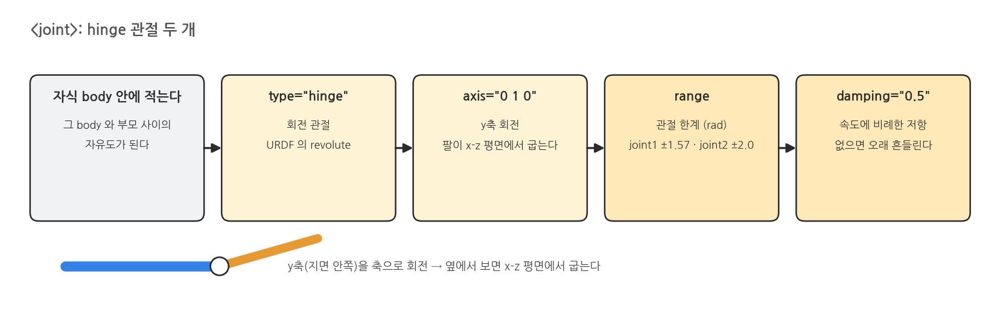{width=1000}

### joint - hinge 관절 두 개 (코드)

```xml
<body name="link1" pos="0 0 0.06">
  <joint name="joint1" type="hinge" axis="0 1 0" range="-1.57 1.57" damping="0.5"/>
  ...
  <body name="link2" pos="0 0 0.30">
    <joint name="joint2" type="hinge" axis="0 1 0" range="-2.0 2.0" damping="0.5"/>
```

### geom - capsule 로 그린 링크

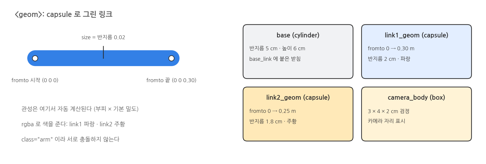{width=1000}

### geom - capsule 로 그린 링크 (코드)

```xml
<geom class="arm" name="base" type="cylinder" size="0.05 0.03" pos="0 0 0.03" rgba="0.3 0.3 0.3 1"/>
<geom class="arm" name="link1_geom" type="capsule" fromto="0 0 0 0 0 0.30" size="0.02" rgba="0.2 0.5 0.9 1"/>
<geom class="arm" name="link2_geom" type="capsule" fromto="0 0 0 0 0 0.25" size="0.018" rgba="0.9 0.6 0.2 1"/>
<geom class="arm" name="camera_body" type="box" size="0.015 0.02 0.01" rgba="0.1 0.1 0.1 1"/>
```

### camera - 팔 끝 카메라의 방향

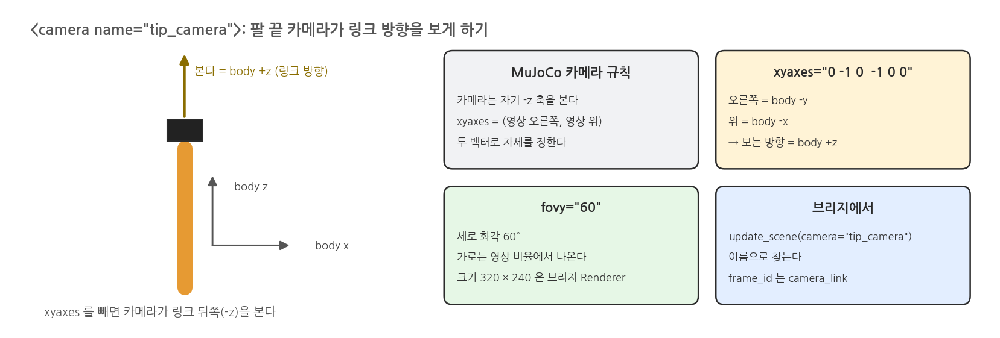{width=1000}

### camera - 팔 끝 카메라의 방향 (코드)

```xml
<body name="camera_link" pos="0 0 0.26">
  <geom class="arm" name="camera_body" type="box" size="0.015 0.02 0.01" rgba="0.1 0.1 0.1 1"/>
  <camera name="tip_camera" pos="0 0 0.01" xyaxes="0 -1 0 -1 0 0" fovy="60"/>
</body>
```

### actuator - 관절을 잡는 위치 액추에이터

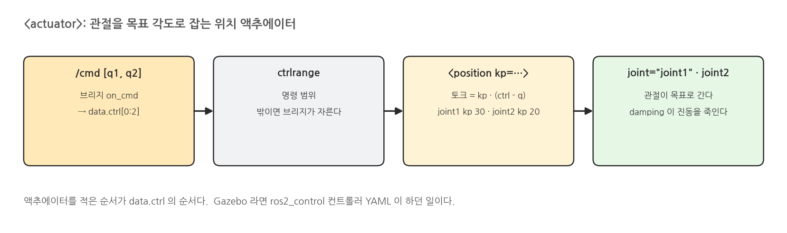{width=1000}

### actuator - 관절을 잡는 위치 액추에이터 (코드)

```xml
<actuator>
  <position name="joint1_pos" joint="joint1" kp="30" ctrlrange="-1.57 1.57"/>
  <position name="joint2_pos" joint="joint2" kp="20" ctrlrange="-2.0 2.0"/>
</actuator>
```

### 브리지가 이 파일에서 찾는 이름

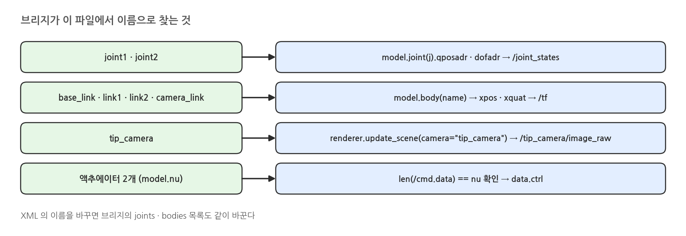{width=1000}

## 3. MuJoCo와 ROS 2 연결하기: 최소 브리지

### 예제 로봇: 2링크 팔 + 팔 끝 카메라

{width=1000}

- 폴더: `lessons/01_mujoco_ros2/` · 파일 2개
- `two_link_arm.xml`: MJCF — hinge 관절 2개, 위치 액추에이터 2개, 팔 끝 카메라 `tip_camera`, 바닥의 빨강 · 파랑 상자

### 브리지가 주고받는 것

{width=1000}

- 나가는 것: `/clock`, `/joint_states`(50 Hz), `/tf`(base_link → link1 → link2 → camera_link), `/tip_camera/image_raw`(320×240, 5 Hz)
- 들어오는 것: `/cmd`(`Float64MultiArray` [q1, q2] rad) · 값이 `data.ctrl`에 들어가면 위치 액추에이터가 관절 제어
- 브리지 노드는 `use_sim_time` 활성화 · 시간은 `data.time` 기준

### 스텝 루프

{width=1000}

### 스텝 루프 def spin 코드

```python
def spin(self):
    wall0 = time.monotonic()
    while rclpy.ok():
        mujoco.mj_step(self.model, self.data)             # 1. physics step
        t = self.data.time
        self.clock_pub.publish(Clock(clock=stamp(t)))     # 2. sim time out
        if t >= self.next_joint:                          # 3. joint states + TF at 50 Hz
            self.publish_joints(t); self.next_joint += self.joint_period
        if t >= self.next_camera:                         # 4. camera image at 5 Hz
            self.publish_camera(t); self.next_camera += self.camera_period
        rclpy.spin_once(self, timeout_sec=0)              # 5. deliver /cmd callbacks
        lag = wall0 + t - time.monotonic()                # 6. keep real time
        if lag > 0:
            time.sleep(lag)
```

- 루프 1회 = 시뮬레이션 2 ms · 발행 주기는 시뮬레이션 시간 기준
- 마지막 `sleep`으로 벽시계와 동기화 · 제거 시 CPU가 허용하는 최대 속도로 실행
- Gazebo에서는 gz_ros2_control · 센서 플러그인이 이 역할 담당

### 실행

{width=1000}

### 실행: 터미널 1 (브리지)

```bash
source /opt/ros/jazzy/setup.bash
source scripts/env.sh
python lessons/01_mujoco_ros2/minimal_bridge.py --viewer     # MuJoCo 창 포함
```

{width=1000}

### minimal_bridge.py 의 실행 결과

{width=1000}

### 터미널 2: 환경 설정

```bash
source /opt/ros/jazzy/setup.bash
source scripts/env.sh
```

{width=1000}

### 터미널 2: ros2 topic list

```bash
ros2 topic list
```

{width=1000}

### 터미널 2: ros2 topic hz /joint_states

```bash
ros2 topic hz /joint_states
```

{width=1000}

### 터미널 2: tf2_echo base_link camera_link

```bash
ros2 run tf2_ros tf2_echo base_link camera_link
```

{width=1000}

### 터미널 2: rqt_image_view /tip_camera/image_raw

```bash
ros2 run rqt_image_view rqt_image_view /tip_camera/image_raw
```

{width=1000}

{width=600}

### 터미널 2: ros2 topic pub /cmd [0.6, 1.5]

```bash
ros2 topic pub -1 /cmd std_msgs/msg/Float64MultiArray "{data: [0.6, 1.5]}"
ros2 topic echo --once /joint_states
```

{width=1000}

### [0.6, 1.5] 를 보내기 전후의 MuJoCo 창과 카메라 영상

- 아래: 같은 순간의 MuJoCo 창과 팔 끝 카메라 영상 (왼쪽: 보내기 전, 오른쪽: 보낸 뒤)
- 보내기 전 카메라 영상이 검은 것은 정상 — 초기 자세는 팔이 수직이라 카메라가 하늘을 향함

{width=1000}

### 터미널 2: ros2 topic pub /cmd [0.0, 0.0]

```bash
ros2 topic pub -1 /cmd std_msgs/msg/Float64MultiArray "{data: [0.0, 0.0]}"
```

![ros2 topic pub /cmd [0.0, 0.0]](lesson01_t2_pub2.png){width=1000}

### [0.0, 0.0] 을 보내기 전후의 MuJoCo 창

- 왼쪽: 보내기 전, 오른쪽: 보낸 뒤 → 팔이 초기 자세로 복귀

![topic pub [0.0, 0.0] 전후의 MuJoCo 창](lesson01_pub2_motion.png){width=1000}

### 터미널 2: ros2 topic echo /tip_camera/image_raw

```bash
ros2 topic echo --once /tip_camera/image_raw --no-arr
```

{width=1000}

### TF 트리

{width=1000}

- MuJoCo는 모든 body 자세를 월드 기준(`xpos`, `xquat`)으로 제공
- TF는 부모 → 자식 상대 자세 → `mju_negQuat`, `mju_mulQuat`, `mju_rotVecQuat` 세 함수로 변환
- 영상의 `frame_id` = `camera_link` → 검출 결과를 TF로 다른 프레임에 변환 가능

### Python과 MuJoCo의 연결

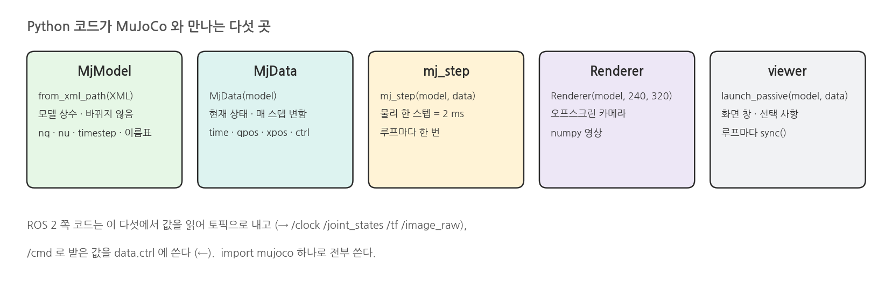{width=1000}

### Python과 MuJoCo의 연결 (코드)

```python
import mujoco
import mujoco.viewer

self.model = mujoco.MjModel.from_xml_path(str(XML))                  # 모델 (상수)
self.data = mujoco.MjData(self.model)                                # 상태 (매 스텝 변함)
mujoco.mj_step(self.model, self.data)                                # 물리 한 스텝
self.renderer = mujoco.Renderer(self.model, height=240, width=320)   # 오프스크린 카메라
self.viewer = mujoco.viewer.launch_passive(self.model, self.data)    # 화면 창 (선택)
```

### 모델 읽기 - MjModel.from_xml_path

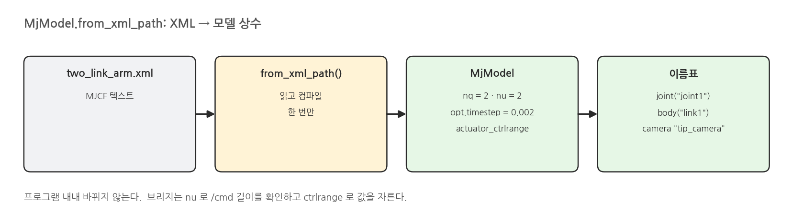{width=1000}

### 모델 읽기 - MjModel.from_xml_path (코드)

```python
XML = Path(__file__).with_name("two_link_arm.xml")
self.model = mujoco.MjModel.from_xml_path(str(XML))
dt = self.model.opt.timestep          # 0.002
self.model.nq, self.model.nu          # 관절 수 2, 액추에이터 수 2
```

### 상태 만들기 - MjData

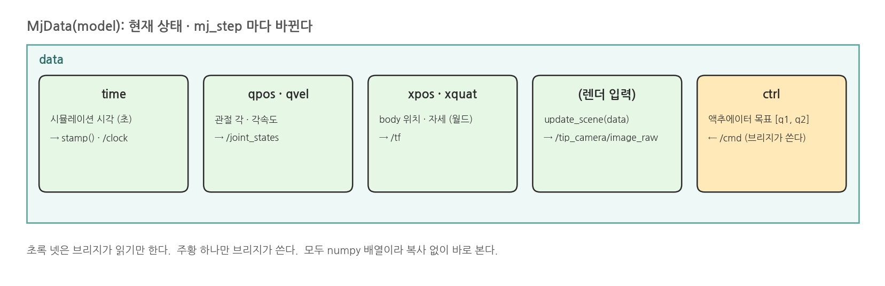{width=1000}

### 상태 만들기 - MjData (코드)

```python
self.data = mujoco.MjData(self.model)
self.data.time                      # 시뮬레이션 시각 (초)
self.data.qpos, self.data.qvel      # 관절 각 · 각속도
self.data.xpos, self.data.xquat     # body 위치 · 자세 (월드 기준)
self.data.ctrl                      # 액추에이터 목표
```

### 물리 한 스텝 - mj_step

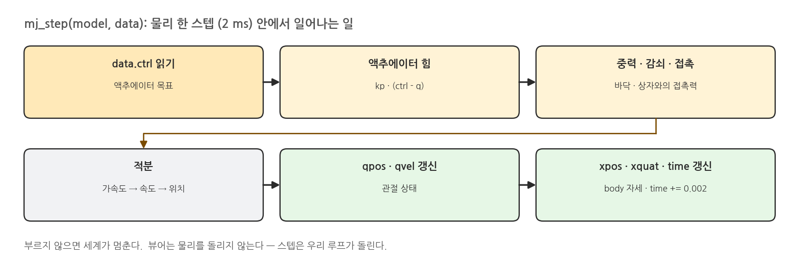{width=1000}

### 물리 한 스텝 - mj_step (코드)

```python
while rclpy.ok():
    mujoco.mj_step(self.model, self.data)   # data.time += model.opt.timestep
    t = self.data.time
```

### 이름으로 찾기 - model.joint · model.body

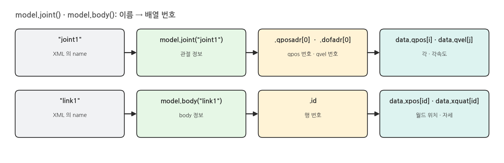{width=1000}

### 이름으로 찾기 - model.joint · model.body (코드)

```python
self.model.joint("joint1").qposadr[0]   # qpos 안의 번호
self.model.joint("joint1").dofadr[0]    # qvel 안의 번호
self.model.body("link1").id             # xpos · xquat 의 행 번호
```

### 오프스크린 렌더 - Renderer

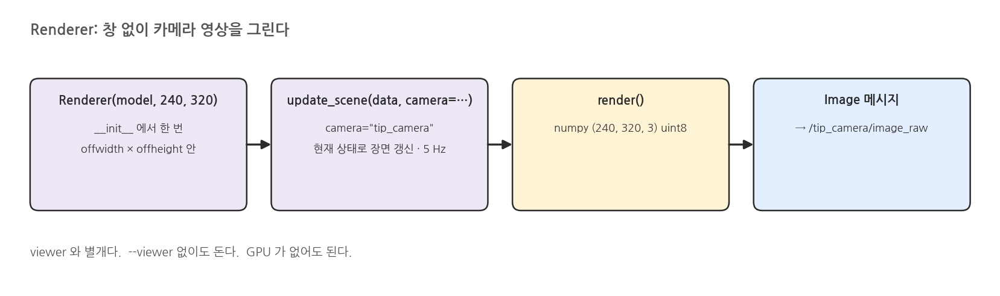{width=1000}

### 오프스크린 렌더 - Renderer (코드)

```python
self.renderer = mujoco.Renderer(self.model, height=240, width=320)   # __init__ 에서 한 번
self.renderer.update_scene(self.data, camera="tip_camera")           # 5 Hz 마다
rgb = self.renderer.render()                                          # (240, 320, 3) uint8
```

### 화면 창 - viewer.launch_passive

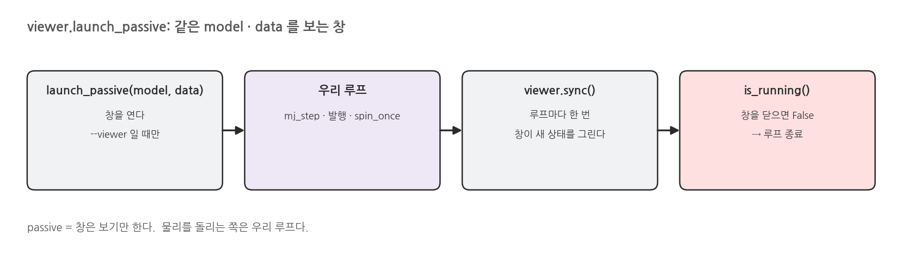{width=1000}

### 화면 창 - viewer.launch_passive (코드)

```python
if viewer:
    self.viewer = mujoco.viewer.launch_passive(self.model, self.data)

while rclpy.ok() and (self.viewer is None or self.viewer.is_running()):
    ...
    if self.viewer is not None:
        self.viewer.sync()
```

### 실시간 맞추기 - 벽시계와 시뮬레이션 시각

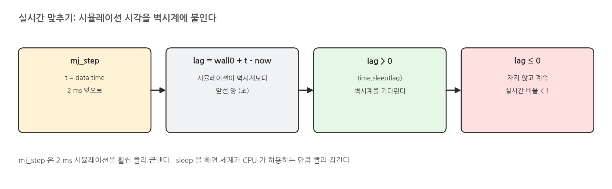{width=1000}

### 실시간 맞추기 - 벽시계와 시뮬레이션 시각 (코드)

```python
wall0 = time.monotonic()
while ...:
    mujoco.mj_step(self.model, self.data)
    ...
    lag = wall0 + t - time.monotonic()   # 시뮬레이션이 벽시계보다 앞선 만큼
    if lag > 0:
        time.sleep(lag)
```

### 노드 초기화 - __init__ 함수

{width=1000}

### 노드 초기화 - __init__ 함수 (코드)

```python
self.model = mujoco.MjModel.from_xml_path(str(XML))
self.data = mujoco.MjData(self.model)
self.joints = ["joint1", "joint2"]
self.bodies = ["base_link", "link1", "link2", "camera_link"]

self.clock_pub = self.create_publisher(Clock, "/clock", 10)
self.joint_pub = self.create_publisher(JointState, "/joint_states", 10)
self.image_pub = self.create_publisher(Image, "/tip_camera/image_raw", 2)
self.tf_pub = TransformBroadcaster(self)
self.create_subscription(Float64MultiArray, "/cmd", self.on_cmd, 10)

self.renderer = mujoco.Renderer(self.model, height=240, width=320)
self.joint_period, self.camera_period = 1.0 / joint_hz, 1.0 / camera_hz
```

### Joint State 발행 - publish_joints 함수 (앞부분)

{width=1000}

### Joint State 발행 - publish_joints 함수 (앞부분) (코드)

```python
def publish_joints(self, t):
    js = JointState()
    js.header.stamp = stamp(t)
    js.name = self.joints
    js.position = [float(self.data.qpos[self.model.joint(j).qposadr[0]]) for j in self.joints]
    js.velocity = [float(self.data.qvel[self.model.joint(j).dofadr[0]]) for j in self.joints]
    self.joint_pub.publish(js)
```

### TF 발행 - publish_joints 함수 (뒷부분)

{width=1000}

### TF 발행 - publish_joints 함수 (뒷부분) (코드)

```python
    tfs = []
    for parent, child in zip(self.bodies[:-1], self.bodies[1:]):
        p, c = self.model.body(parent).id, self.model.body(child).id
        # child pose expressed in the parent body frame: q_rel = conj(q_parent) * q_child
        q_parent_inv, q_rel, pos_rel = np.zeros(4), np.zeros(4), np.zeros(3)
        mujoco.mju_negQuat(q_parent_inv, self.data.xquat[p])
        mujoco.mju_mulQuat(q_rel, q_parent_inv, self.data.xquat[c])
        mujoco.mju_rotVecQuat(pos_rel, self.data.xpos[c] - self.data.xpos[p], q_parent_inv)
        tf = TransformStamped()
        tf.header.stamp, tf.header.frame_id, tf.child_frame_id = stamp(t), parent, child
        tf.transform.translation.x, tf.transform.translation.y, tf.transform.translation.z = map(float, pos_rel)
        tf.transform.rotation.w, tf.transform.rotation.x, tf.transform.rotation.y, tf.transform.rotation.z = map(float, q_rel)
        tfs.append(tf)
    self.tf_pub.sendTransform(tfs)
```

### 카메라 영상 발행 - publish_camera 함수

{width=1000}

### 카메라 영상 발행 - publish_camera 함수 (코드)

```python
def publish_camera(self, t):
    self.renderer.update_scene(self.data, camera="tip_camera")
    rgb = self.renderer.render()
    img = Image()
    img.header.stamp, img.header.frame_id = stamp(t), "camera_link"
    img.height, img.width, img.encoding, img.step = rgb.shape[0], rgb.shape[1], "rgb8", rgb.shape[1] * 3
    img.data = rgb.tobytes()
    self.image_pub.publish(img)
```

### 명령 수신 - on_cmd 함수

{width=1000}

### 명령 수신 - on_cmd 함수 (코드)

```python
def on_cmd(self, msg):
    if len(msg.data) == self.model.nu:
        self.data.ctrl[:] = np.clip(msg.data, self.model.actuator_ctrlrange[:, 0], self.model.actuator_ctrlrange[:, 1])
```

### 시뮬레이션 시각 - stamp 함수와 /clock

{width=1000}

### 시뮬레이션 시각 - stamp 함수와 /clock (코드)

```python
def stamp(t):
    """float seconds -> builtin_interfaces/Time"""
    return Time(sec=int(t), nanosec=int((t - int(t)) * 1e9))

# spin() 안에서 매 스텝
self.clock_pub.publish(Clock(clock=stamp(t)))
```

### 창고 브리지와의 관계

{width=1000}

### MuJoCo <-> ROS2

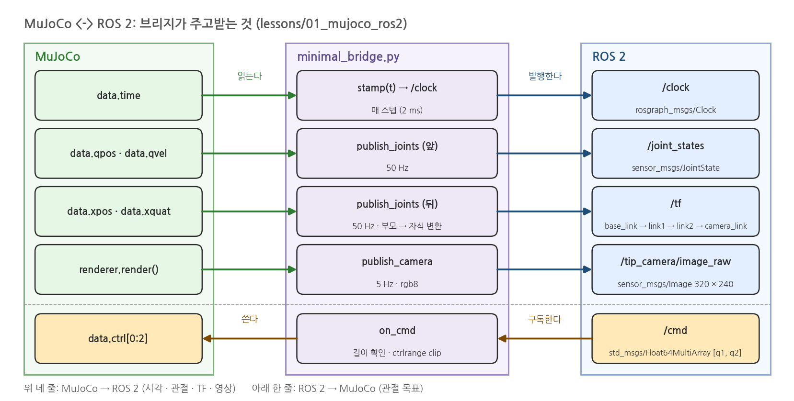{width=1000}

### 해 볼 것

{width=1000}

- `--camera-hz 20`으로 올려 CPU 사용량 확인 → 창고 브리지가 영상을 토픽으로 보내지 않는 이유 확인
- `two_link_arm.xml`의 `kp`를 5로 낮춤 → 팔이 늘어짐
- `link3` 추가 후 `joints` · `bodies` 목록에 등록 → TF 한 단 증가
