## 1. 패키지: OpenARM 것과 우리가 만든 것

### 두 종류의 패키지

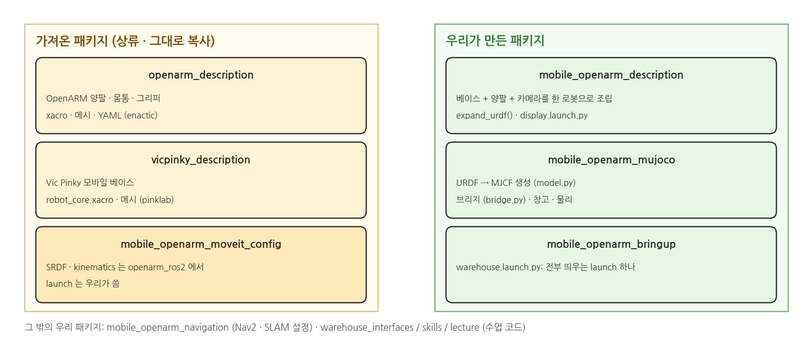{width=1000}

### OpenARM: 오픈소스 양팔 매니퓰레이터

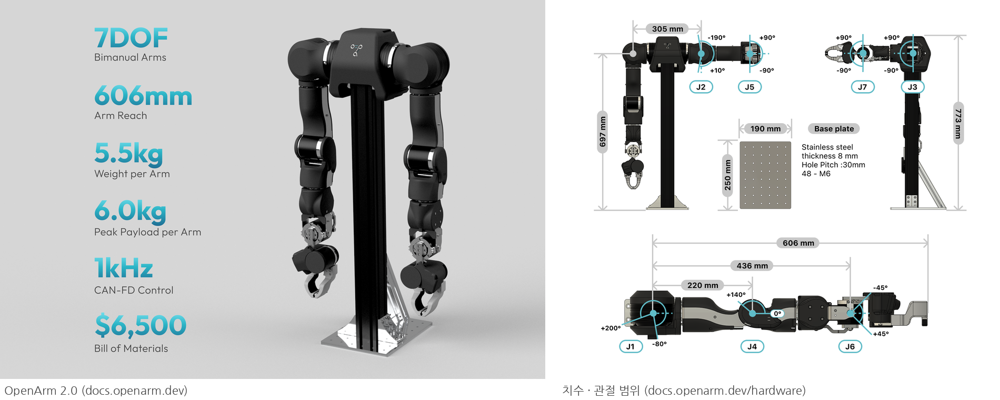{width=1000}

### OpenARM 특징

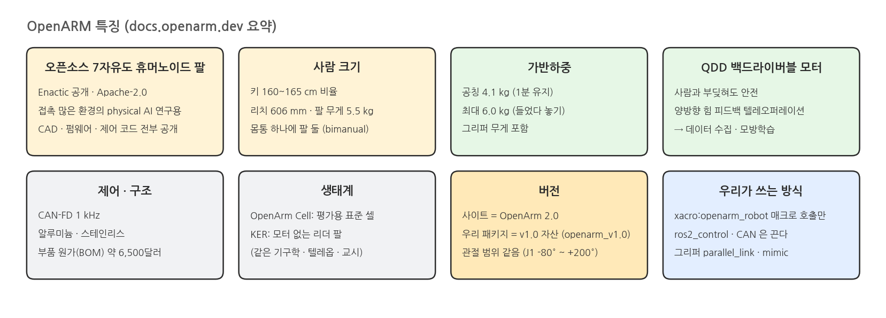{width=1000}

### Vic Pinky: PinkLAB 차동 구동 모바일 베이스

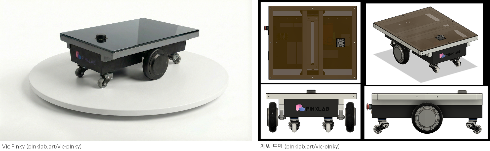{width=1000}

### Vic Pinky 특징

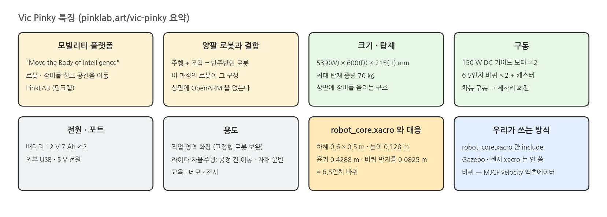{width=1000}

### Vic Pinky 의 description 만 보기

```bash
source /opt/ros/jazzy/setup.bash
source scripts/env.sh
ros2 launch vicpinky_description display.launch.py
```

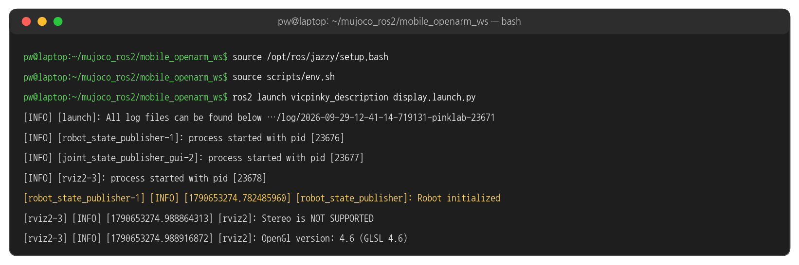{width=1000}

### Vic Pinky 의 실행 결과

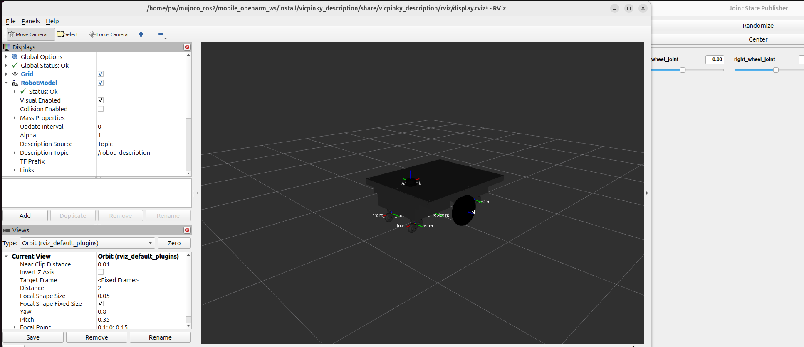{width=1000}

### OpenARM 의 description 만 보기

```bash
source /opt/ros/jazzy/setup.bash
source scripts/env.sh
ros2 launch openarm_description display.launch.py
```

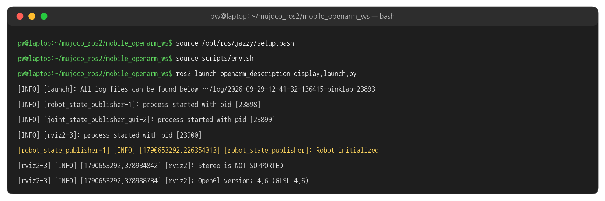{width=1000}

### OpenARM 의 실행 결과

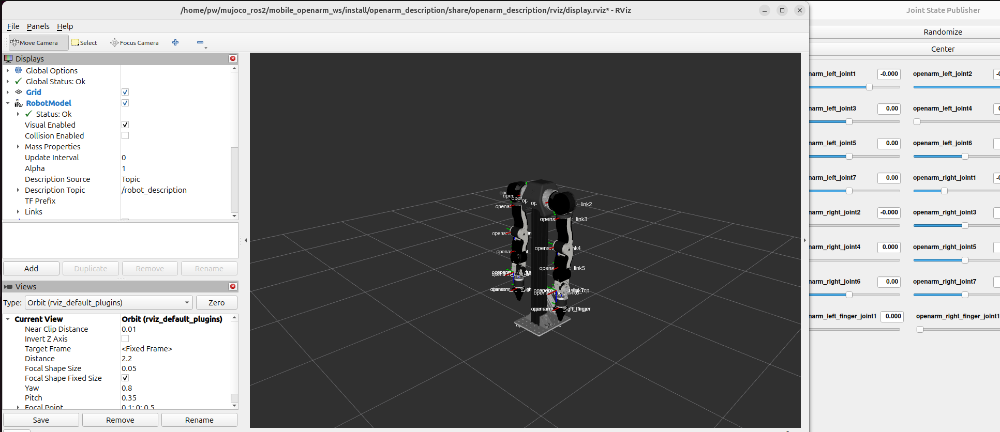{width=1000}

### 로봇 한 대의 조립

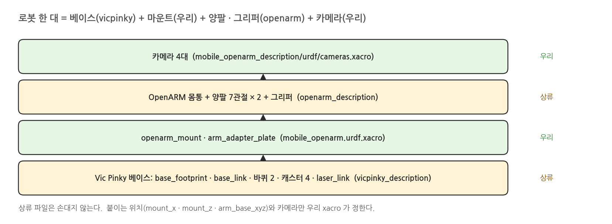{width=1000}

## 2. 관계 편: URDF 하나가 세 곳으로

### 흐름 한눈에

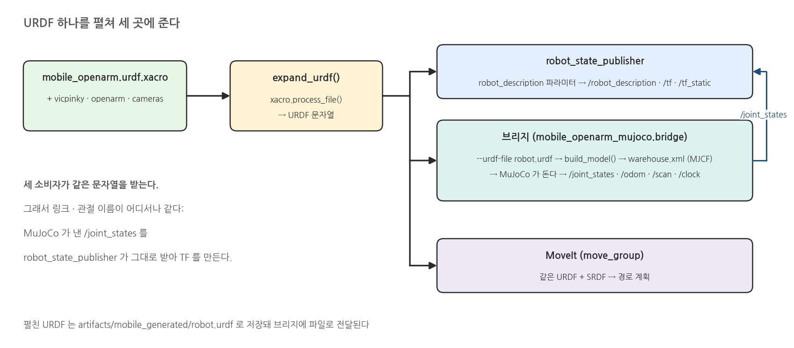{width=1000}

### Xacro 조립 순서

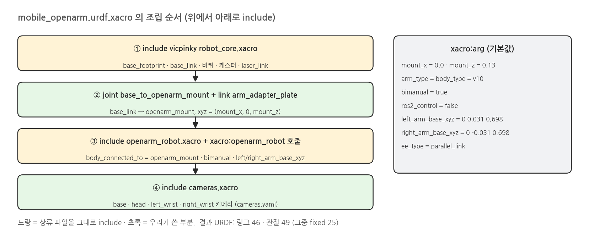{width=1000}

### URDF → MJCF: 그대로 가는 것 · 더해지는 것

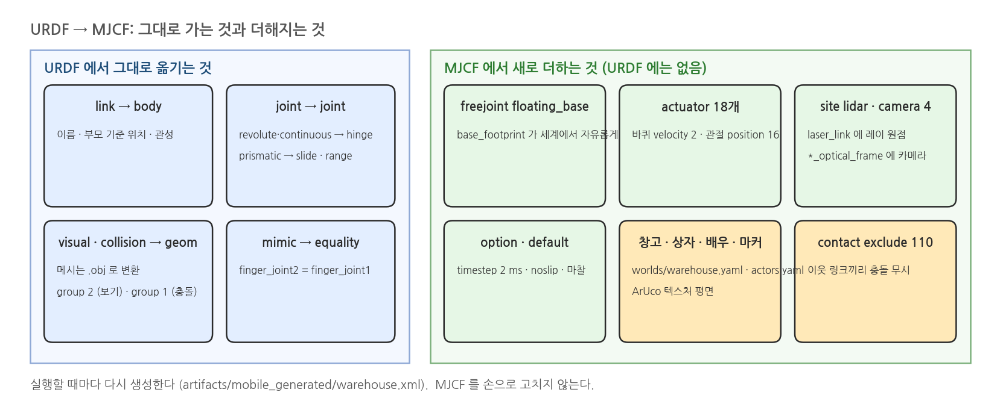{width=1000}

### 이름이 그대로라서 맞물린다

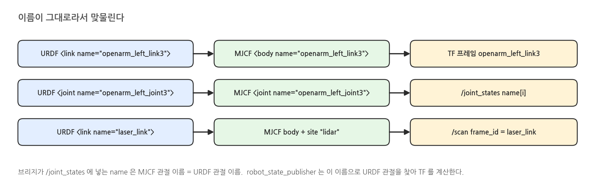{width=1000}

### TF는 누가 내나

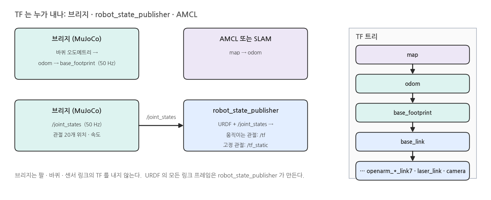{width=1000}

## 3. 코드 편

### 파생물의 흐름: model.py → robot.urdf → 누가 쓰나

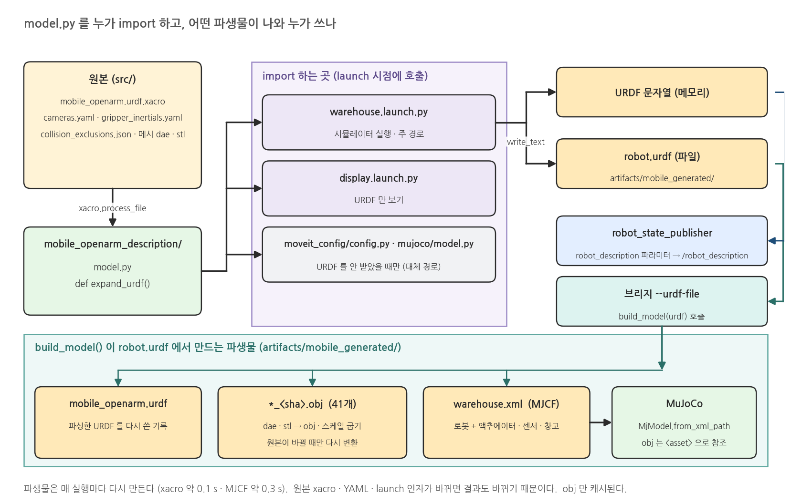{width=1000}

### Xacro 펼치기 - expand_urdf 함수 (다른 launch · 모듈이 import 해서 사용)

```python
# mobile_openarm_description/model.py
def expand_urdf(mappings=None):
    path = Path(get_package_share_directory("mobile_openarm_description")) / "urdf/mobile_openarm.urdf.xacro"
    options = {str(k): str(v) for k, v in (mappings or {}).items()}
    options["ros2_control"] = "false"
    return xacro.process_file(str(path), mappings=options).toxml()
```

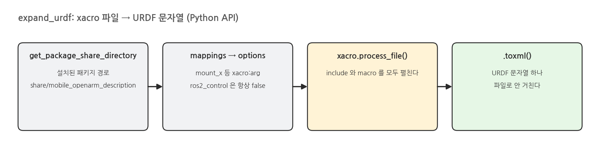{width=1000}

### 한 번 펼쳐 세 곳에 - warehouse.launch.py 의 setup 함수

```python
# mobile_openarm_bringup/launch/warehouse.launch.py
urdf = expand_urdf()
path = root / "robot.urdf"
path.write_text(urdf)
command = [python, "-m", "mobile_openarm_mujoco.bridge", "--urdf-file", str(path), "--output-dir", str(root)]
...
physics = ExecuteProcess(cmd=command, output="screen", name="mobile_openarm_mujoco")
actions = [
    physics,
    RegisterEventHandler(OnProcessExit(target_action=physics, on_exit=exited)),
    Node(package="robot_state_publisher", executable="robot_state_publisher",
         parameters=[{"robot_description": urdf, "use_sim_time": True}], output="screen"),
]
```

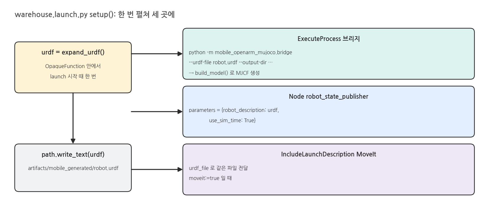{width=1000}

### MJCF 뼈대 - build_model 함수 앞부분

```python
# mobile_openarm_mujoco/model.py
def build_model(output_dir, urdf=None, config_file=None, world_file=None, actors_file=None):
    robot = ET.fromstring(urdf or expand_urdf())
    links = {x.get("name"): x for x in robot.findall("link")}
    joints = robot.findall("joint")
    children = {}
    for j in joints:
        children.setdefault(j.find("parent").get("link"), []).append(j)
    root = ET.Element("mujoco", model="mobile_openarm_warehouse")
    ET.SubElement(root, "compiler", angle="radian", eulerseq="XYZ", autolimits="true",
                  inertiafromgeom="false", fusestatic="false")
    ET.SubElement(root, "option", timestep=str(p["timestep"]), gravity=vector(p["gravity"]),
                  integrator=p["integrator"], iterations=str(p["iterations"]), ...)
    ...
    link(world, "base_footprint")
    ...
    ET.ElementTree(root).write(out / "warehouse.xml", encoding="unicode")
```

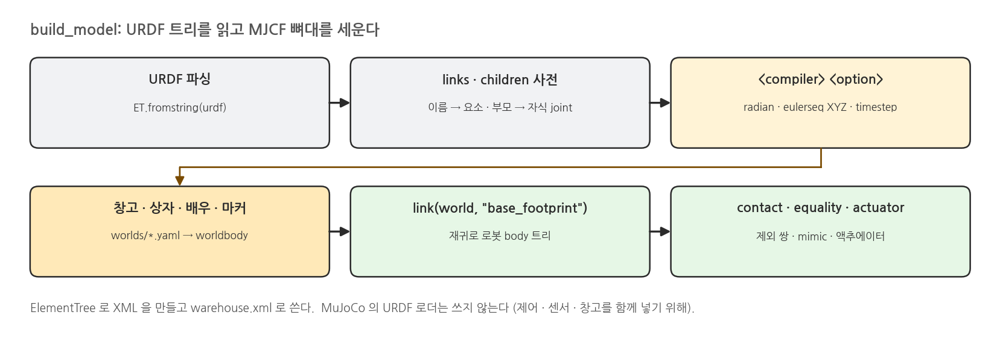{width=1000}

### 링크 → body - link 함수

```python
def link(parent, name, joint=None):
    attrs = {"name": name}
    attrs.update(origin(joint) if joint is not None else {"pos": vector(settings["spawn"]["position"])})
    body = ET.SubElement(parent, "body", **attrs)
    ...  # joint · inertial · geom · site · camera
    for child in children.get(name, []):
        link(body, child.find("child").get("link"), child)

link(world, "base_footprint")
```

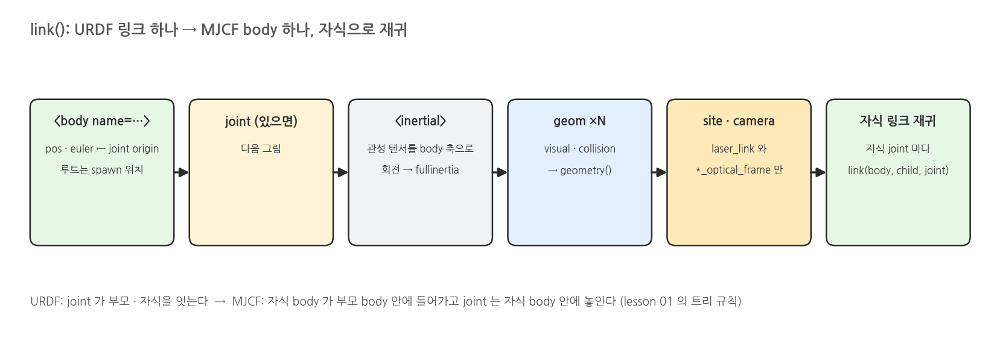{width=1000}

### 관절 → joint - link 함수 (관절 부분)

```python
if joint is None:
    ET.SubElement(body, "freejoint", name="floating_base")
elif joint.get("type") != "fixed":
    typ = joint.get("type")
    a = {"name": joint.get("name"),
         "type": "slide" if typ == "prismatic" else "hinge",
         "axis": joint.find("axis").get("xyz"),
         "damping": "0.1",
         "armature": "0.01" if typ != "prismatic" else "0.001"}
    if typ in ["revolute", "prismatic"]:
        lim = joint.find("limit")
        a["range"] = lim.get("lower") + " " + lim.get("upper")
    ET.SubElement(body, "joint", **a)
```

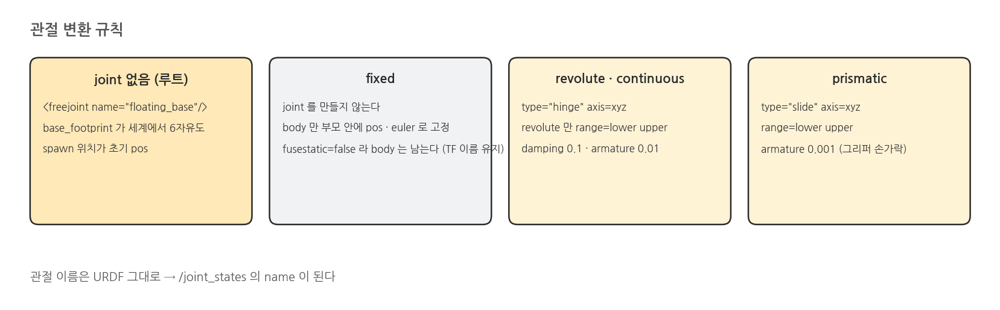{width=1000}

### 형상 → geom - geometry 함수

```python
def geometry(body, element, is_visual, name, index):
    geom = element.find("geometry")[0]
    attrs = origin(element)
    attrs.update(name=f"{name}_{'visual' if is_visual else 'collision'}_{index}",
                 group="2" if is_visual else "1",
                 contype="0" if is_visual else "2",
                 conaffinity="0" if is_visual else "3")
    if geom.tag == "mesh":
        path = resolve_mesh(geom.get("filename"))            # package:// → 실제 경로
        mesh = trimesh.load(str(path), force="scene").to_geometry()
        mesh.apply_scale(scale)
        mesh.export(str(converted))                            # <stem>_<sha>.obj
        attrs.update(type="mesh", mesh=meshes[key])
    elif geom.tag == "box":
        attrs.update(type="box", size=vector(numbers(geom.get("size")) / 2))
    ...
    ET.SubElement(body, "geom", **attrs)
```

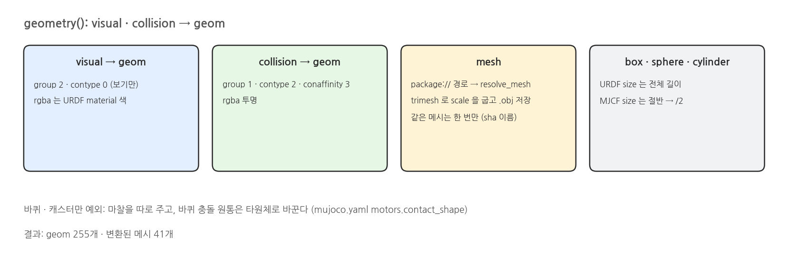{width=1000}

### 센서 자리 - lidar site 와 camera

```python
if name == "laser_link":
    ET.SubElement(body, "site", name="lidar", size=".005", rgba="1 0 0 1")
if name in camera_frames:                       # {"base_camera_optical_frame": "base_camera", ...}
    camera_name = camera_frames[name]
    # Optical +Z forward/+Y down -> MuJoCo -Z forward/+Y up.
    ET.SubElement(body, "camera", name=camera_name, mode="fixed", quat="0 1 0 0",
                  fovy=str(cameras["cameras"][camera_name]["fovy"]))
```

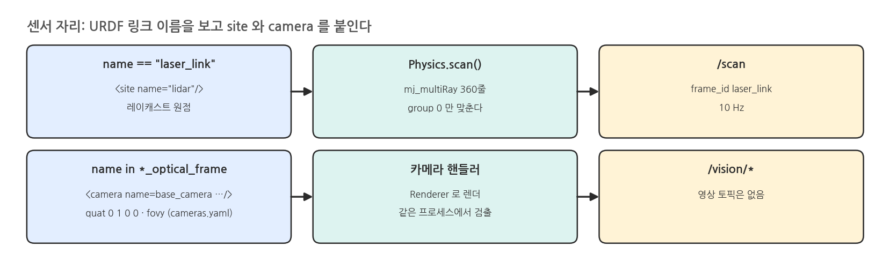{width=1000}

### 액추에이터 - 바퀴 velocity · 관절 position

```python
actuators = ET.SubElement(root, "actuator")
for side in ["left", "right"]:
    ET.SubElement(actuators, "velocity", name=side + "_motor", joint=side + "_wheel_joint",
                  kv=str(motors["velocity_gain"]),
                  ctrlrange=vector([-motors["max_speed"], motors["max_speed"]]),
                  forcerange=vector([-motors["max_torque"], motors["max_torque"]]))
for j in joints:
    if j.get("type") not in ["revolute", "prismatic"] or j.find("mimic") is not None:
        continue
    lim = j.find("limit")
    cfg = settings["gripper" if j.get("type") == "prismatic" else "arm"]
    ET.SubElement(actuators, "position", name=j.get("name") + "_position", joint=j.get("name"),
                  kp=str(cfg["kp"]), kv=str(cfg["kv"]),
                  ctrlrange=lim.get("lower") + " " + lim.get("upper"), forcerange=vector([-force, force]))
```

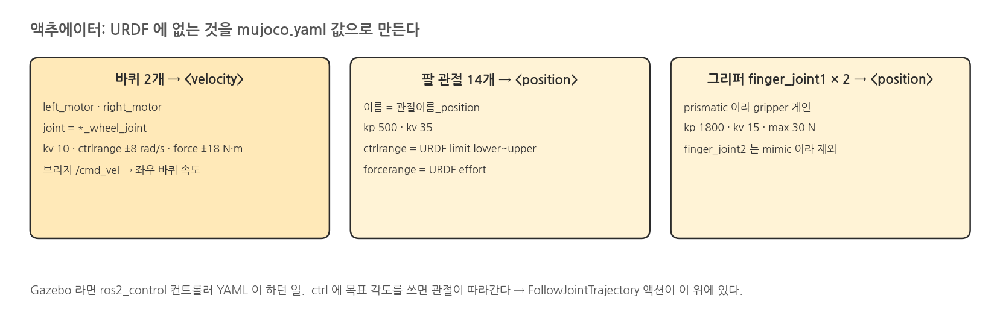{width=1000}

### mimic → equality

```python
equality = ET.SubElement(root, "equality")
for j in joints:
    mimic = j.find("mimic")
    if mimic is not None:
        ET.SubElement(equality, "joint", joint1=j.get("name"), joint2=mimic.get("joint"),
                      polycoef=f"{mimic.get('offset', '0')} {mimic.get('multiplier', '1')} 0 0 0",
                      solref="0.004 1")
```

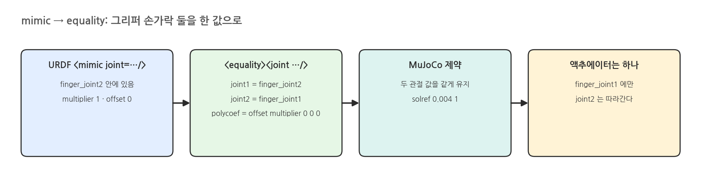{width=1000}

### 모델 읽기 - Physics 클래스의 __init__

```python
# mobile_openarm_mujoco/model.py
class Physics:
    def __init__(self, model_path, config_file=None):
        self.model = mujoco.MjModel.from_xml_path(str(model_path))
        self.data = mujoco.MjData(self.model)
        self.radius = float(self.model.geom("left_wheel_collision_0").size[0])
        self.track = float(abs(self.model.body("left_wheel").pos[1] - self.model.body("right_wheel").pos[1]))
        self.joint_names = [self.model.joint(i).name for i in range(self.model.njnt)
                            if self.model.jnt_type[i] in (2, 3)]          # slide · hinge
        self.q_indices = [self.model.joint(n).qposadr[0] for n in self.joint_names]
        self.v_indices = [self.model.joint(n).dofadr[0] for n in self.joint_names]
        self.targets = initial_positions()
```

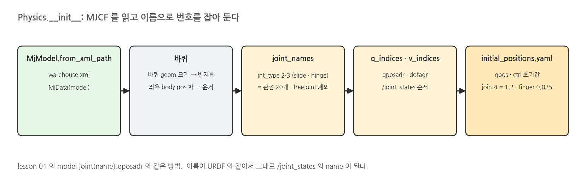{width=1000}

### /joint_states 와 odom TF - publish_state 함수

```python
# mobile_openarm_mujoco/bridge.py
def publish_state(self, now):
    p = self.physics
    odom = Odometry()
    odom.header.stamp, odom.header.frame_id, odom.child_frame_id = now, "odom", "base_footprint"
    planar(odom.pose.pose, p.odom)
    self.odom_pub.publish(odom)
    tf = TransformStamped()
    tf.header, tf.child_frame_id = odom.header, odom.child_frame_id
    tf.transform.translation.x = odom.pose.pose.position.x
    tf.transform.translation.y = odom.pose.pose.position.y
    tf.transform.rotation = odom.pose.pose.orientation
    self.tf.sendTransform(tf)
    joints = JointState()
    joints.header.stamp = now
    joints.name = p.joint_names
    joints.position = p.data.qpos[p.q_indices].tolist()
    joints.velocity = p.data.qvel[p.v_indices].tolist()
    self.joint_pub.publish(joints)
```

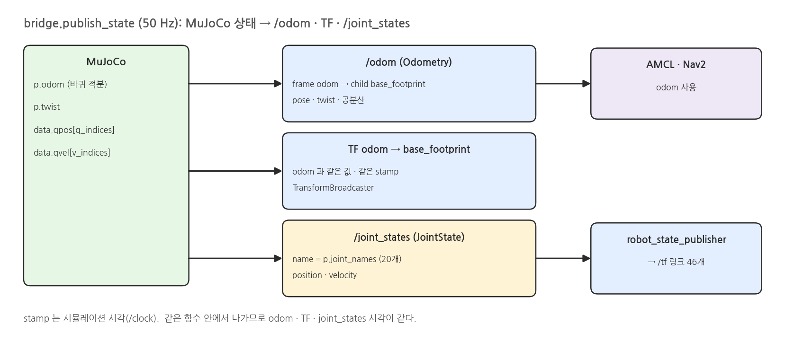{width=1000}

### display.launch.py - 노드 셋

```python
# mobile_openarm_description/launch/display.launch.py
def setup(context):
    urdf = expand_urdf()
    gui = LaunchConfiguration("gui").perform(context) == "true"
    actions = [
        Node(package="robot_state_publisher", executable="robot_state_publisher",
             parameters=[{"robot_description": urdf}], output="screen"),
        Node(package="joint_state_publisher_gui" if gui else "joint_state_publisher",
             executable="joint_state_publisher_gui" if gui else "joint_state_publisher",
             parameters=[{"robot_description": urdf}], output="screen"),
    ]
    if LaunchConfiguration("rviz").perform(context) == "true":
        actions.append(Node(package="rviz2", executable="rviz2",
                            arguments=["-d", str(share / "config/display.rviz")], output="screen"))
    return actions
```

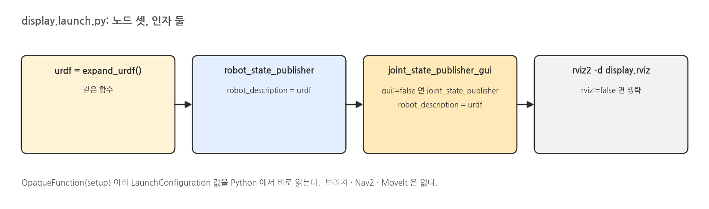{width=1000}

## 4. 실행해보기

### 시뮬레이터 없이 보기: display.launch.py

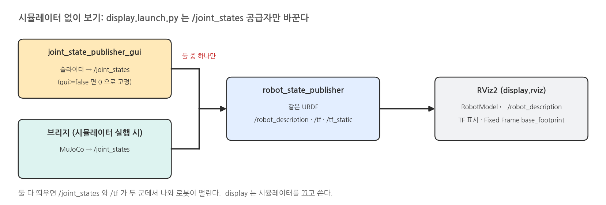{width=1000}

### 실행: 터미널 1 (display)

```bash
source /opt/ros/jazzy/setup.bash
source scripts/env.sh
./scripts/mobile_openarm display          # = ros2 launch mobile_openarm_description display.launch.py
```

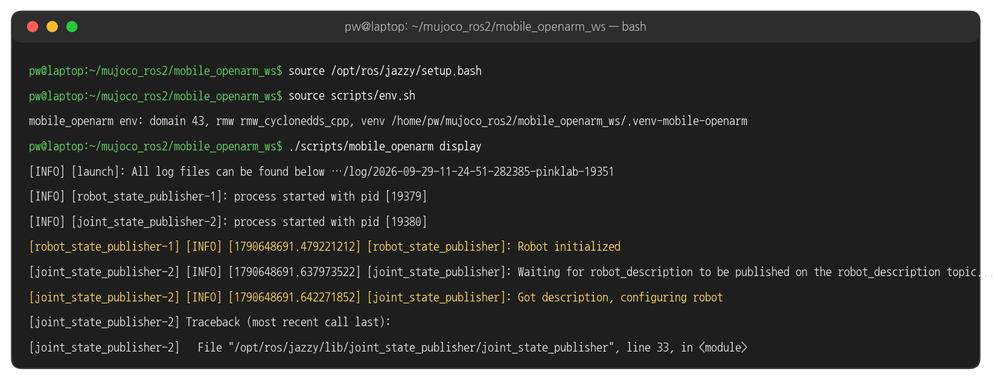{width=1000}

### display 의 실행 결과

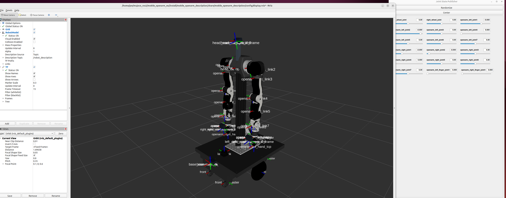{width=1000}

### 터미널 2: ros2 node list

```bash
source /opt/ros/jazzy/setup.bash
source scripts/env.sh
ros2 node list
```

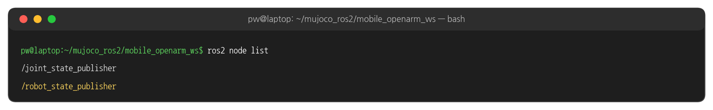{width=1000}

### 터미널 2: ros2 topic list · topic info /robot_description

```bash
ros2 topic list
ros2 topic info /robot_description
```

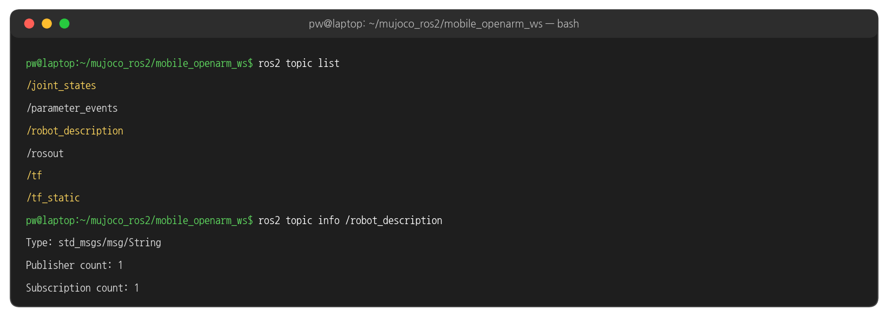{width=1000}

### 터미널 2: ros2 topic echo /joint_states

```bash
ros2 topic echo --once /joint_states
```

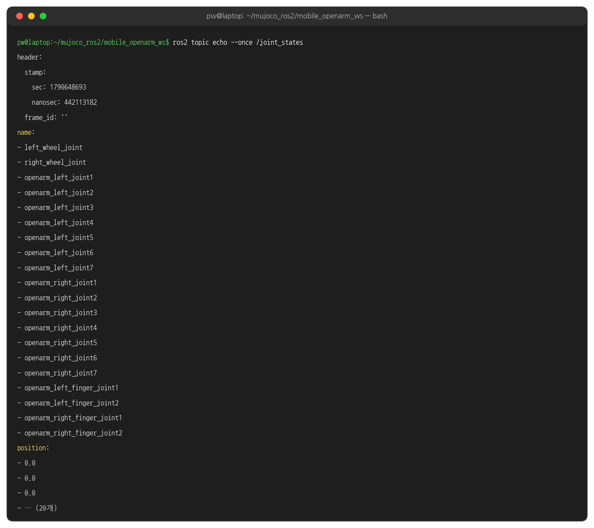{width=1000}

### 터미널 2: tf2_echo base_footprint openarm_left_hand_tcp

```bash
ros2 run tf2_ros tf2_echo base_footprint openarm_left_hand_tcp
```

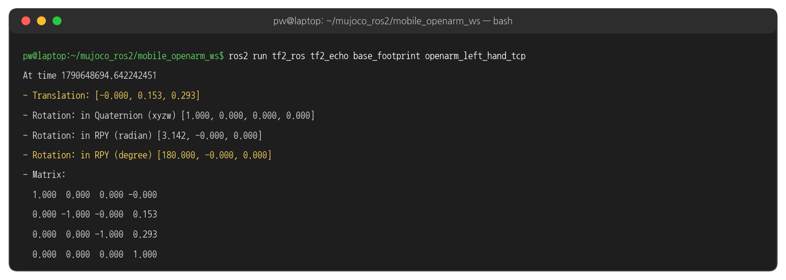{width=1000}

### 터미널 2: tf2_echo base_link laser_link

```bash
ros2 run tf2_ros tf2_echo base_link laser_link
```

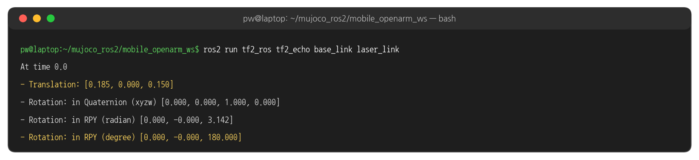{width=1000}

### 생성된 파일 보기

```bash
ls artifacts/mobile_generated/
head -3 artifacts/mobile_generated/warehouse.xml
```

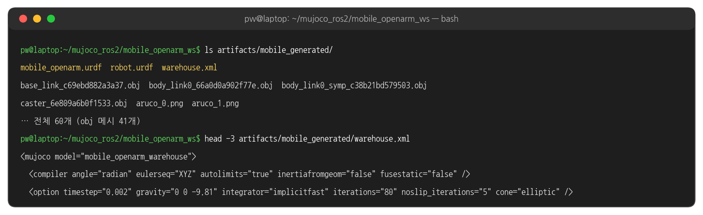{width=1000}

### URDF 와 MJCF 의 크기 비교

```bash
grep -o '<link ' artifacts/mobile_generated/robot.urdf | wc -l
grep -o '<joint ' artifacts/mobile_generated/robot.urdf | wc -l
for t in body joint geom camera site velocity position exclude; do
  echo "$t $(grep -o "<$t " artifacts/mobile_generated/warehouse.xml | wc -l)"
done
```

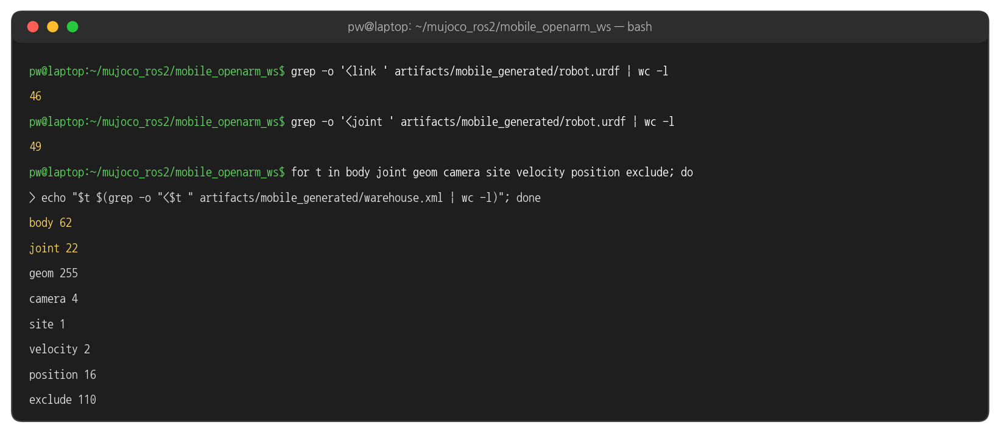{width=1000}

- URDF 관절 49개 중 fixed 25개는 MJCF에서 joint가 되지 않는다. body만 남아 22개 joint(자유 관절 1 + 바퀴 2 + 팔 14 + 손가락 4)다.
- body가 링크 수보다 많다. 창고 상자 · 배우 · 마커 body가 더해졌다.

### 해 볼 것

- `./scripts/mobile_openarm display`를 띄우고 슬라이더로 `openarm_left_joint4`를 움직인다. `tf2_echo base_footprint openarm_left_hand_tcp` 값이 바뀐다.
- `ros2 launch mobile_openarm_description display.launch.py gui:=false`로 띄우면 관절이 0에 고정된다. 초기 자세와 다른 이유를 `initial_positions.yaml`에서 찾는다.
- `mujoco.yaml`의 `arm.kp`를 반으로 줄이고 `./scripts/mobile_openarm start`. 팔이 초기 자세를 잡는 데 걸리는 시간이 달라진다.
