## 1. Bringup: 시뮬레이터 하나를 띄우면

### warehouse.launch.py 가 띄우는 것

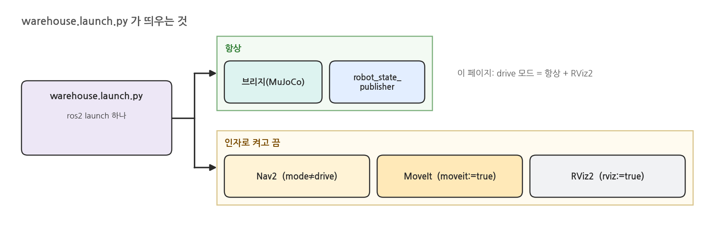{width=1000}

### mode 인자: drive · slam · nav

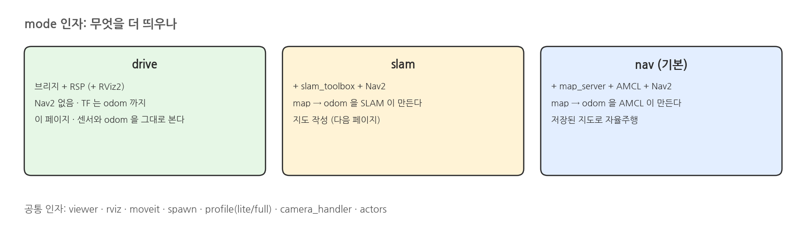{width=1000}

### wrapper 를 쓰는 이유

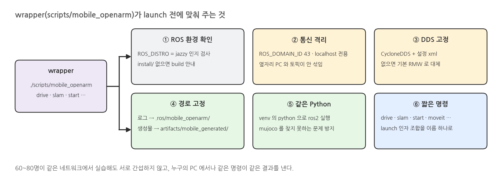{width=1000}

### wrapper 명령과 launch 인자

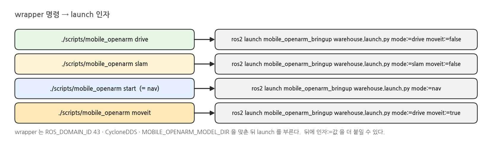{width=1000}

### 실행: 터미널 1 (drive)

```bash
source /opt/ros/jazzy/setup.bash
source scripts/env.sh
./scripts/mobile_openarm drive          # = ros2 launch mobile_openarm_bringup warehouse.launch.py mode:=drive moveit:=false
```

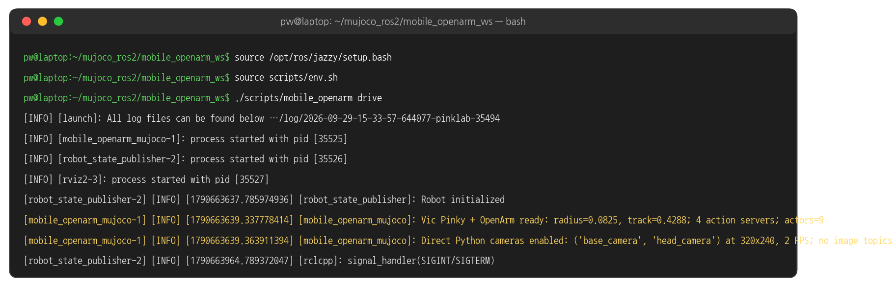{width=1000}

### 실행 결과

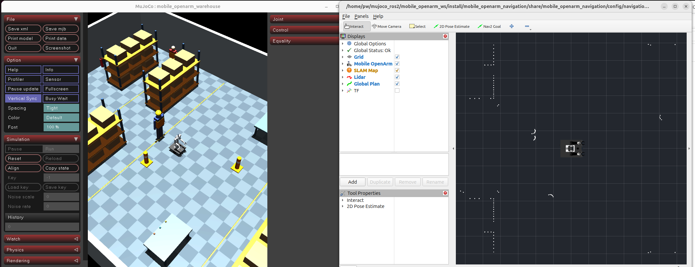{width=1000}

### 터미널 2: ros2 node list · ros2 topic list

```bash
source /opt/ros/jazzy/setup.bash
source scripts/env.sh
ros2 node list
ros2 topic list
```

### 실행 결과: node list · topic list

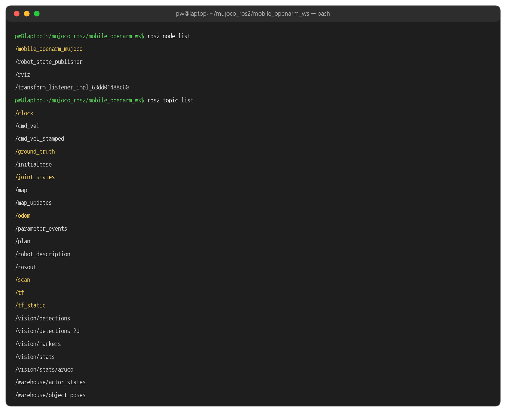{width=1000}

## 2. 센서: 무엇을 어떻게 재나

### 센서 한눈에

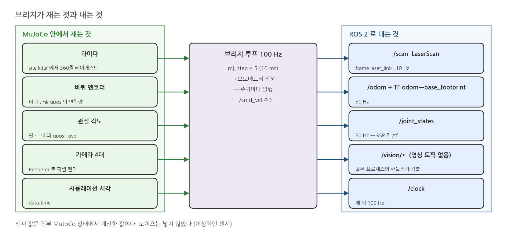{width=1000}

### 브리지 프로세스: bridge.py + model.py

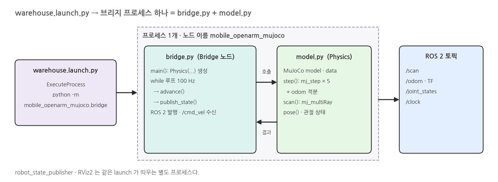{width=1000}

### MuJoCo에서 라이다값 읽기

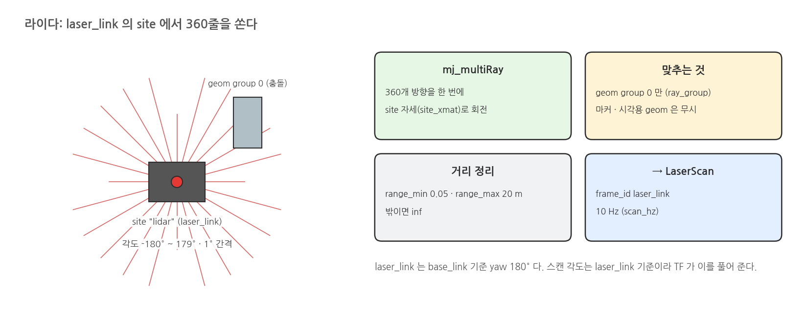{width=1000}

### 라이다 광선 준비 - __init__ 발췌

```python
# mobile_openarm_mujoco/model.py  (Physics)
def __init__(self, model_path, config_file=None):   # 발췌
    self.angles = np.linspace(-math.pi, math.pi, self.settings["lidar"]["samples"], endpoint=False)   # 360개
    self.rays = np.column_stack([np.cos(self.angles), np.sin(self.angles), np.zeros(len(self.angles))])
    self.ray_group = np.array([1, 0, 0, 0, 0, 0], dtype=np.uint8)      # geom group 0 만 맞춘다
    self.lidar_id = self.model.site("lidar").id
```

### 라이다 거리 측정 - scan 함수

```python
# mobile_openarm_mujoco/model.py  (Physics)
def scan(self):
    self.mj.mj_forward(self.model, self.data)
    rays = np.ascontiguousarray(self.rays @ self.data.site_xmat[self.lidar_id].reshape(3, 3).T)
    distances = np.empty(len(rays)); ids = np.empty(len(rays), dtype=np.int32)
    cfg = self.settings["lidar"]
    self.mj.mj_multiRay(self.model, self.data, self.data.site_xpos[self.lidar_id], rays.ravel(),
                        self.ray_group, True, -1, ids, distances, None, len(rays), cfg["range_max"])
    distances[(distances < cfg["range_min"]) | (distances > cfg["range_max"])] = np.inf
    return distances
```

### LaserScan 메시지

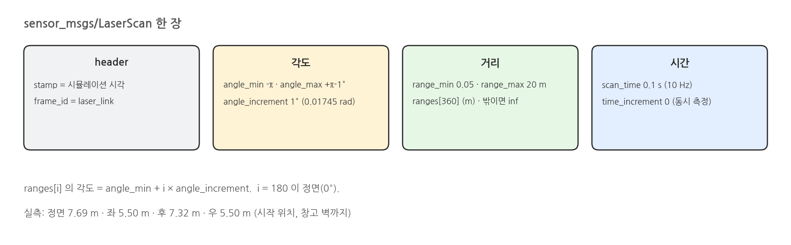{width=1000}

### /scan 발행자 만들기 - Bridge.__init__ 발췌

```python
# mobile_openarm_mujoco/bridge.py  (Bridge)
def __init__(self, physics, world_file=None, actors=None):   # 발췌
    self.scan_pub = self.create_publisher(LaserScan, "/scan", qos_profile_sensor_data)
```

### /scan 메시지 채워 발행 - advance 함수 발췌

```python
# mobile_openarm_mujoco/bridge.py  (Bridge)
def advance(self):   # 발췌: 100 Hz 루프 한 바퀴
    p = self.physics
    ...                                    # 명령 적용 · p.step() (mj_step 5회) · /clock 발행
    now = self.sim_stamp()
    self.tick += 1
    rates = p.settings["rates"]
    if self.tick % round(rates["bridge_hz"] / rates["scan_hz"]) == 0:   # 10 바퀴에 한 번 = 10 Hz
        scan = LaserScan()
        scan.header.stamp = now
        scan.header.frame_id = "laser_link"
        scan.angle_min = float(p.angles[0])                        # -π
        scan.angle_max = float(p.angles[-1])                       # +π - 1°
        scan.angle_increment = float(p.angles[1] - p.angles[0])    # 1°
        scan.time_increment = 0.0
        scan.scan_time = 1 / rates["scan_hz"]                      # 0.1 s
        scan.range_min = p.settings["lidar"]["range_min"]          # 0.05 m
        scan.range_max = p.settings["lidar"]["range_max"]          # 20 m
        scan.ranges = p.scan().astype("float32").tolist()          # Physics.scan() 결과 360개
        self.scan_pub.publish(scan)
```

### 터미널 2: ros2 topic echo /scan

```bash
ros2 topic echo --once /scan
```

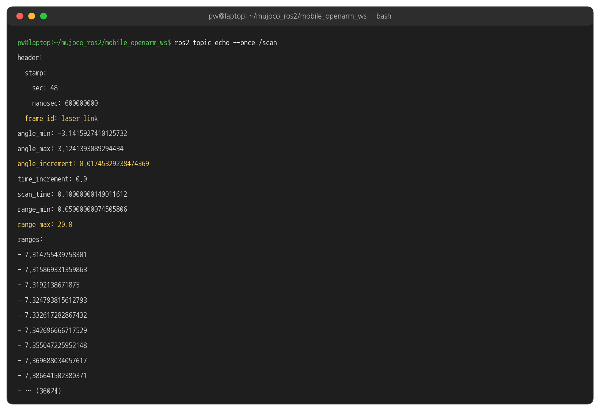{width=1000}

### 터미널 2: scan_probe.py 로 요약 보기

```bash
python docs/camp/scan_probe.py
```

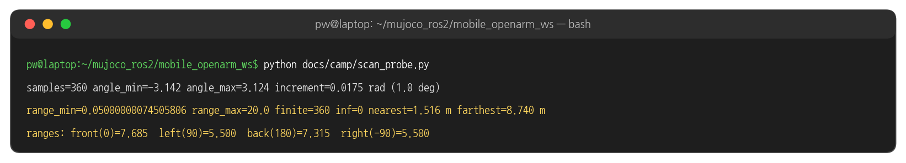{width=1000}

### RViz2 에서 본 /scan

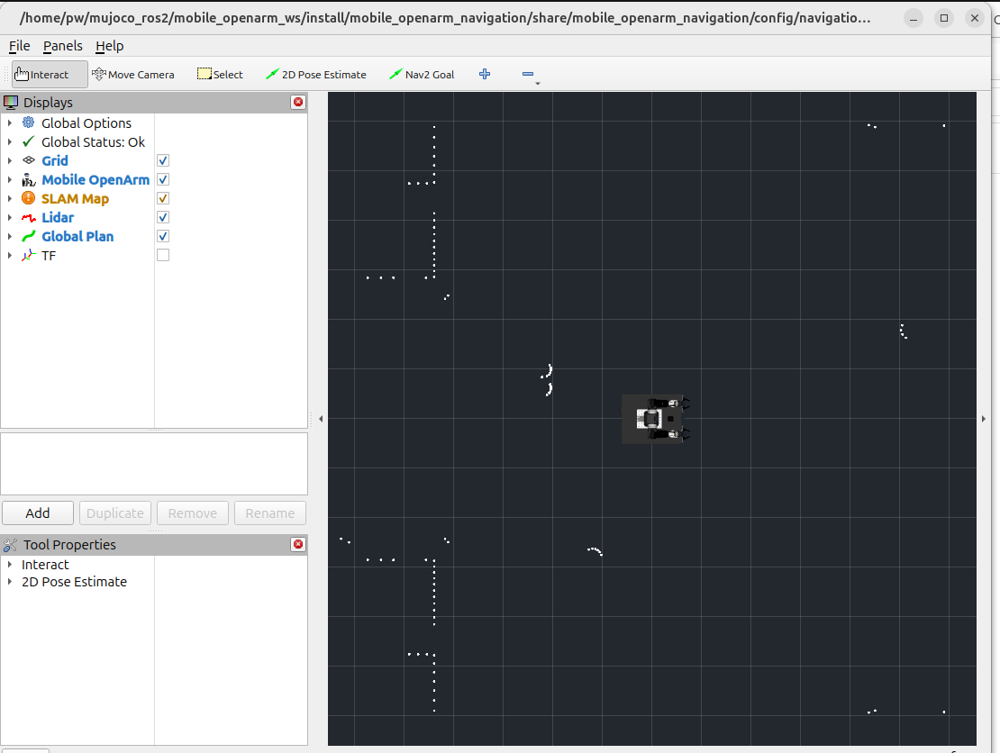{width=1000}

### 바퀴 엔코더 (밑에서 별도로 설명)

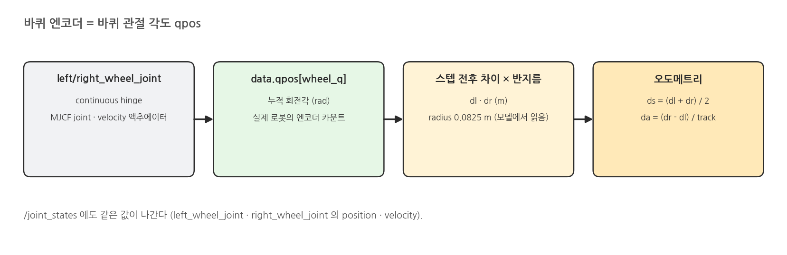{width=1000}

### 카메라 4대

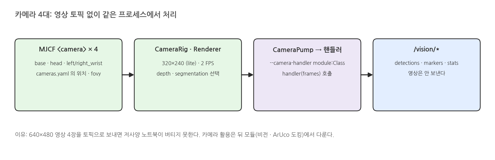{width=1000}

### /clock 과 TF

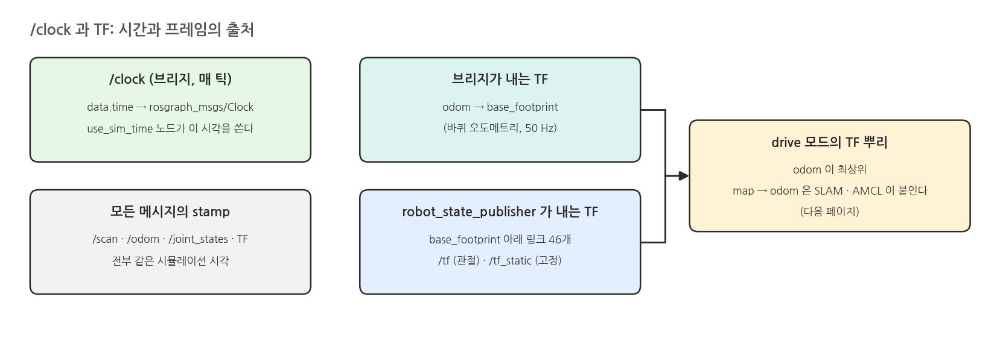{width=1000}

### 터미널 2: TF 트리 (view_frames)

```bash
ros2 run tf2_tools view_frames -o frames     # frames.pdf 생성
```

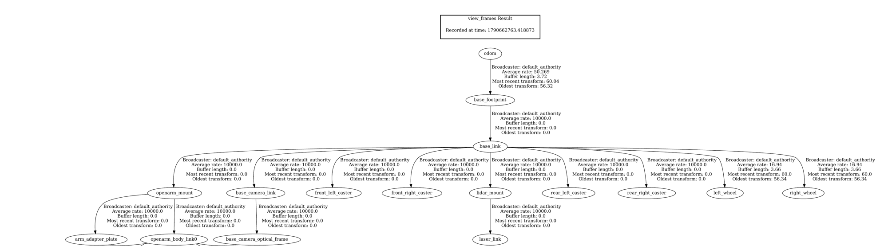{width=1000}

- odom → base_footprint: 브리지가 50 Hz로 갱신
- 나머지 링크: robot_state_publisher가 발행
- 고정 관절(캐스터 · 카메라 · laser_link)은 /tf_static
- 그래서 "Average rate 10000"으로 표시

### 발행 주기

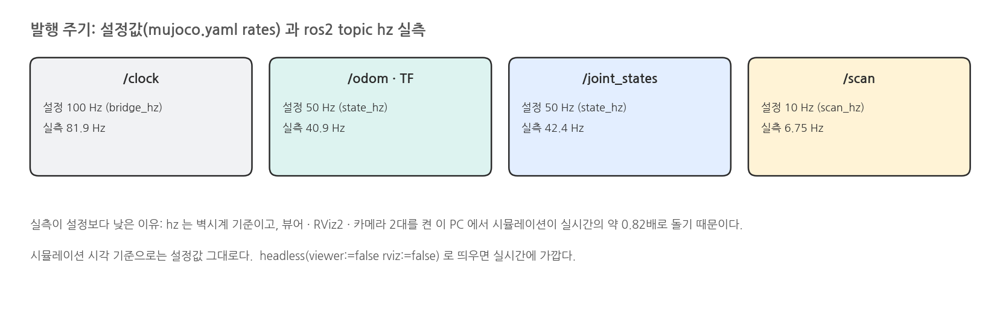{width=1000}

### 터미널 2: ros2 topic hz

```bash
ros2 topic hz /scan
ros2 topic hz /odom
ros2 topic hz /joint_states
ros2 topic hz /clock
```

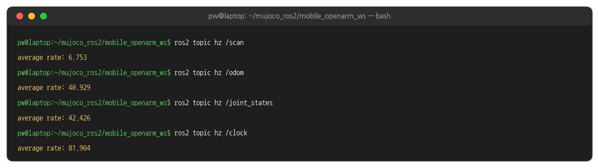{width=1000}

## 3. Odom 계산 과정

### 차동 구동 기구학

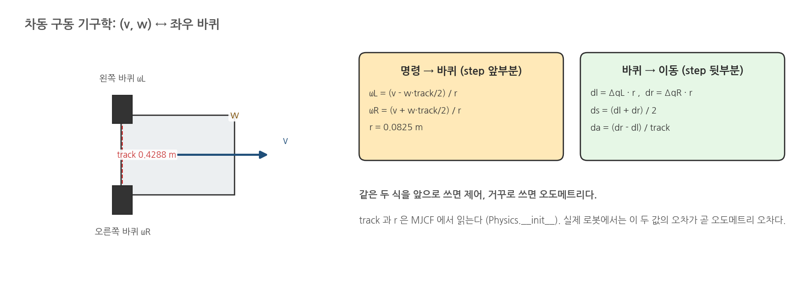{width=1000}

### 명령 → 바퀴 목표 속도

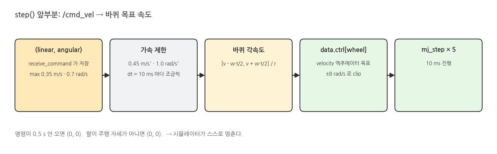{width=1000}

### 명령 → 바퀴 목표 속도 - step 함수 앞부분

```python
# mobile_openarm_mujoco/model.py  (Physics)
def step(self, linear=0.0, angular=0.0, steps=None):
    steps = steps or round(self.bridge_period / self.model.opt.timestep)      # 5
    dt = steps * self.model.opt.timestep                                        # 0.01 s
    cfg = self.settings["control"]
    change = np.array([cfg["acceleration"], cfg["angular_acceleration"]]) * dt  # 가속 제한
    self.command += np.clip(np.array([linear, angular]) - self.command, -change, change)
    v, w = self.command
    wheel = np.array([v - w * self.track / 2, v + w * self.track / 2]) / self.radius
    self.data.ctrl[self.wheel_ctrl] = np.clip(wheel, -max_speed, max_speed)
```

### 바퀴 회전 → 자세 적분

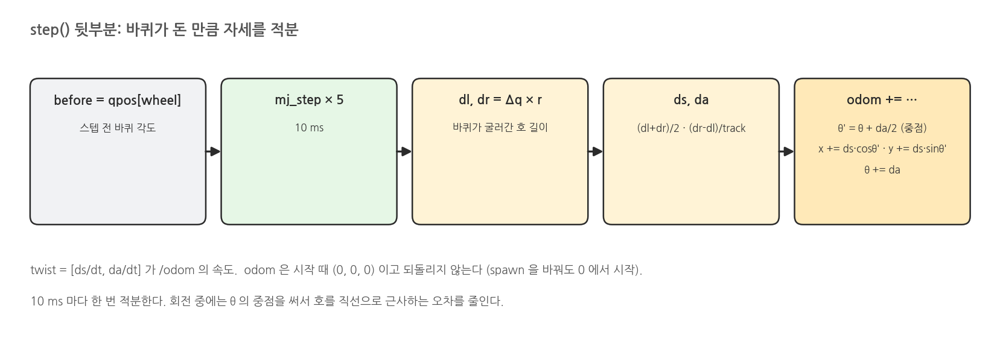{width=1000}

### 바퀴 회전 → 자세 적분 - step 함수 뒷부분

```python
    before = self.data.qpos[self.wheel_q].copy()
    self.mj.mj_step(self.model, self.data, nstep=steps)
    dl, dr = (self.data.qpos[self.wheel_q] - before) * self.radius   # 바퀴가 굴러간 호 길이
    ds, da = (dl + dr) / 2, (dr - dl) / self.track                    # 전진량 · 회전량
    theta = self.odom[2] + da / 2                                       # 중점 각도
    self.odom += [ds * math.cos(theta), ds * math.sin(theta), da]
    self.twist[:] = [ds / dt, da / dt]
```

### /odom 메시지와 TF

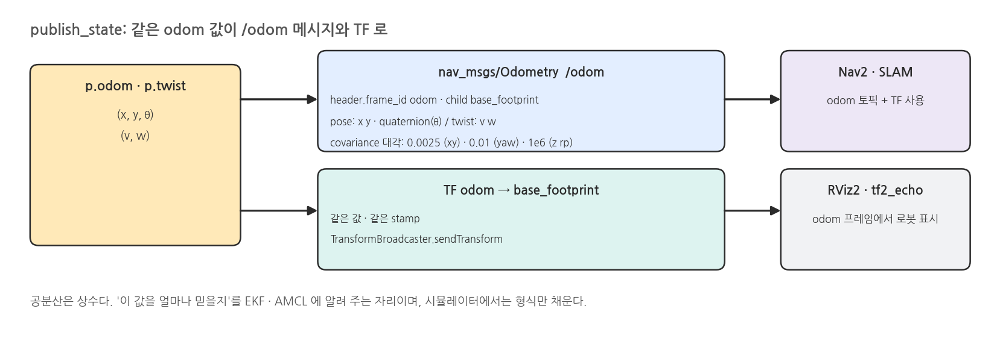{width=1000}

### /odom 메시지와 TF - publish_state 함수

```python
# mobile_openarm_mujoco/bridge.py
def publish_state(self, now):
    p = self.physics
    odom = Odometry()
    odom.header.stamp, odom.header.frame_id, odom.child_frame_id = now, "odom", "base_footprint"
    planar(odom.pose.pose, p.odom)                       # x, y, quaternion(theta)
    odom.twist.twist.linear.x = float(p.twist[0])
    odom.twist.twist.angular.z = float(p.twist[1])
    for i, v in enumerate([0.0025, 0.0025, 1e6, 1e6, 1e6, 0.01]):
        odom.pose.covariance[7 * i] = v
        odom.twist.covariance[7 * i] = v
    self.odom_pub.publish(odom)
    tf = TransformStamped()
    tf.header, tf.child_frame_id = odom.header, odom.child_frame_id
    tf.transform.translation.x = odom.pose.pose.position.x
    tf.transform.translation.y = odom.pose.pose.position.y
    tf.transform.rotation = odom.pose.pose.orientation
    self.tf.sendTransform(tf)
```

### 터미널 2: ros2 topic echo /odom

```bash
ros2 topic echo --once /odom
```

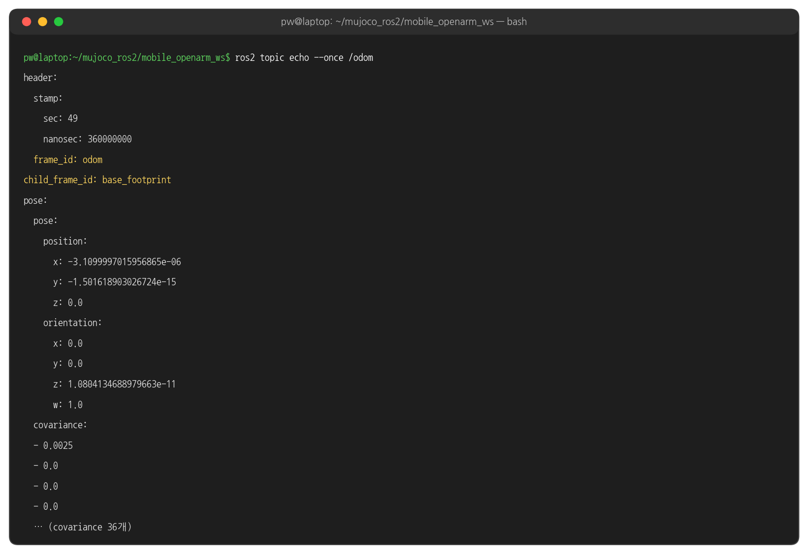{width=1000}

### 터미널 2: tf2_echo odom base_footprint

```bash
ros2 run tf2_ros tf2_echo odom base_footprint
```

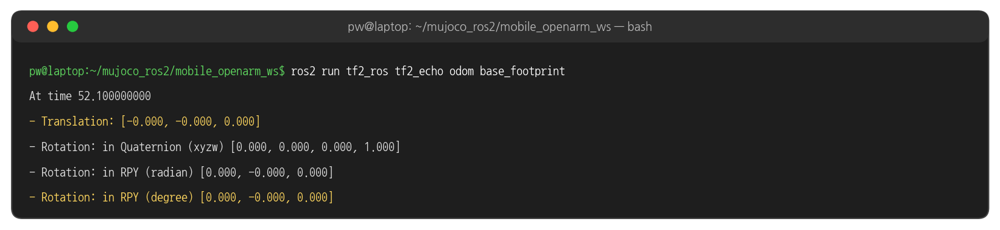{width=1000}

## 4. Odom 프레임과 실험

### 프레임 셋: world · odom · base_footprint

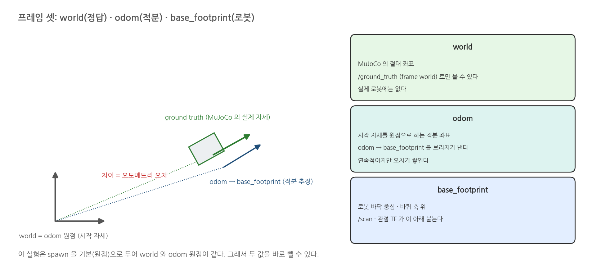{width=1000}

- world: MuJoCo의 절대 좌표
- /ground_truth 토픽으로만 확인 가능 · 실제 로봇에는 없음
- odom: 시작 자세를 원점으로 한 적분 좌표
- 연속적이지만 오차 누적
- 시뮬레이터라서 정답(world)과 추정(odom)의 직접 비교 가능
- 이 비교가 실험의 핵심

### 터미널 2: ros2 topic echo /ground_truth

```bash
ros2 topic echo --once /ground_truth
```

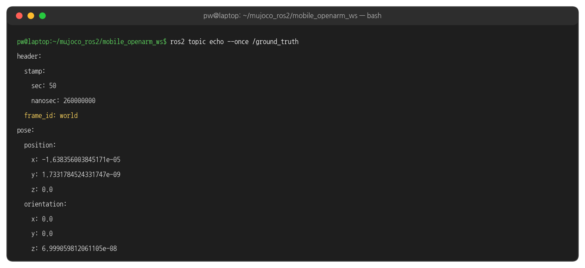{width=1000}

### 실험 설계

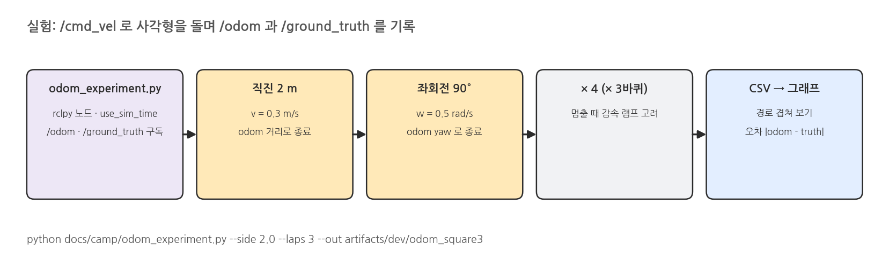{width=1000}

- /cmd_vel로 한 변 2 m 사각형 주행
- 직진은 odom 거리, 회전은 odom yaw 기준으로 종료
- 주행 중 /odom · /ground_truth 동시 기록
- 두 값의 차이 = 오도메트리 오차
- 스크립트: `docs/camp/odom_experiment.py`
- 1바퀴 · 3바퀴 각각 실행

### 터미널 2: 실험 실행

```bash
python docs/camp/odom_experiment.py --side 2.0 --laps 1 --out artifacts/dev/odom_square1
python docs/camp/odom_experiment.py --side 2.0 --laps 3 --out artifacts/dev/odom_square3
```

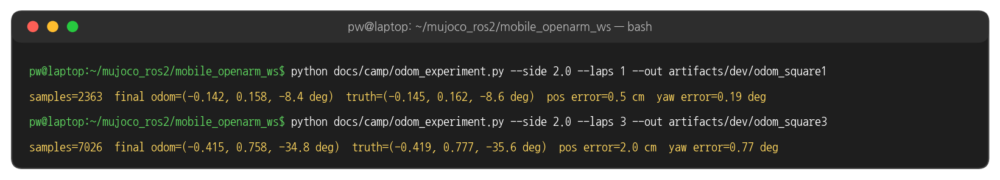{width=1000}

### 사각형 1바퀴 전후의 MuJoCo 창

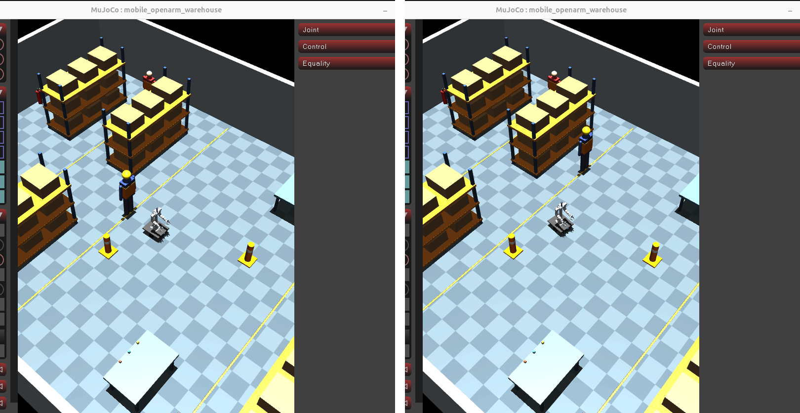{width=1000}

### 결과: 1바퀴

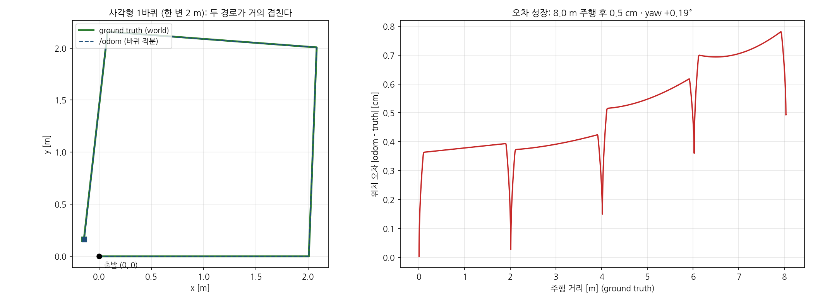{width=1000}

- 두 경로가 거의 겹침
- 약 8 m 주행 후 위치 오차 0.5 cm · yaw 오차 0.2°
- 오차 그래프의 뾰족한 곳 = 회전 구간
- 회전에서 오차 발생 · 직진에서는 거의 증가 없음

### 결과: 3바퀴

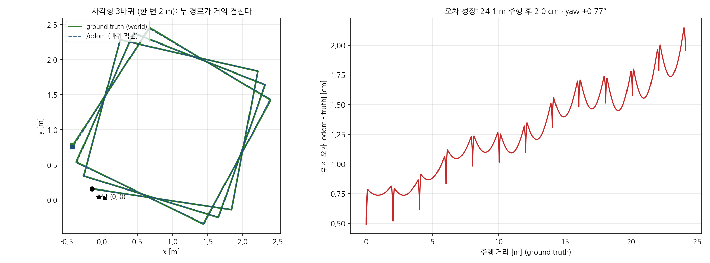{width=1000}

- 약 24 m 주행 후 위치 오차 2.0 cm · yaw 오차 0.8°
- 오차는 줄지 않고 계속 누적
- 시뮬레이터라서 오차가 작음
- 이유: 바퀴 미끄러짐 없음 · 반지름과 윤거가 모델 값과 동일

### spawn 을 바꿔도 odom 은 0 에서 시작한다

```bash
./scripts/mobile_openarm drive viewer:=false rviz:=false spawn:=pick_table     # 터미널 1
ros2 topic echo --once /ground_truth                                            # 터미널 2
ros2 topic echo --once /odom
```

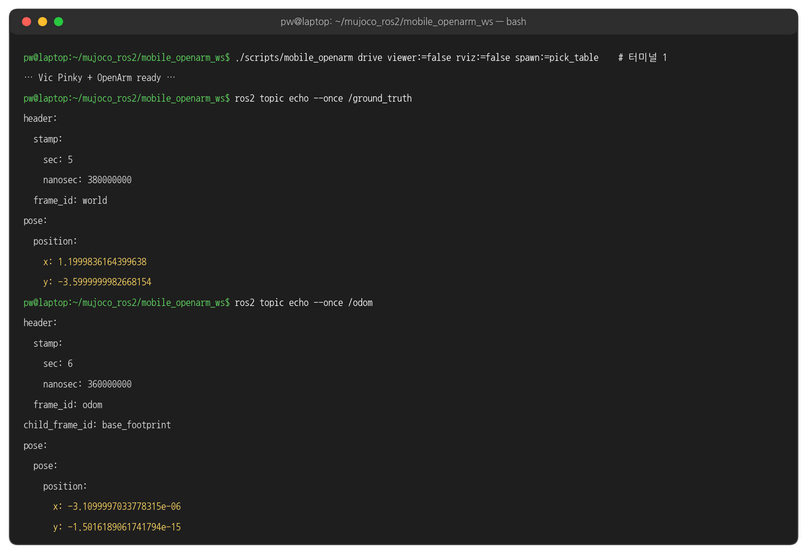{width=1000}

- 로봇 위치는 픽업 작업대 앞 (1.2, -3.6)
- odom 값은 (0, 0, 0)
- odom은 출발 위치를 모름
- 출발점을 원점으로 삼을 뿐임
- odom만으로는 지도 위 위치 파악 불가
- 이 빈칸은 SLAM · AMCL이 map → odom으로 채움

### 시뮬레이터에서도 odom 오차가 생기는 이유

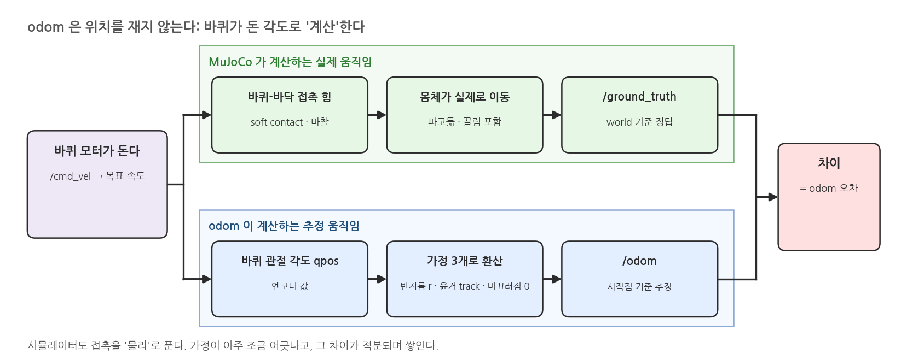{width=1000}

### 원인 1: 바퀴가 바닥에 살짝 파고든다

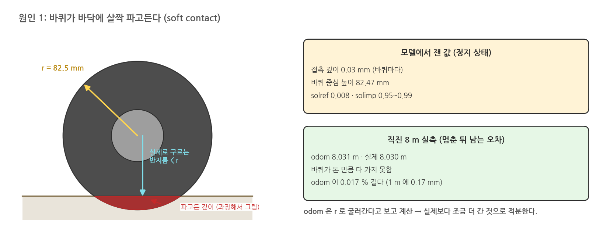{width=1000}

### 원인 2: 제자리 회전에서 바퀴와 캐스터가 끌린다

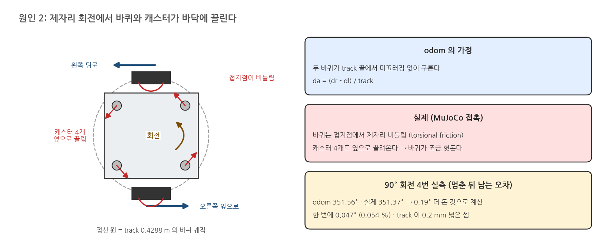{width=1000}

### 원인 3: 접촉은 스프링이다

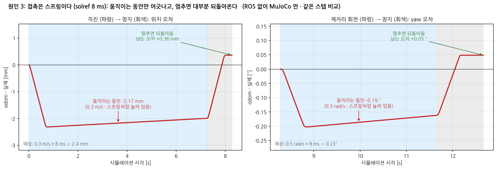{width=1000}

### yaw 오차는 다음 직진에서 옆으로 벌어진다

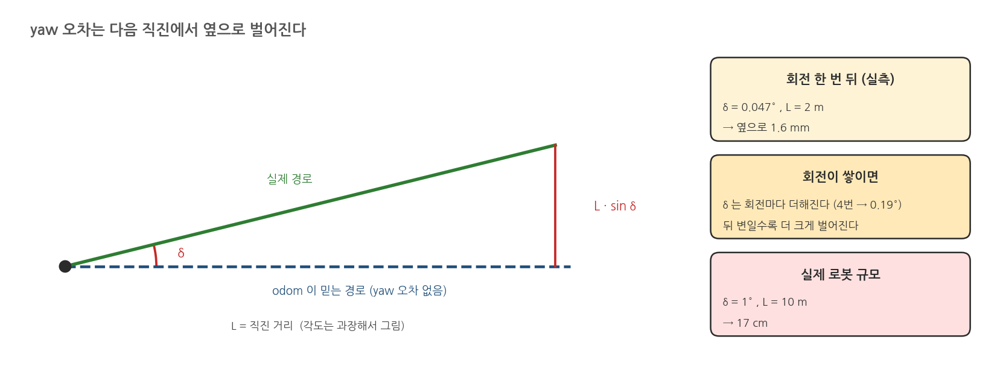{width=1000}

### 비교할 때 주의: 같은 시각의 값끼리

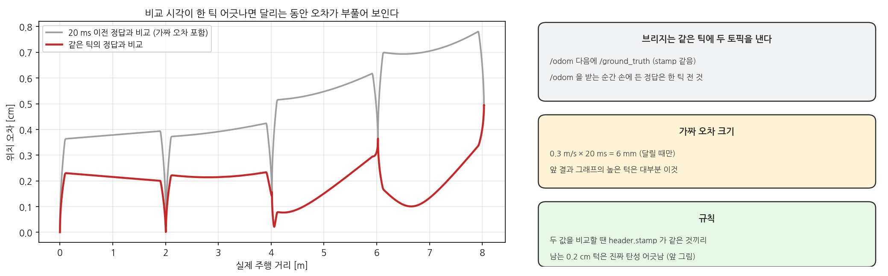{width=1000}

### 실측 다시 보기: 같은 틱끼리 비교

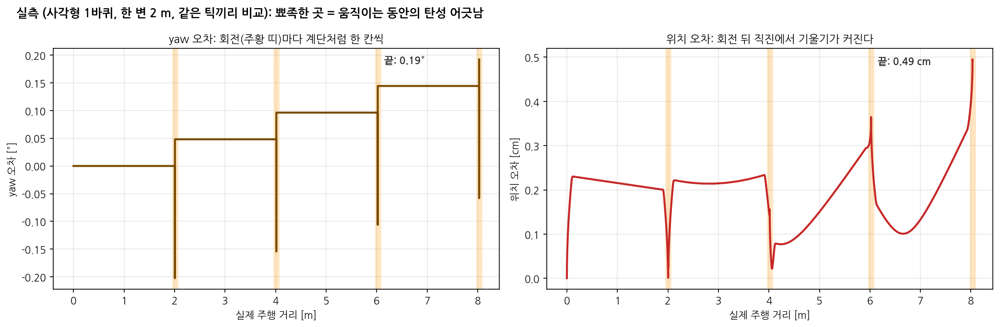{width=1000}

## 5. Odom 의 의미와 단점

### 오차가 쌓이는 이유

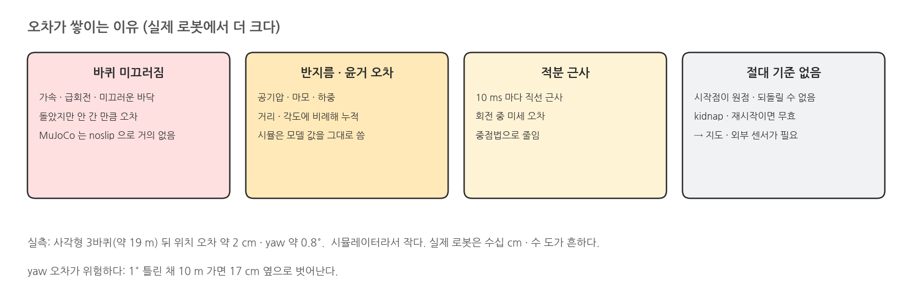{width=1000}

### Odom 의 역할과 한계

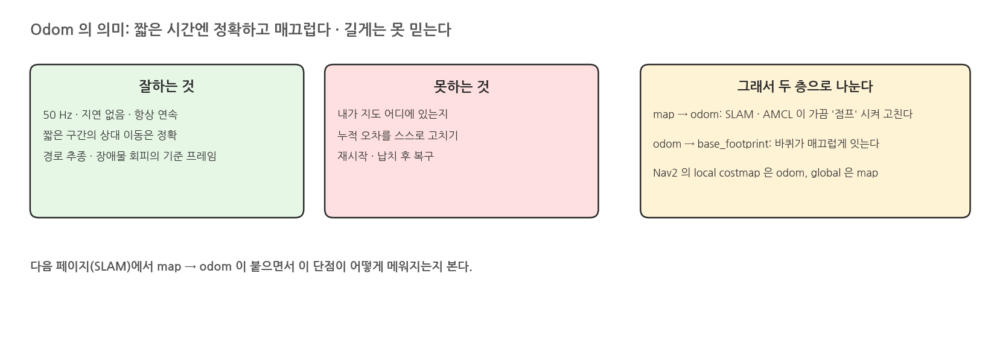{width=1000}

### 해 볼 것

- `--speed 0.35 --turn 0.7`로 최대 속도 주행 → 오차 변화 확인
- `ros2 topic pub -1 /cmd_vel geometry_msgs/msg/Twist "{angular: {z: 0.5}}"` 전송 → 0.5 s 뒤 정지 확인 (command_timeout)
- `mujoco.yaml`의 `lidar.samples`를 720으로 변경 → `/scan`의 angle_increment 0.5° 확인
