## 1. Nav2 란

### 지도 위에서 목표까지

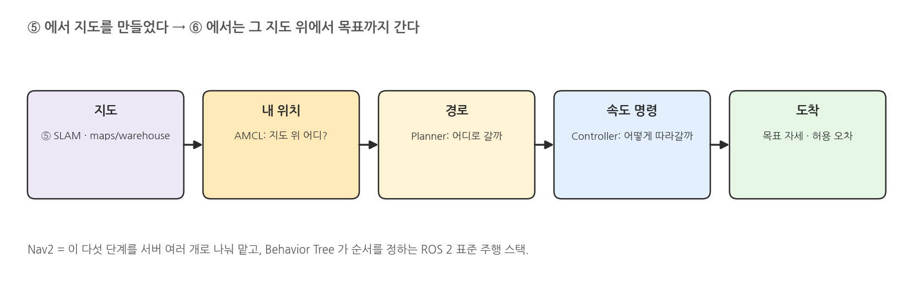{width=1000}

### Nav2 구성

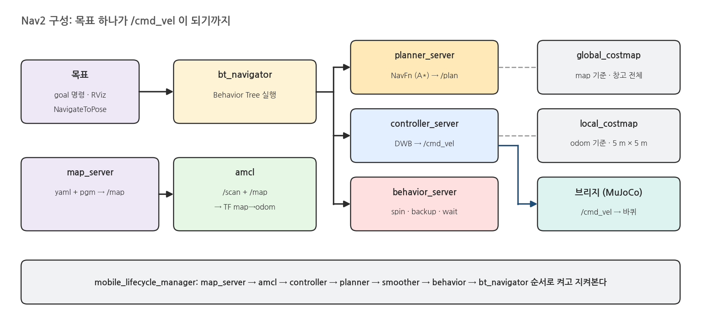{width=1000}

### Lifecycle 노드

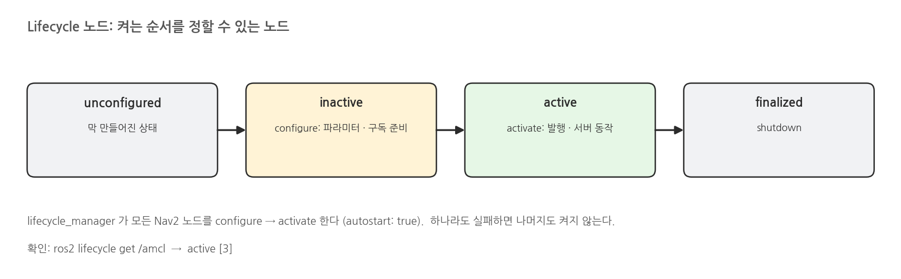{width=1000}

### 위치 추정: AMCL

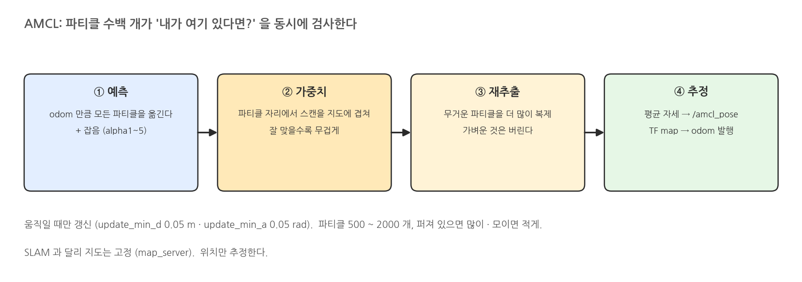{width=1000}

### Costmap: 부딪히면 안 되는 곳

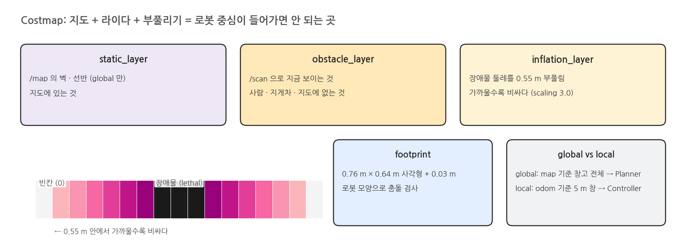{width=1000}

### 전역 경로: Planner

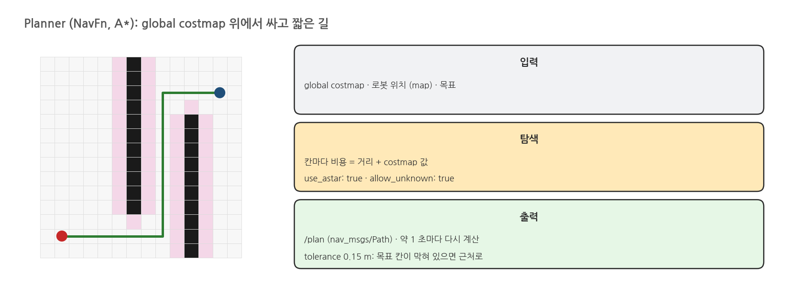{width=1000}

### 경로 따라가기: Controller (DWB)

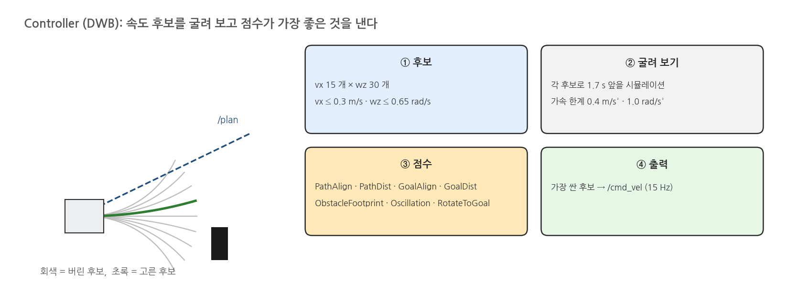{width=1000}

### Behavior Tree

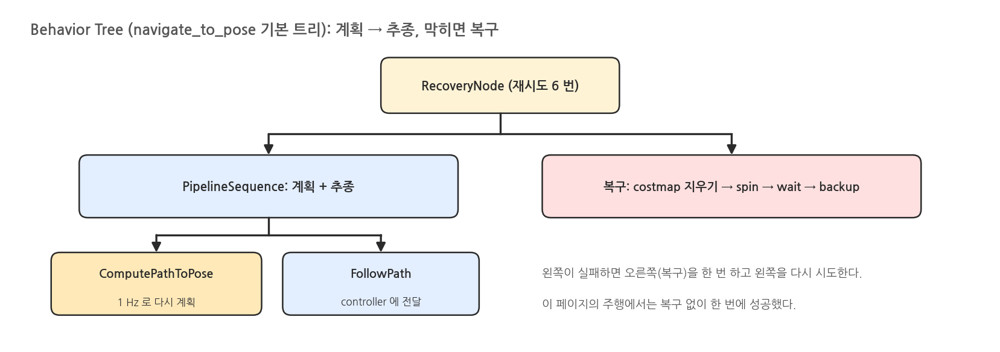{width=1000}

## 2. 실행: 목표로 보내기

### nav 모드가 띄우는 것

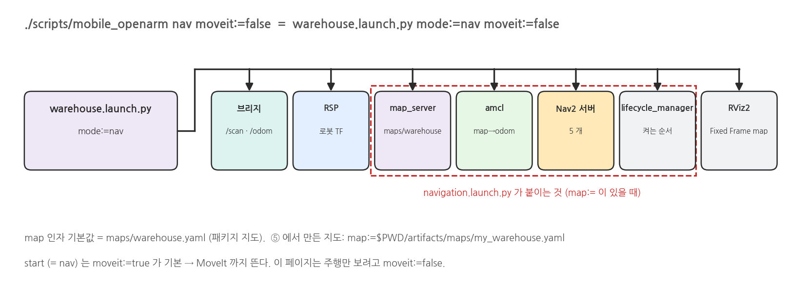{width=1000}

### 실행: 터미널 1 (nav)

```bash
source /opt/ros/jazzy/setup.bash
source scripts/env.sh
./scripts/mobile_openarm nav moveit:=false     # 주행만 (MoveIt 없이). 지도 = maps/warehouse.yaml
```

### 실행 결과: 터미널 1

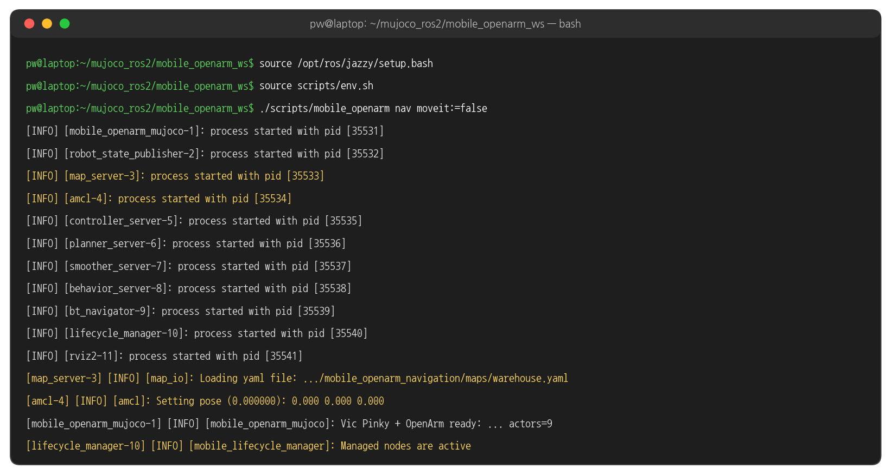{width=1000}

### 실행 결과: 시작 화면

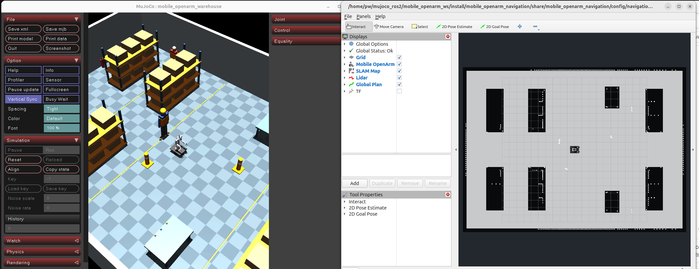{width=1000}

### 터미널 2: ros2 node list

```bash
source /opt/ros/jazzy/setup.bash
source scripts/env.sh
ros2 node list
```

### 실행 결과: node list

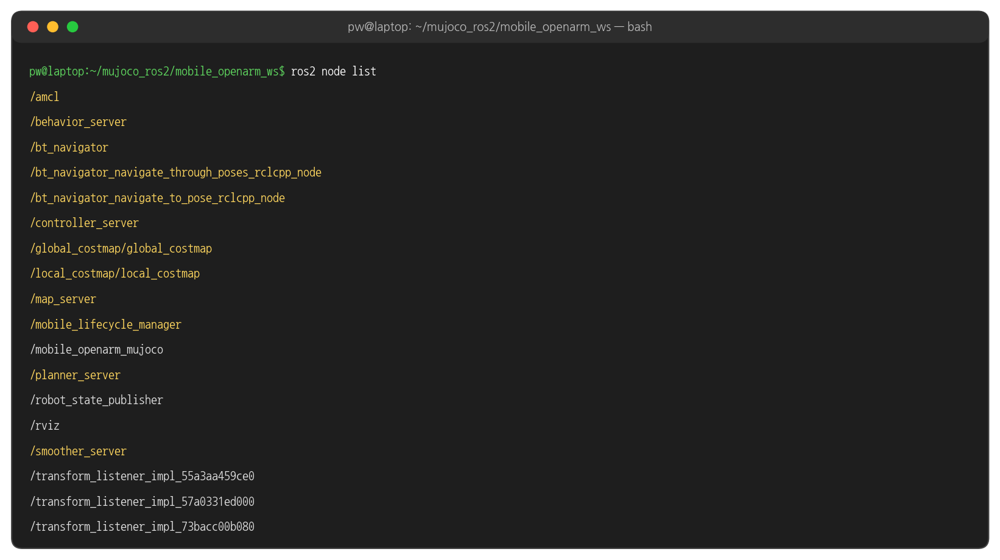{width=1000}

### 터미널 2: ros2 action list · lifecycle

```bash
ros2 action list
for n in map_server amcl controller_server planner_server smoother_server behavior_server bt_navigator; do \
  echo "/$n: $(ros2 lifecycle get /$n)"; done
```

### 실행 결과: action list · lifecycle

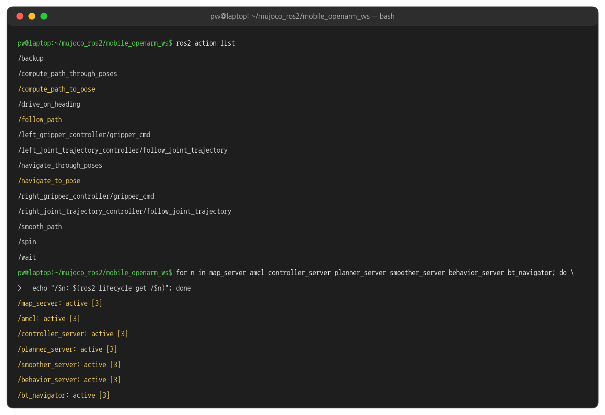{width=1000}

### 목표를 보내는 세 가지 방법

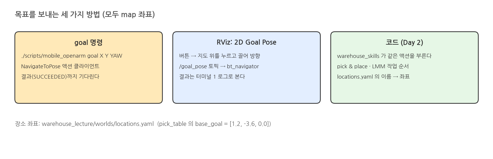{width=1000}

### 터미널 3: goal 명령

```bash
source /opt/ros/jazzy/setup.bash
source scripts/env.sh
time ./scripts/mobile_openarm goal 1.2 -3.6 0        # 픽업 작업대 앞 (x, y, yaw)
```

### 실행 결과: goal

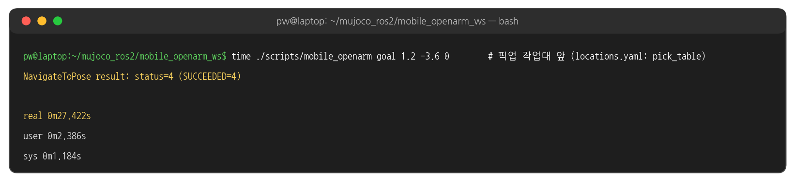{width=1000}

### 실행 결과: 터미널 1 로그

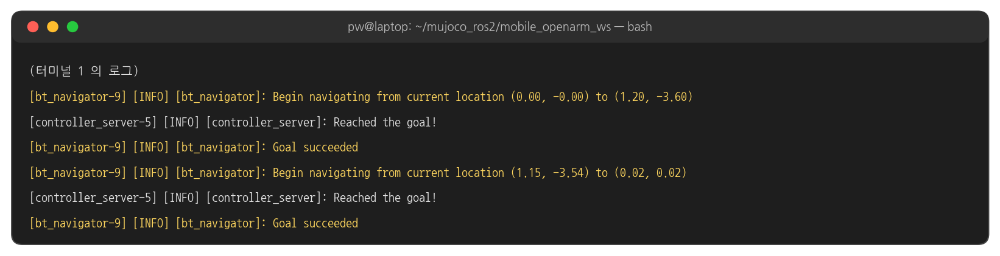{width=1000}

### 실행 결과: 주행 중 화면

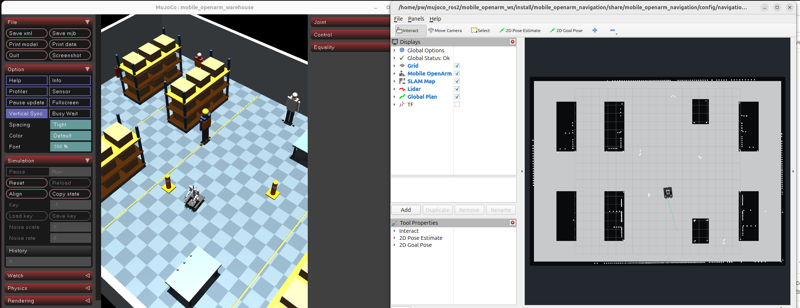{width=1000}

### 실행 결과: 도착 화면

{width=1000}

### 실제 경로와 global costmap

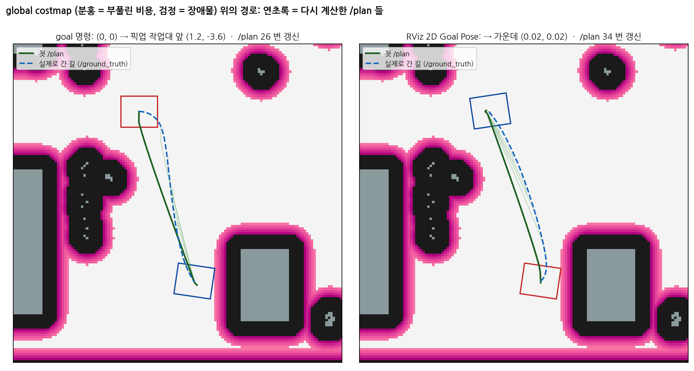{width=1000}

### local costmap

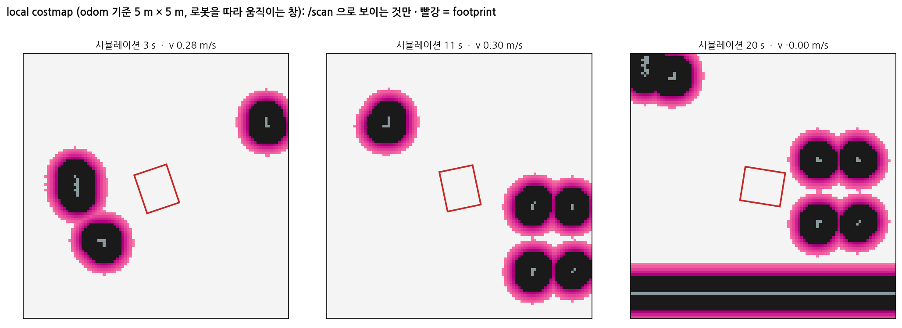{width=1000}

### Controller 가 낸 속도

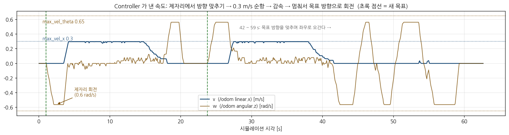{width=1000}

### RViz: 2D Goal Pose

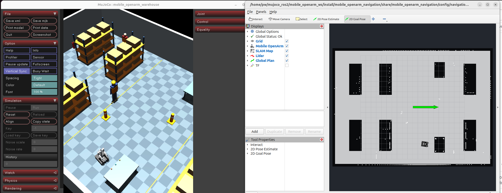{width=1000}

### 실행 결과: RViz 목표로 주행

{width=1000}

## 3. 위치 추정 실험: AMCL

### 첫 위치를 알려 주는 방법

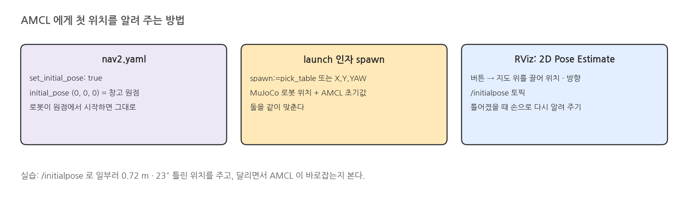{width=1000}

### 터미널 2: 틀린 초기 위치 주기

```bash
ros2 topic pub -1 /initialpose geometry_msgs/msg/PoseWithCovarianceStamped \
  "{header: {frame_id: map}, pose: {pose: {position: {x: 0.6, y: 0.4}, orientation: {z: 0.1987, w: 0.9801}},
    covariance: [0.25,0,0,0,0,0, 0,0.25,0,0,0,0, 0,0,0,0,0,0, 0,0,0,0,0,0, 0,0,0,0,0,0, 0,0,0,0,0,0.0685]}}"
./scripts/mobile_openarm goal 3.5 0.0 0
```

### 실행 결과: 틀린 초기 위치

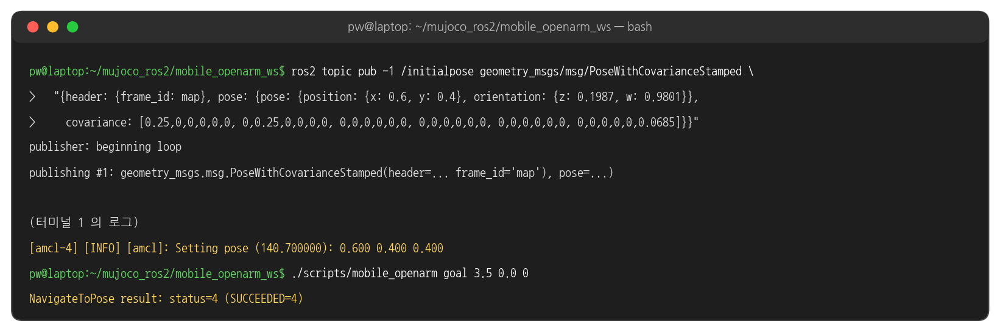{width=1000}

### 틀린 위치와 바로잡은 위치

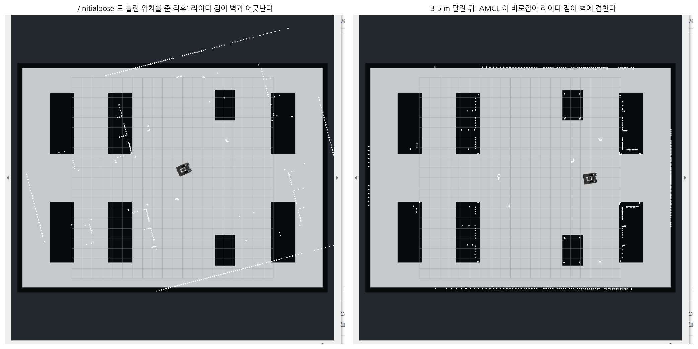{width=1000}

### 파티클이 모이는 모습

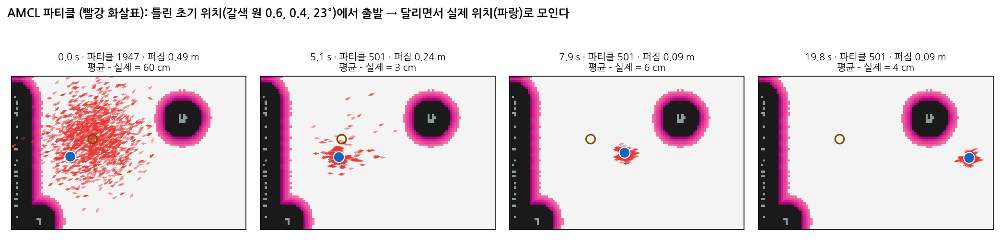{width=1000}

## 4. 코드와 설정

### goal 명령의 흐름

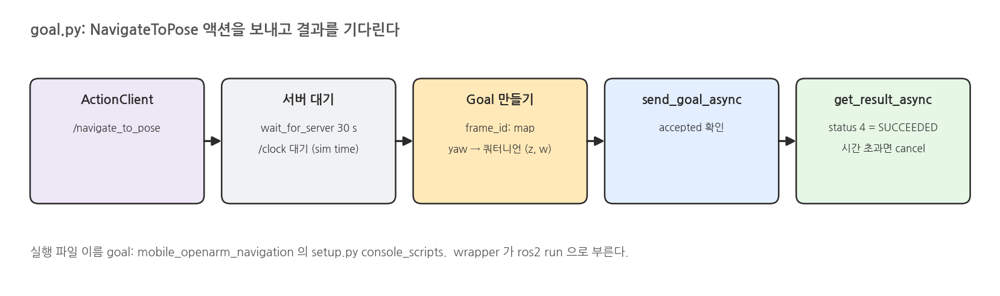{width=1000}

### 목표 보내기 - goal.py main 함수 발췌

```python
# mobile_openarm_navigation/goal.py
def main(args=None):   # 발췌
    rclpy.init()
    node = Node("mobile_openarm_goal", parameter_overrides=[rclpy.parameter.Parameter("use_sim_time", value=True)])
    client = ActionClient(node, NavigateToPose, "/navigate_to_pose")
    if not client.wait_for_server(timeout_sec=30.0):
        raise RuntimeError("Nav2 action server did not become available in 30 seconds")
    goal = NavigateToPose.Goal()
    goal.pose.header.frame_id = "map"                                   # 목표는 map 좌표
    goal.pose.header.stamp = node.get_clock().now().to_msg()
    goal.pose.pose.position.x, goal.pose.pose.position.y = options.x, options.y
    goal.pose.pose.orientation.z = math.sin(options.yaw / 2)            # yaw → 쿼터니언
    goal.pose.pose.orientation.w = math.cos(options.yaw / 2)
    future = client.send_goal_async(goal)
    rclpy.spin_until_future_complete(node, future, timeout_sec=10)
    handle = future.result()                                            # accepted 확인
    result = handle.get_result_async()
    rclpy.spin_until_future_complete(node, result, timeout_sec=options.timeout)
    status = result.result().status                                     # 4 = SUCCEEDED
    print(f"NavigateToPose result: status={status} (SUCCEEDED={GoalStatus.STATUS_SUCCEEDED})")
```

### nav 모드의 분기

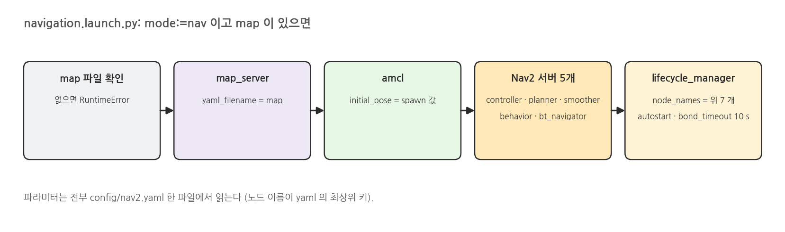{width=1000}

### Nav2 노드 띄우기 - navigation.launch.py setup 함수 발췌

```python
# mobile_openarm_navigation/launch/navigation.launch.py
def setup(context):   # 발췌
    params = str(share / "config/nav2.yaml")
    amcl_params = [params]
    if initial:                                                          # spawn 값 → AMCL 초기 위치
        x, y, yaw = (float(v) for v in initial.split(","))
        amcl_params.append({"initial_pose": {"x": x, "y": y, "z": 0.0, "yaw": yaw}})
    if mode == "nav":
        if mapfile:
            actions.extend([
                Node(package="nav2_map_server", executable="map_server", name="map_server",
                     parameters=[params, {"yaml_filename": mapfile}]),
                Node(package="nav2_amcl", executable="amcl", name="amcl", parameters=amcl_params),
            ])
            lifecycle += ["map_server", "amcl"]
        for pkg, exe in [("nav2_controller", "controller_server"), ("nav2_planner", "planner_server"),
                         ("nav2_smoother", "smoother_server"), ("nav2_behaviors", "behavior_server"),
                         ("nav2_bt_navigator", "bt_navigator")]:
            actions.append(Node(package=pkg, executable=exe, name=exe, parameters=[params]))
            lifecycle.append(exe)
        actions.append(Node(package="nav2_lifecycle_manager", executable="lifecycle_manager", name="mobile_lifecycle_manager",
                            parameters=[{"use_sim_time": True, "autostart": True, "bond_timeout": 10.0, "node_names": lifecycle}]))
    return actions
```

### nav2.yaml 주요 파라미터

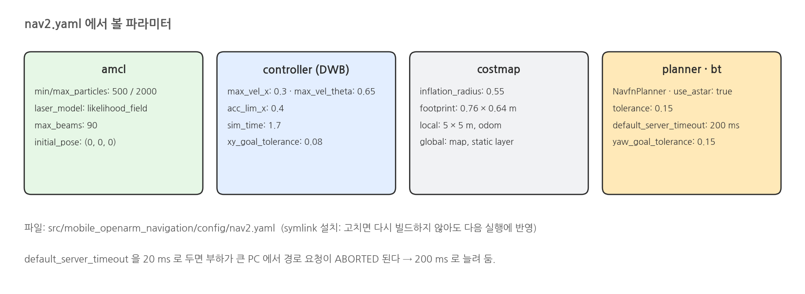{width=1000}

### nav2.yaml

```yaml
# mobile_openarm_navigation/config/nav2.yaml  (발췌)
amcl:
  ros__parameters:
    min_particles: 500
    max_particles: 2000
    laser_model_type: likelihood_field
    set_initial_pose: true
    initial_pose: {x: 0.0, y: 0.0, z: 0.0, yaw: 0.0}
controller_server:
  ros__parameters:
    controller_frequency: 15.0
    FollowPath:
      plugin: nav2_rotation_shim_controller::RotationShimController
      primary_controller: dwb_core::DWBLocalPlanner
      rotate_to_heading_angular_vel: 0.6
      max_vel_x: 0.3
      max_vel_theta: 0.65
      acc_lim_x: 0.4
      sim_time: 1.7
      xy_goal_tolerance: 0.08
      critics: [RotateToGoal, Oscillation, ObstacleFootprint, GoalAlign, PathAlign, PathDist, GoalDist]
local_costmap:
  local_costmap:
    ros__parameters:
      global_frame: odom
      rolling_window: true
      width: 5
      height: 5
      plugins: [obstacle_layer, inflation_layer]
      inflation_layer: {plugin: nav2_costmap_2d::InflationLayer, cost_scaling_factor: 3.0, inflation_radius: 0.55}
      footprint: '[[0.38,0.32],[0.38,-0.32],[-0.38,-0.32],[-0.38,0.32]]'
planner_server:
  ros__parameters:
    GridBased: {plugin: nav2_navfn_planner::NavfnPlanner, tolerance: 0.15, use_astar: true, allow_unknown: true}
```

### RViz 목표 버튼 - navigation.rviz 발췌

```yaml
# mobile_openarm_navigation/config/navigation.rviz  (발췌)
  Tools:
    - Class: rviz_default_plugins/SetInitialPose     # 2D Pose Estimate → /initialpose → amcl
      Topic: /initialpose
    - Class: rviz_default_plugins/SetGoal            # 2D Goal Pose → /goal_pose → bt_navigator
      Topic: /goal_pose
```

### 해 볼 것

- ⑤ 에서 만든 지도로 주행: `./scripts/mobile_openarm nav moveit:=false map:=$PWD/artifacts/maps/my_warehouse.yaml` → 작업대 상판이 지도에 없을 때 경로 비교
- `nav2.yaml` 의 `inflation_radius` 를 0.3 으로 바꿔 다시 주행 → 경로가 선반에 얼마나 붙는지 확인
- 사람이 걷는 통로로 목표 보내기 (`goal -1.1 0.0 0`) → local costmap 에 사람이 나타나는 모습 확인
