## 1. 움직이는 장애물과 Nav2

### 시나리오: 걷는 근로자와 마주치기

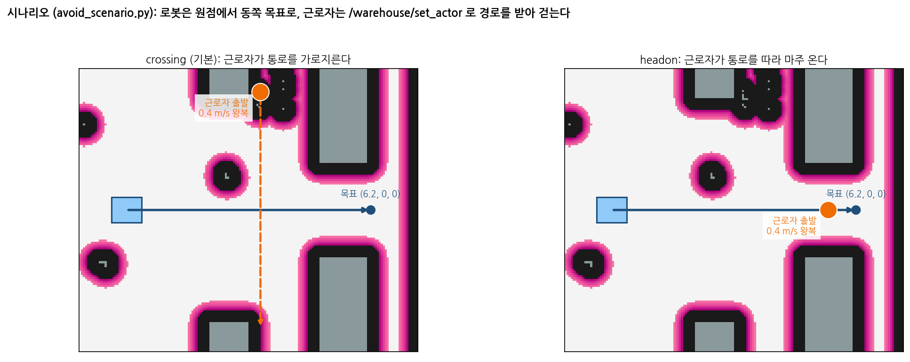{width=1000}

### 회피의 동작 흐름

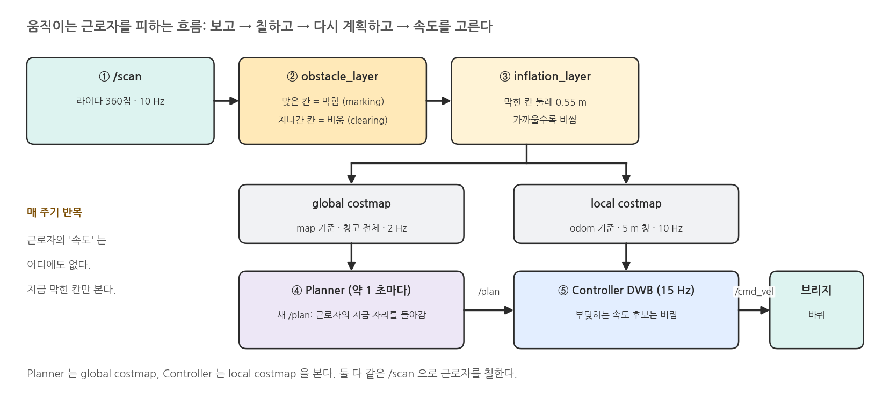{width=1000}

### marking 과 clearing

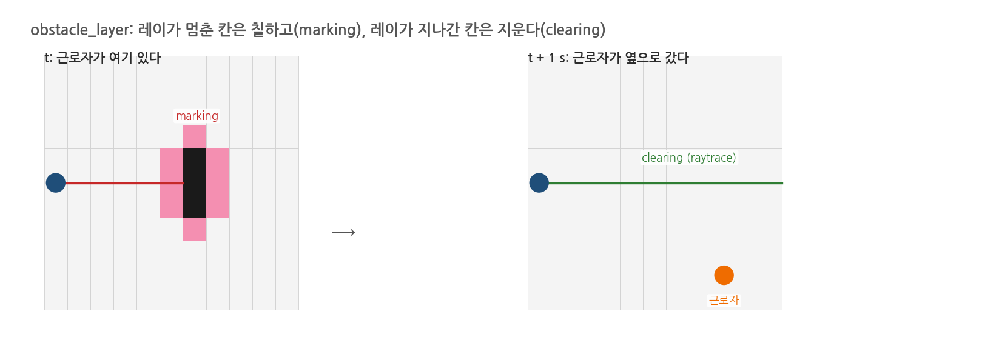{width=1000}

### RViz2 에서 인지 결과 보기

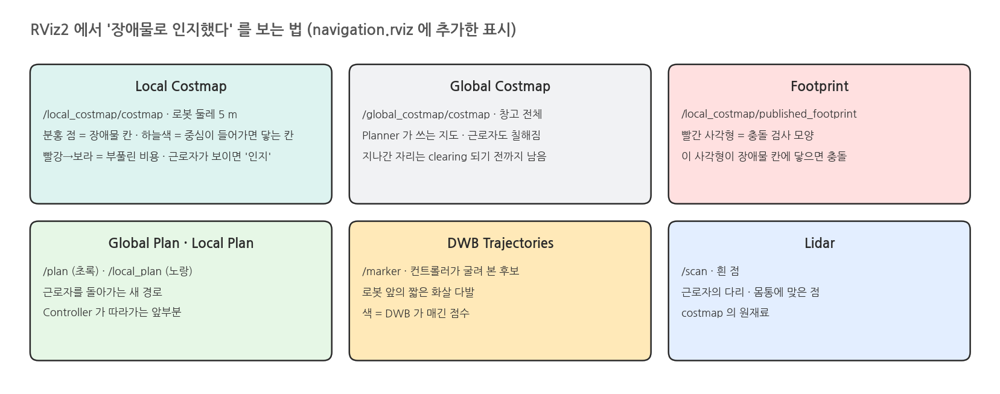{width=1000}

## 2. 실행: 가로지르는 근로자 피하기

### 실행: 터미널 1 (nav)

```bash
source /opt/ros/jazzy/setup.bash
source scripts/env.sh
./scripts/mobile_openarm nav moveit:=false      # 새로 띄운 직후 (로봇이 원점, 동쪽을 볼 때)
```

### 실행 결과: 시작 화면

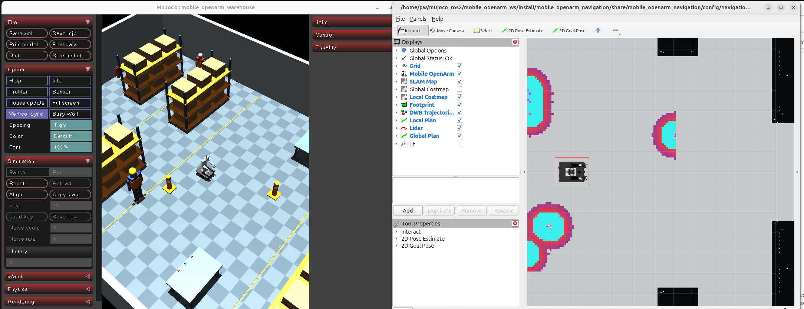{width=1000}

### 터미널 2: 시나리오 실행

```bash
source /opt/ros/jazzy/setup.bash
source scripts/env.sh
python docs/camp/avoid_scenario.py              # 근로자가 x = 3.4 에서 통로를 가로지르고, 로봇은 (6.2, 0) 으로
```

### 실행 결과: 시나리오

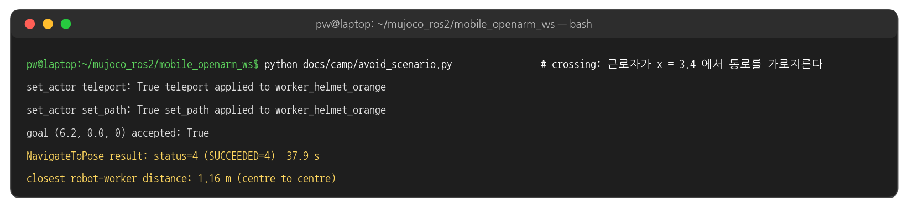{width=1000}

### RViz2 로 본 회피 과정

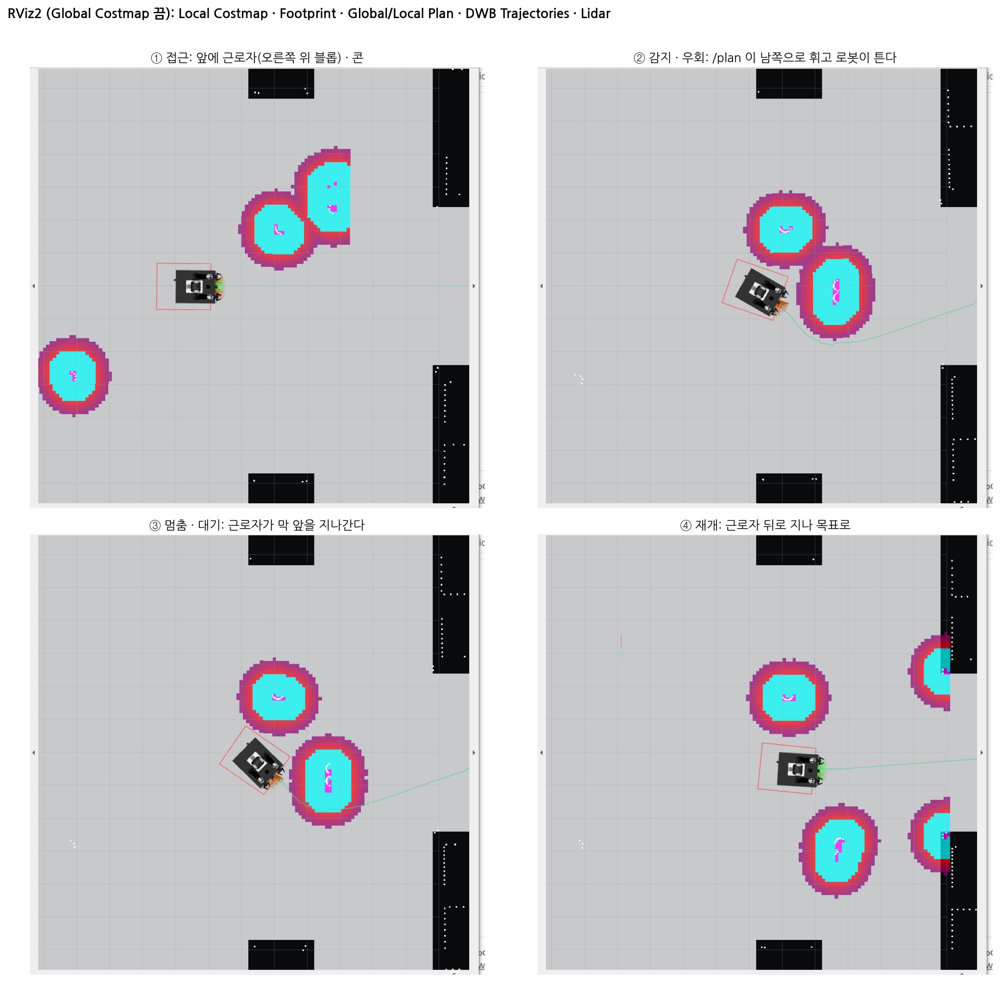{width=1000}

### 같은 순간의 MuJoCo 창

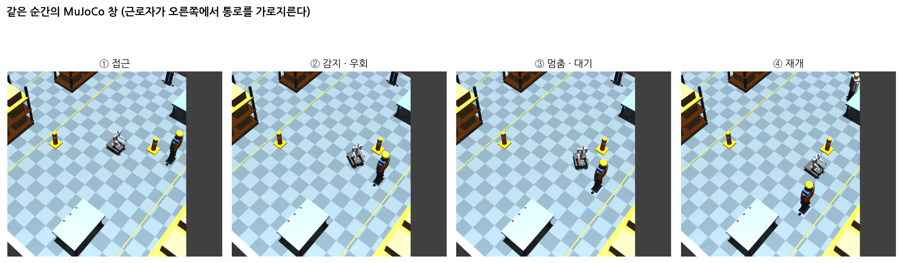{width=1000}

### Global Costmap 을 켠 넓은 화면

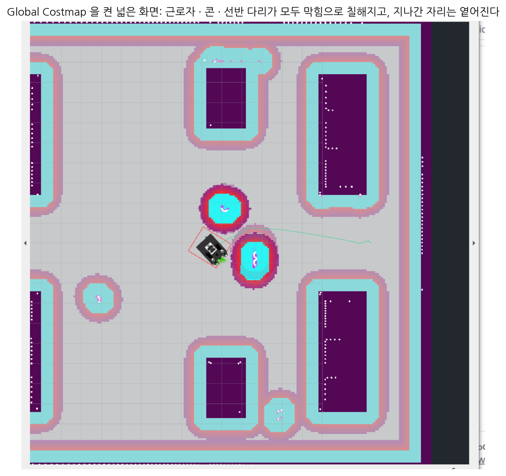{width=1000}

### 실측: local costmap 과 경로

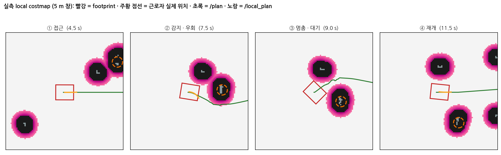{width=1000}

### 실측: 타임라인

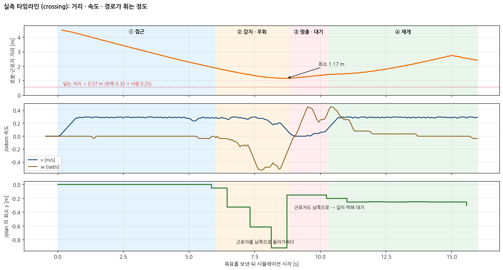{width=1000}

### 실측: 위에서 본 궤적

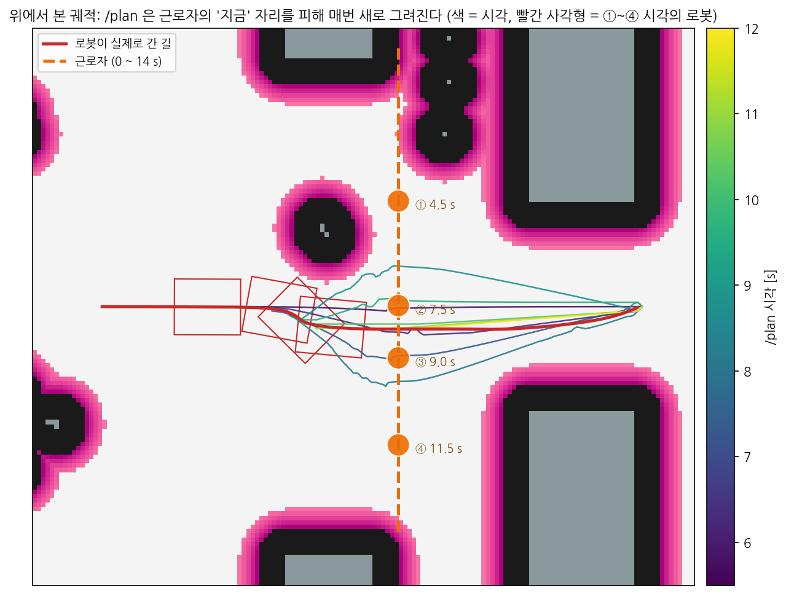{width=1000}

## 3. 한계: 마주 오는 근로자

### 터미널 2: headon 시나리오

```bash
python docs/camp/avoid_scenario.py --mode headon     # 새로 띄운 직후에 실행
```

### 실행 결과: headon

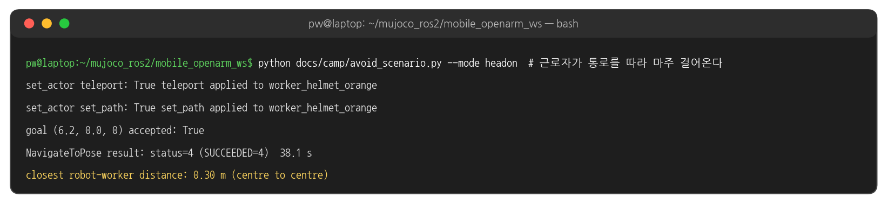{width=1000}

### headon 의 궤적과 거리

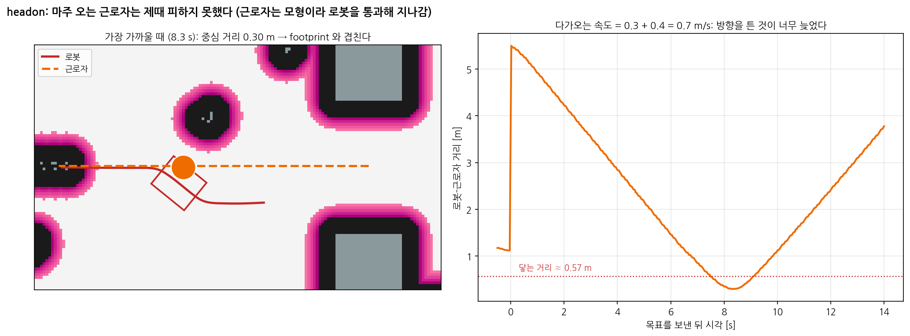{width=1000}

### 같은 순간의 MuJoCo 창 (headon)

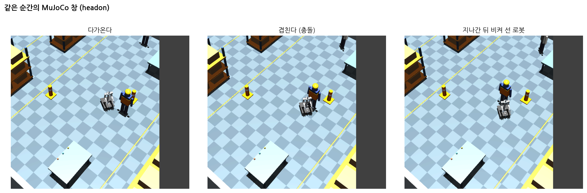{width=1000}

### 왜 늦게 피하나

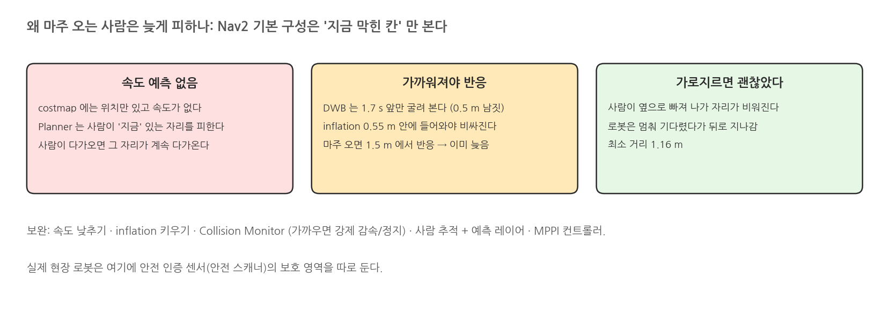{width=1000}

## 4. 코드와 설정

### 회피에 관여하는 파라미터

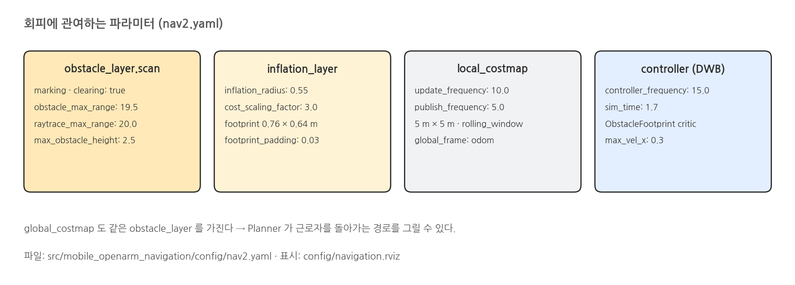{width=1000}

### 장애물 칠하기 - nav2.yaml local_costmap 발췌

```yaml
# mobile_openarm_navigation/config/nav2.yaml  (발췌)
local_costmap:
  local_costmap:
    ros__parameters:
      update_frequency: 10.0
      publish_frequency: 5.0
      global_frame: odom
      rolling_window: true
      width: 5
      height: 5
      resolution: 0.05
      plugins: [obstacle_layer, inflation_layer]
      obstacle_layer:
        plugin: nav2_costmap_2d::ObstacleLayer
        observation_sources: scan
        scan:
          topic: /scan
          data_type: LaserScan
          clearing: true              # 레이가 지나간 칸을 비운다
          marking: true               # 레이가 멈춘 칸을 막힘으로
          raytrace_max_range: 20.0
          obstacle_max_range: 19.5
      inflation_layer:
        plugin: nav2_costmap_2d::InflationLayer
        cost_scaling_factor: 3.0
        inflation_radius: 0.55
      footprint: '[[0.38,0.32],[0.38,-0.32],[-0.38,-0.32],[-0.38,0.32]]'
```

### RViz 표시 추가 - navigation.rviz 발췌

```yaml
# mobile_openarm_navigation/config/navigation.rviz  (발췌: 이번에 추가한 표시)
    - Class: rviz_default_plugins/Map
      Name: Global Costmap
      Topic: {Value: /global_costmap/costmap, Durability Policy: Transient Local}
      Color Scheme: costmap
      Alpha: 0.3
    - Class: rviz_default_plugins/Map
      Name: Local Costmap
      Topic: {Value: /local_costmap/costmap, Durability Policy: Transient Local}
      Color Scheme: costmap
      Alpha: 0.7
    - Class: rviz_default_plugins/Polygon
      Name: Footprint
      Topic: {Value: /local_costmap/published_footprint}
    - Class: rviz_default_plugins/MarkerArray
      Name: DWB Trajectories
      Topic: {Value: /marker}
    - Class: rviz_default_plugins/Path
      Name: Local Plan
      Topic: {Value: /local_plan}
```

### 근로자 움직이기 - avoid_scenario.py 발췌

```python
# docs/camp/avoid_scenario.py  (발췌)
route = {"crossing": [(3.4, 3.0), (3.4, -3.0)], "headon": [(5.5, 0.0), (-5.5, 0.0)]}[a.mode]
pose.position.x, pose.position.y = route[0]
n.call(operation="teleport", pose=pose)                                   # /warehouse/set_actor
n.call(operation="set_path", waypoints=[Point(x=x, y=y) for x, y in route], speed=a.speed)
goal = NavigateToPose.Goal()
goal.pose.header.frame_id = "map"
goal.pose.pose.position.x, goal.pose.pose.position.y = 6.2, 0.0
goal.pose.pose.orientation.w = 1.0                                        # yaw = 0 (동쪽)
handle = n.nav.send_goal_async(goal)                                      # /navigate_to_pose
```

### 해 볼 것

- `--speed 0.2` 로 근로자를 천천히 걷게 해 headon 다시 실행 → 최소 거리 비교
- `nav2.yaml` 의 `inflation_radius` 를 0.8 로 키워 headon 다시 실행 → 더 일찍 피하는지 확인
- RViz 에서 Local Costmap 만 켜고 근로자가 지나간 칸이 비워지는(clearing) 순간 관찰
