## 1. 전반부 통합 Demo: 창고 순찰

### 지금까지 만든 것 합치기

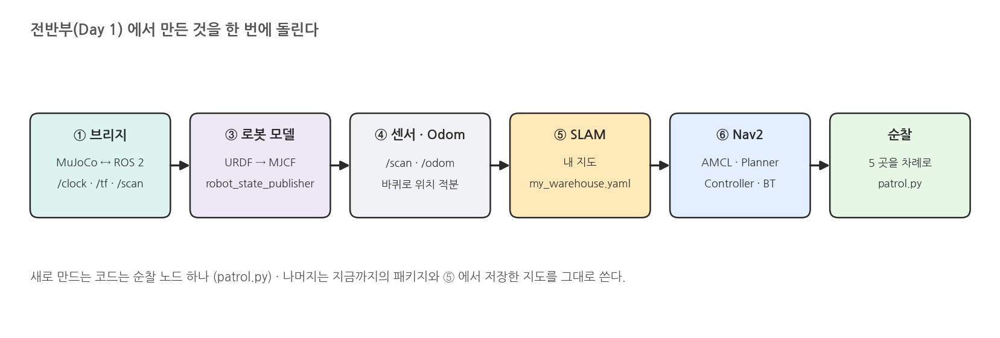{width=1000}

### 순찰 경로

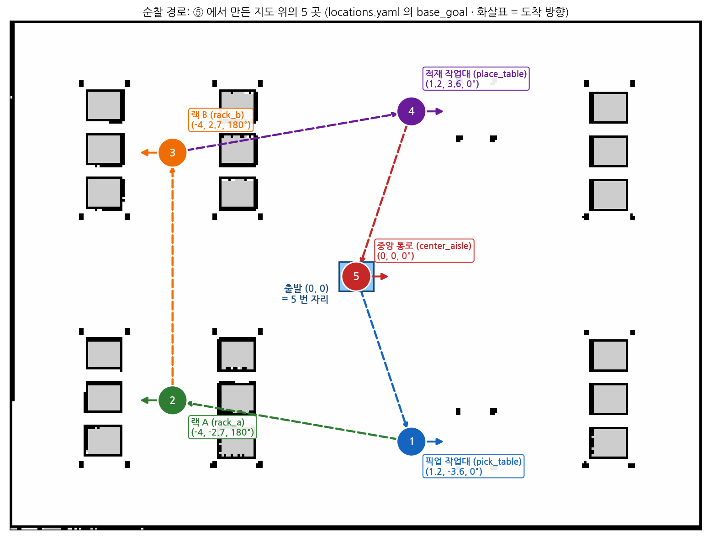{width=1000}

### 순찰 노드: patrol.py

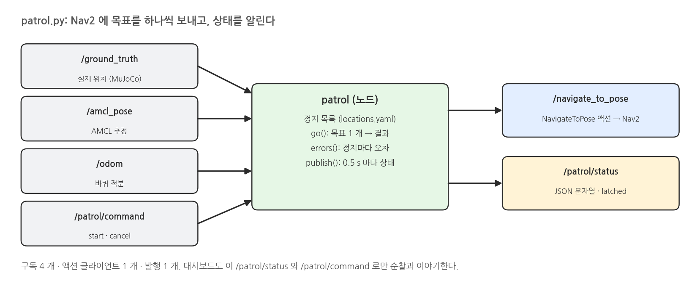{width=1000}

### 정지 하나의 흐름

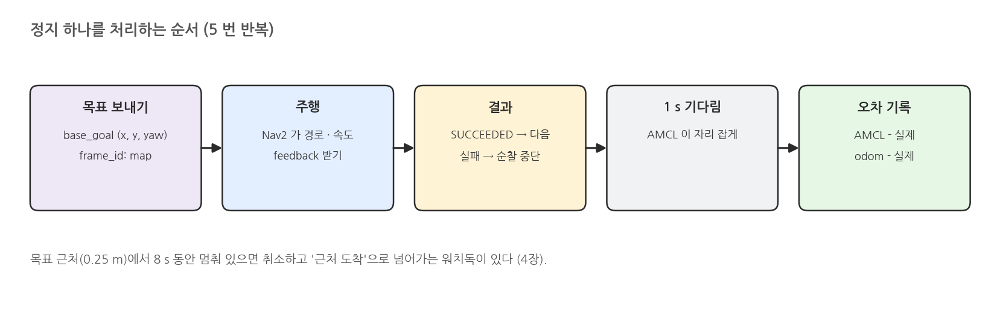{width=1000}

### 정지마다 재는 것

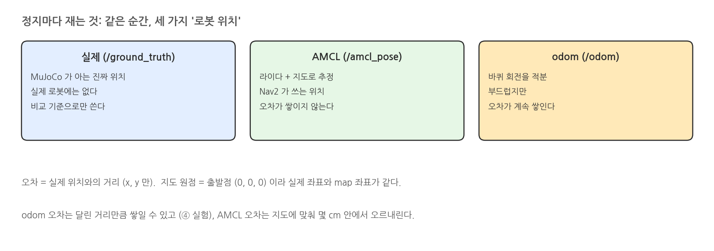{width=1000}

## 2. 실행: 순찰 돌리기

### 실행: 터미널 1 (nav, 내 지도)

```bash
source /opt/ros/jazzy/setup.bash
source scripts/env.sh
./scripts/mobile_openarm nav moveit:=false map:=$PWD/artifacts/maps/my_warehouse.yaml   # ⑤ 에서 저장한 지도
```

### 실행 결과: 터미널 1

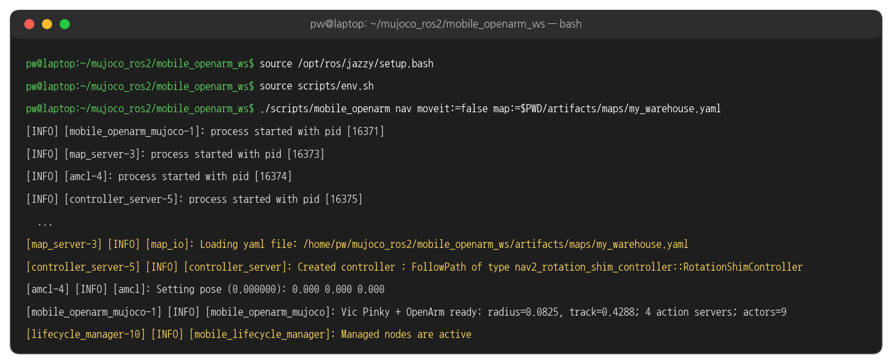{width=1000}

### 실행 결과: 시작 화면

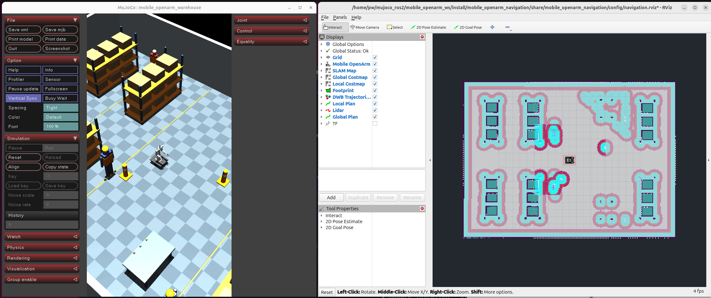{width=1000}

### 터미널 2: patrol.py

```bash
source /opt/ros/jazzy/setup.bash
source scripts/env.sh
python lessons/04_navigation/patrol.py          # 기본 경로: pick_table → rack_a → rack_b → place_table → center_aisle
```

### 실행 결과: patrol.py

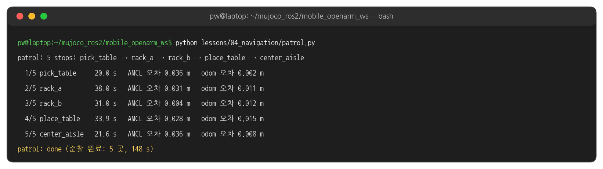{width=1000}

### 실행 결과: 터미널 1 로그

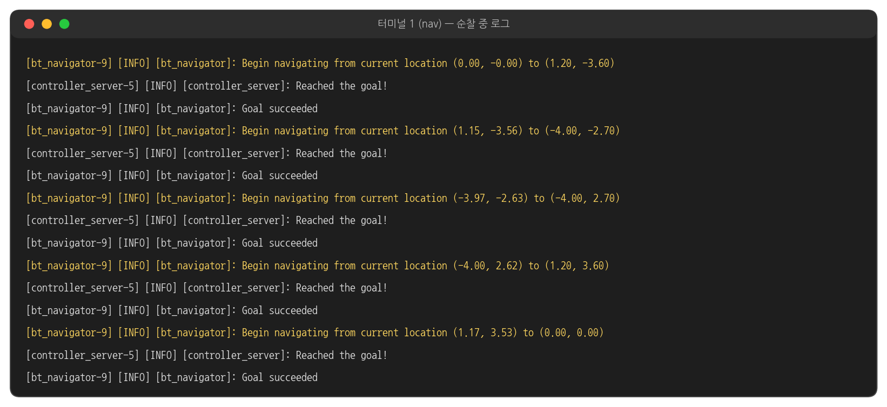{width=1000}

### 실행 결과: 랙 A 통로

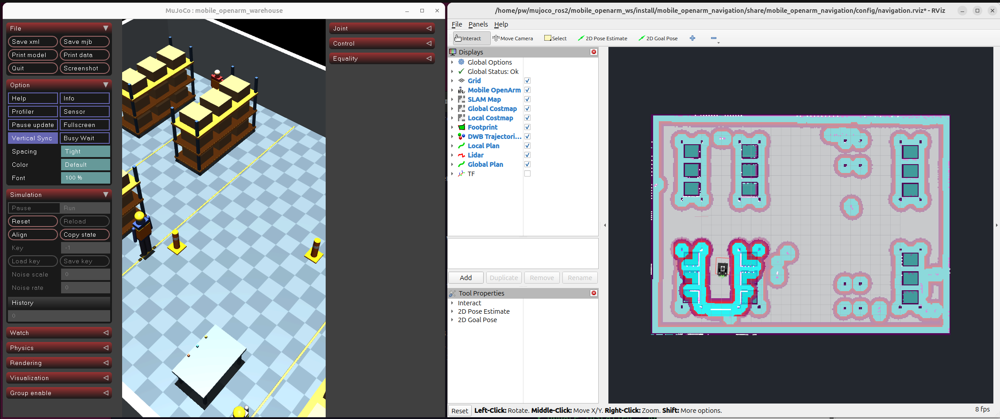{width=1000}

### 실행 결과: 적재 작업대로 가는 중

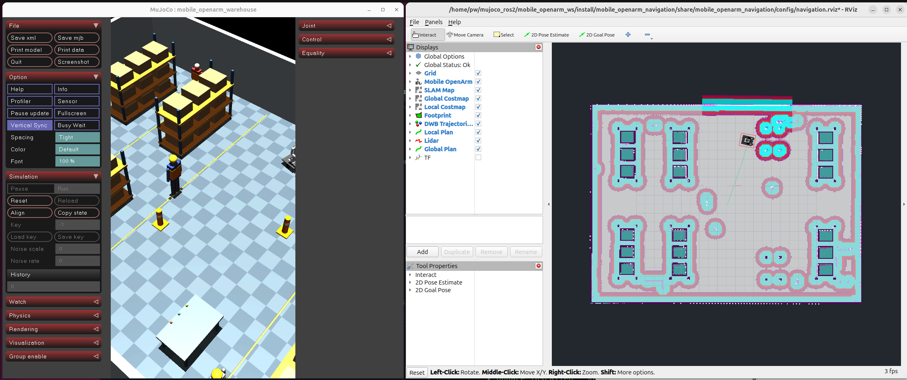{width=1000}

### 실행 결과: 순찰 완료

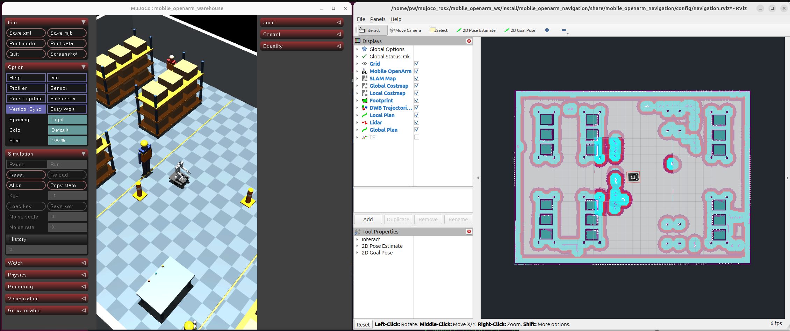{width=1000}

### 실측: 순찰 궤적

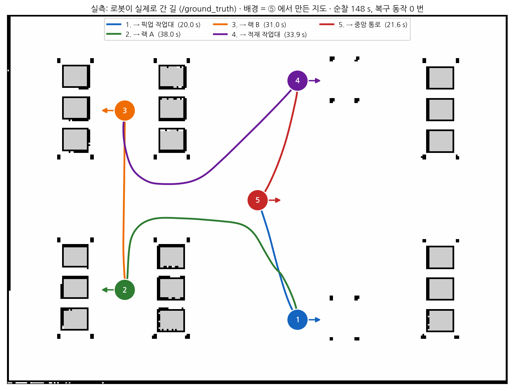{width=1000}

### 실측: 구간별 시간과 오차

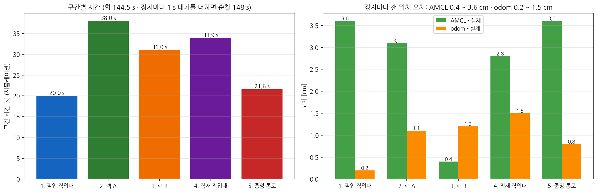{width=1000}

### 실측: 속도

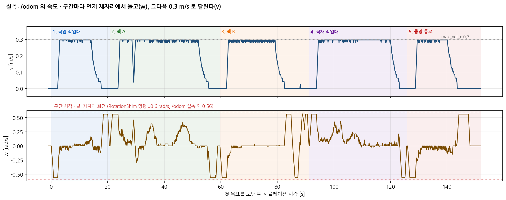{width=1000}

### 터미널 3: /patrol/status 보기

```bash
source /opt/ros/jazzy/setup.bash
source scripts/env.sh
ros2 topic echo --once /patrol/status         # 순찰 중에 실행
```

### 실행 결과: /patrol/status

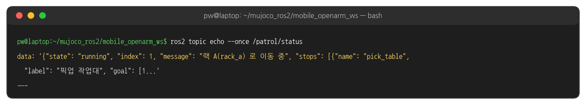{width=1000}

## 3. 막혔던 곳: 랙 통로에서 멈추는 로봇

### 증상: Failed to make progress

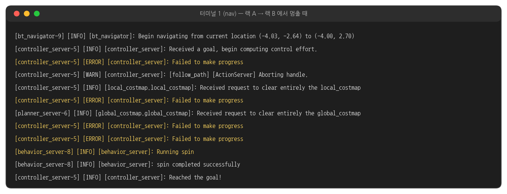{width=1000}

### 원인: 제자리 회전이 너무 느리다

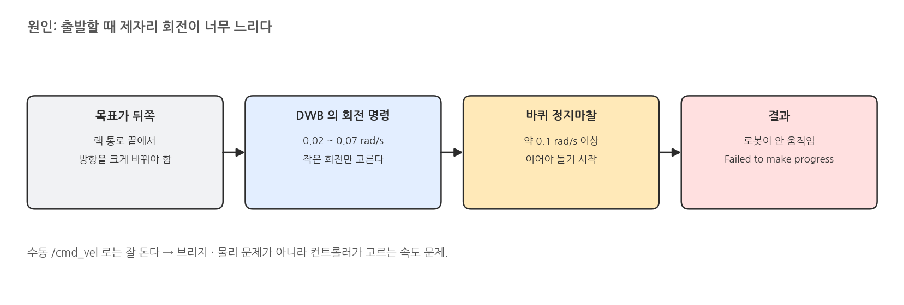{width=1000}

### 해결: RotationShim 컨트롤러

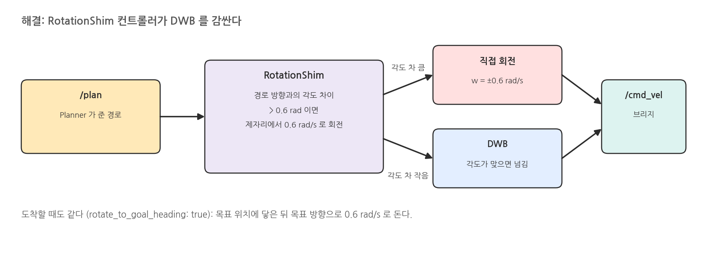{width=1000}

## 4. 코드와 설정

### patrol.py 의 흐름

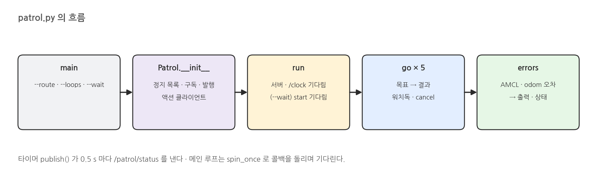{width=1000}

### 목표 보내기 - Patrol.go 발췌

```python
# lessons/04_navigation/patrol.py
def go(self, stop):   # 발췌
    goal = NavigateToPose.Goal()
    goal.pose.header.frame_id = "map"
    goal.pose.header.stamp = self.get_clock().now().to_msg()
    x, y, yaw = stop["goal"]                                             # locations.yaml 의 base_goal
    goal.pose.pose.position.x, goal.pose.pose.position.y = x, y
    goal.pose.pose.orientation.z, goal.pose.pose.orientation.w = math.sin(yaw / 2), math.cos(yaw / 2)
    future = self.nav.send_goal_async(goal, feedback_callback=on_feedback)
    while not future.done():
        rclpy.spin_once(self, timeout_sec=0.05)                          # 기다리는 동안에도 콜백을 돌린다
    handle = future.result()
    if not handle.accepted:
        return GoalStatus.STATUS_ABORTED
    result = handle.get_result_async()
    while not result.done():
        rclpy.spin_once(self, timeout_sec=0.05)
        ...                                                              # 워치독 (아래)
        if self.command in ("cancel", "cancel_near"):                    # 대시보드의 [취소] 또는 워치독
            cancel = handle.cancel_goal_async()
            ...
    return result.result().status                                        # 4 = SUCCEEDED
```

### 목표 근처 워치독

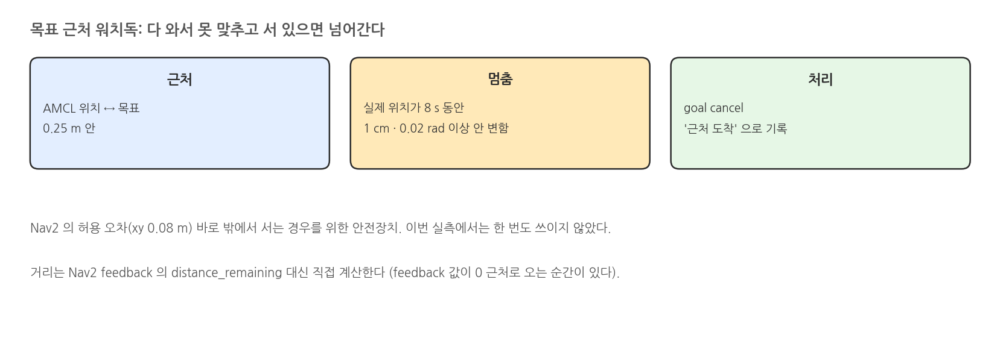{width=1000}

### 워치독 - Patrol.go 발췌

```python
# lessons/04_navigation/patrol.py
NEAR_DIST, NEAR_STALL_S = 0.25, 8.0

    still, still_since = self.truth, time.monotonic()
    while not result.done():
        rclpy.spin_once(self, timeout_sec=0.05)
        if self.truth and (still is None or math.hypot(self.truth[0] - still[0], self.truth[1] - still[1]) > 0.01
                           or abs(self.truth[2] - still[2]) > 0.02):
            still, still_since = self.truth, time.monotonic()            # 움직였다 → 정지 시계 다시
        near = self.amcl is not None and math.hypot(self.amcl[0] - x, self.amcl[1] - y) < NEAR_DIST
        if near and time.monotonic() - still_since > NEAR_STALL_S:
            self.command = "cancel_near"
```

### 정지마다 기록 - Patrol.run 발췌

```python
# lessons/04_navigation/patrol.py
for i, stop in enumerate(self.stops):   # 발췌
    self.index, self.leg_started, self.feedback = i, self.now(), {}
    stop["status"] = "active"
    status = self.go(stop)
    stop["time"] = round(self.now() - self.leg_started, 1)
    if status not in (GoalStatus.STATUS_SUCCEEDED, NEAR):
        stop["status"], self.state = "failed", "failed"
        break
    self.spin_for(1.0)                                                   # AMCL 이 자리 잡게
    stop["err_amcl"], stop["err_odom"] = self.errors()                   # 실제 위치와의 거리
    stop["status"] = "done" if status == GoalStatus.STATUS_SUCCEEDED else "near"
```

### 상태 알리기 - Patrol.publish 발췌

```python
# lessons/04_navigation/patrol.py
LATCHED = QoSProfile(depth=1, durability=DurabilityPolicy.TRANSIENT_LOCAL)   # 늦게 붙은 구독자도 마지막 값을 받는다
self.pub = self.create_publisher(String, "/patrol/status", LATCHED)
self.create_subscription(String, "/patrol/command", self.on_command, 10)
self.create_timer(0.5, self.publish)

def publish(self):
    status = dict(state=self.state, index=self.index, message=self.message, stops=self.stops, sim_time=now,
                  elapsed=..., leg_elapsed=..., feedback=self.feedback)
    self.pub.publish(String(data=json.dumps(status, ensure_ascii=False)))
```

### nav2.yaml - FollowPath 발췌

```yaml
# mobile_openarm_navigation/config/nav2.yaml  (발췌)
controller_server:
  ros__parameters:
    FollowPath:
      plugin: nav2_rotation_shim_controller::RotationShimController
      primary_controller: dwb_core::DWBLocalPlanner
      angular_dist_threshold: 0.6          # 경로와 0.6 rad 넘게 틀어져 있으면
      rotate_to_heading_angular_vel: 0.6   # 제자리에서 0.6 rad/s 로 돌고
      rotate_to_goal_heading: true         # 도착해서도 목표 방향으로 돈다
      max_vel_x: 0.3
      critics: [RotateToGoal, Oscillation, ObstacleFootprint, GoalAlign, PathAlign, PathDist, GoalDist]
      ObstacleFootprint.scale: 0.05        # 장애물 점수의 비중
      PathAlign.scale: 16.0
      PathDist.scale: 16.0
      GoalDist.scale: 12.0
```

## 5. 웹 대시보드

### 브라우저로 보는 순찰

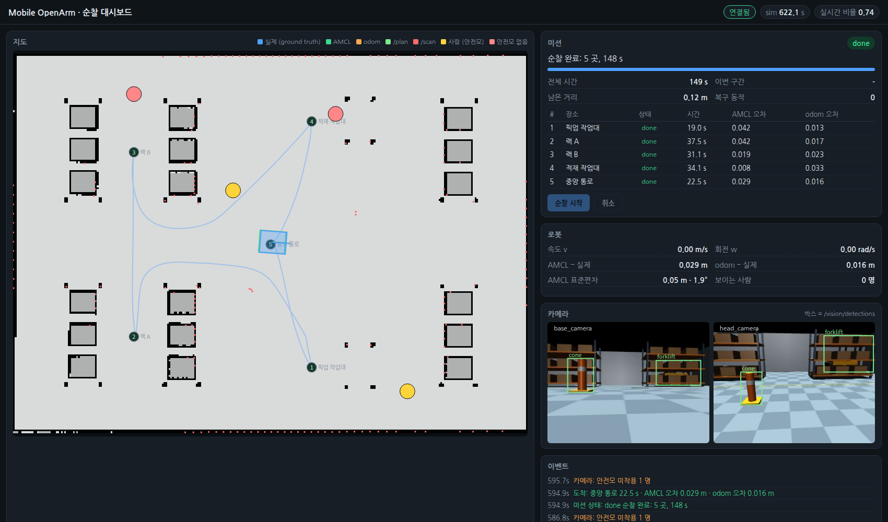{width=1000}

### 화면 구성

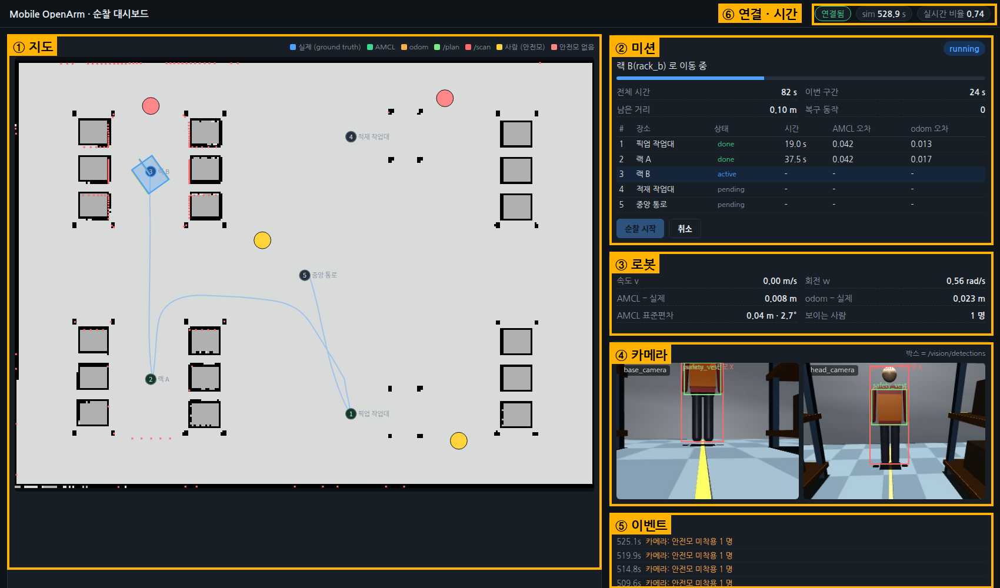{width=1000}

### 영역별 데이터 출처

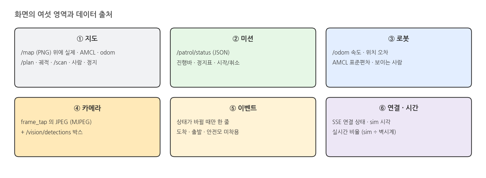{width=1000}

### 구성: 프로세스 셋

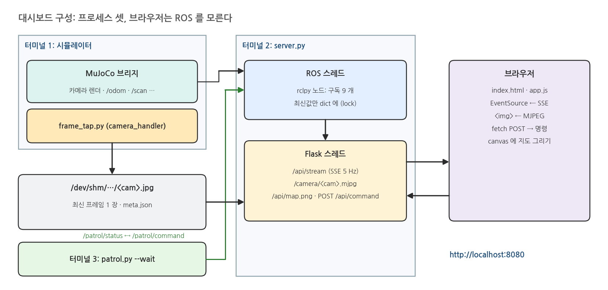{width=1000}

### 실행: 터미널 1 (카메라 프레임 저장)

```bash
source /opt/ros/jazzy/setup.bash
source scripts/env.sh
./scripts/mobile_openarm nav moveit:=false map:=$PWD/artifacts/maps/my_warehouse.yaml \
  camera_fps:=5 camera_handler:=lessons/04_navigation/dashboard/frame_tap.py:DashboardPipeline
```

### 터미널 2: 대시보드 서버

```bash
source /opt/ros/jazzy/setup.bash
source scripts/env.sh
python lessons/04_navigation/dashboard/server.py          # 다른 PC 에서 보려면 --host 0.0.0.0
```

### 실행 결과: 서버

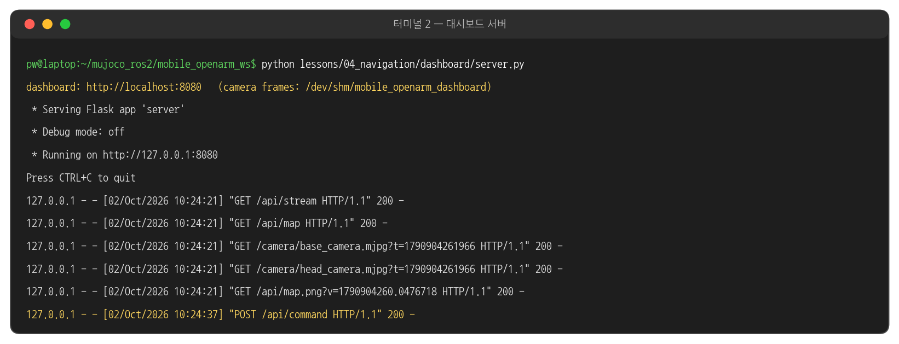{width=1000}

### 터미널 3: 순찰 (시작 버튼 대기)

```bash
source /opt/ros/jazzy/setup.bash
source scripts/env.sh
python lessons/04_navigation/patrol.py --wait
```

### 브라우저 열기

```bash
google-chrome http://localhost:8080          # 또는 아무 브라우저 주소창에
```

### 실행 결과: 시작 대기

![waiting: [순찰 시작] 을 누르면 터미널 3 의 순찰이 출발한다](lesson07_dash_waiting.png){width=1000}

### 실행 결과: 순찰 중

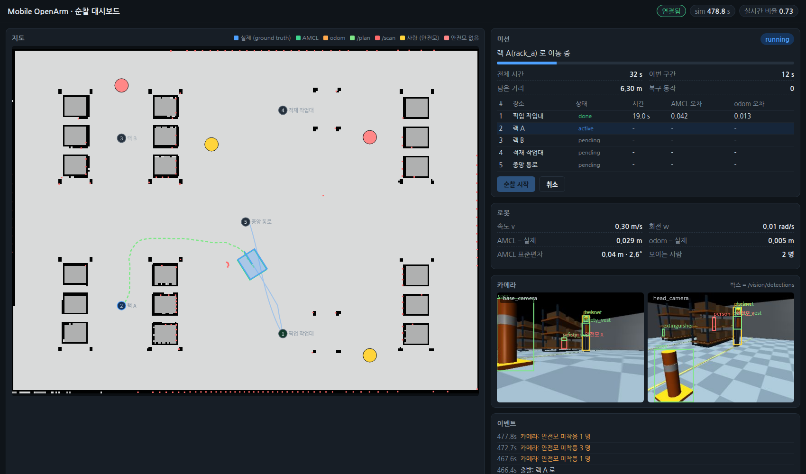{width=1000}

### 실행 결과: 안전모 미착용 감지

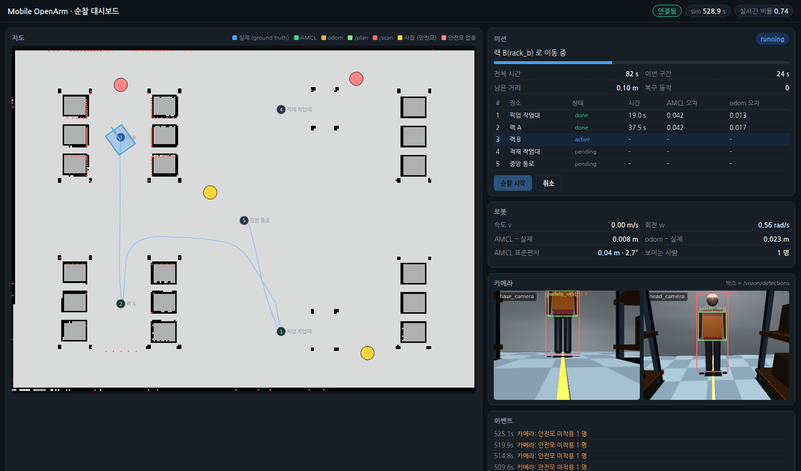{width=1000}

### 실행 결과: 순찰 완료

{width=1000}

### 실행 결과: 터미널 3

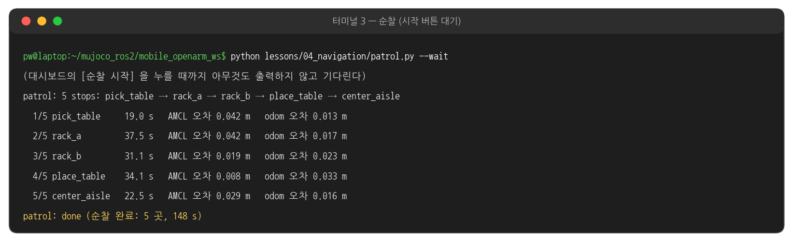{width=1000}

### 터미널 4: 브라우저 없이 API 보기

```bash
curl -s localhost:8080/api/cameras
curl -s -X POST -H "Content-Type: application/json" -d '{"cmd":"start"}' localhost:8080/api/command
curl -s -N localhost:8080/api/stream | head -c 600
```

### 실행 결과: API

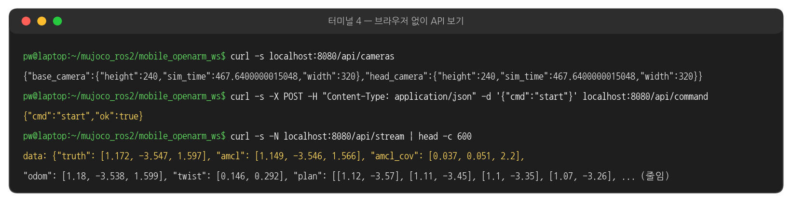{width=1000}

### 구현 원리: SSE

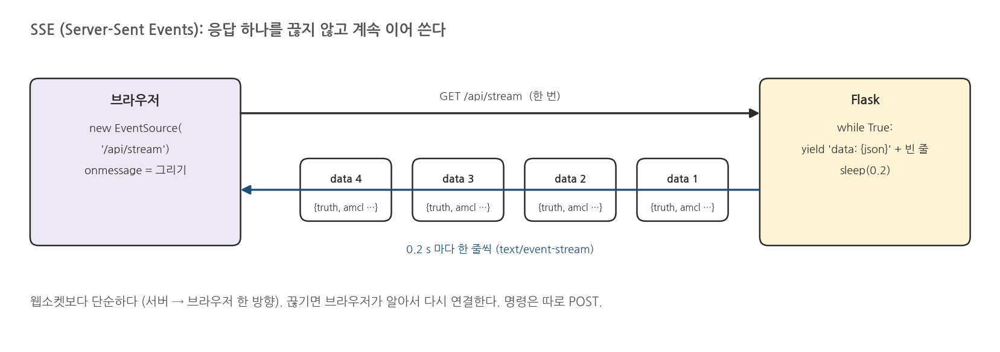{width=1000}

### 구현 원리: MJPEG

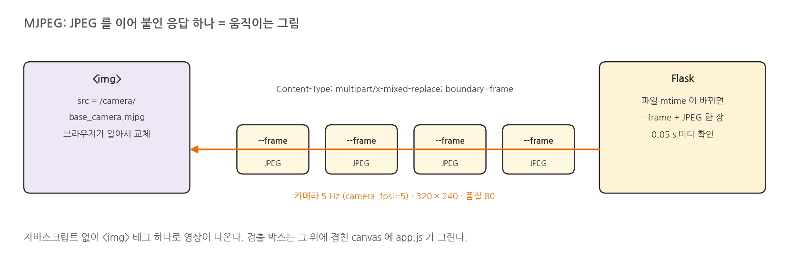{width=1000}

### 구현 원리: frame_tap

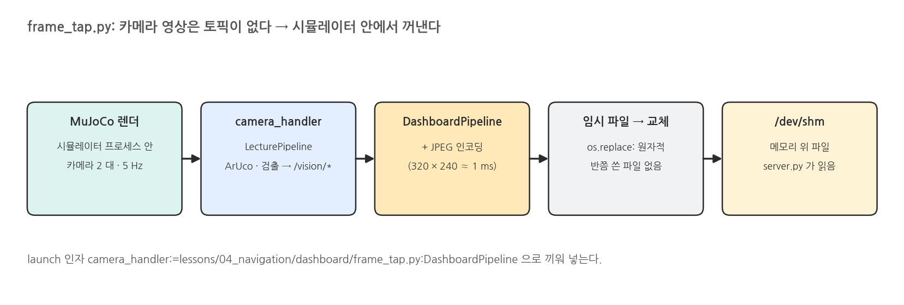{width=1000}

### 구현 원리: 스레드 둘

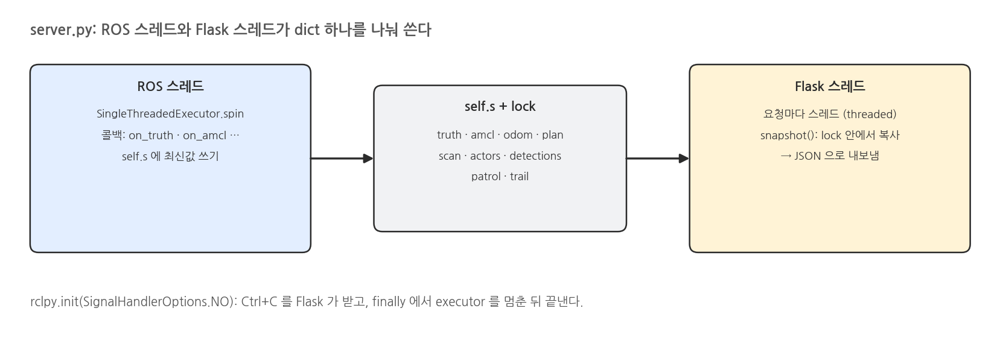{width=1000}

### 프레임 저장 - DashboardPipeline 발췌

```python
# lessons/04_navigation/dashboard/frame_tap.py
class DashboardPipeline(LecturePipeline):   # 발췌
    def __call__(self, frames):
        super().__call__(frames)                         # /vision/* 먼저: 대시보드는 보기만 한다
        for name, frame in frames.items():
            ok, jpg = cv2.imencode(".jpg", cv2.cvtColor(frame.rgb, cv2.COLOR_RGB2BGR), [cv2.IMWRITE_JPEG_QUALITY, 80])
            tmp = FRAMES / f".{name}.jpg.tmp"
            tmp.write_bytes(jpg.tobytes())
            os.replace(tmp, FRAMES / f"{name}.jpg")       # 원자적 교체: 반쯤 쓴 파일을 읽지 않는다
```

### 상태 모으기 - RobotState 발췌

```python
# lessons/04_navigation/dashboard/server.py
class RobotState(Node):   # 발췌
    def __init__(self):
        super().__init__("patrol_dashboard", parameter_overrides=[rclpy.Parameter("use_sim_time", value=True)])
        self.lock = threading.Lock()
        self.create_subscription(PoseStamped, "/ground_truth", self.on_truth, 10)
        self.create_subscription(Odometry, "/odom", self.on_odom, 10)
        self.create_subscription(String, "/patrol/status", self.on_patrol, LATCHED)
        ...                                                  # /amcl_pose /plan /scan /map /actor_states /vision/detections

    def on_odom(self, m):
        p = m.pose.pose
        self.put(odom=[round(p.position.x, 3), round(p.position.y, 3), round(yaw_of(p.orientation), 3)],
                 twist=[round(m.twist.twist.linear.x, 3), round(m.twist.twist.angular.z, 3)])

    def put(self, **kw):
        with self.lock:                                      # ROS 스레드가 쓰고
            self.s.update(kw)

    def snapshot(self):
        with self.lock:                                      # Flask 스레드가 복사해 간다
            s = dict(self.s)
        ...
        return s
```

### SSE - api_stream 발췌

```python
# lessons/04_navigation/dashboard/server.py
@app.get("/api/stream")
def api_stream():
    def gen():
        while True:
            yield f"data: {json.dumps(state.snapshot(), ensure_ascii=False)}\n\n"
            time.sleep(0.2)
    return Response(gen(), mimetype="text/event-stream", headers={"Cache-Control": "no-cache"})
```

### MJPEG - camera 발췌

```python
# lessons/04_navigation/dashboard/server.py
@app.get("/camera/<name>.mjpg")
def camera(name):
    path = FRAMES / f"{Path(name).name}.jpg"
    def gen():
        last = None
        while True:
            mtime = path.stat().st_mtime_ns
            if mtime != last:                                # frame_tap 이 파일을 바꿨을 때만
                last = mtime
                jpg = path.read_bytes()
                yield b"--frame\r\nContent-Type: image/jpeg\r\nContent-Length: " + str(len(jpg)).encode() + b"\r\n\r\n" + jpg + b"\r\n"
            time.sleep(0.05)
    return Response(gen(), mimetype="multipart/x-mixed-replace; boundary=frame")
```

### 명령 - api_command 발췌

```python
# lessons/04_navigation/dashboard/server.py
@app.post("/api/command")
def api_command():
    cmd = (request.get_json(silent=True) or {}).get("cmd", "")
    if cmd not in ("start", "cancel"):
        return jsonify(ok=False, error="cmd must be start or cancel"), 400
    state.cmd.publish(String(data=cmd))                      # → /patrol/command → patrol.py
    return jsonify(ok=True, cmd=cmd)
```

### 두 스레드 띄우기 - main 발췌

```python
# lessons/04_navigation/dashboard/server.py
def main():   # 발췌
    rclpy.init(signal_handler_options=SignalHandlerOptions.NO)     # Ctrl+C 는 Flask 가 받는다
    state = RobotState()
    executor = SingleThreadedExecutor()
    executor.add_node(state)
    spinner = threading.Thread(target=executor.spin, daemon=True)   # ROS 스레드
    spinner.start()
    try:
        make_app(state).run(host=a.host, port=a.port, threaded=True, use_reloader=False)   # Flask 스레드
    finally:
        executor.shutdown()
        spinner.join(timeout=2)
        state.destroy_node()
        rclpy.try_shutdown()
```

### 브라우저 - app.js 발췌

```javascript
// lessons/04_navigation/dashboard/static/app.js  (발췌)
const es = new EventSource("/api/stream");              // SSE 하나가 화면 전체를 움직인다
es.onmessage = async (e) => {
  S = JSON.parse(e.data);
  if (S.map_version && S.map_version !== mapVersion) { mapVersion = S.map_version; await loadMap(); }
  render(); drawMap(); drawDetections();
};
img.src = `/camera/${n}.mjpg?t=${Date.now()}`;           // 카메라는  에 MJPEG 주소만
async function command(cmd) {
  await fetch("/api/command", { method: "POST", headers: { "Content-Type": "application/json" }, body: JSON.stringify({ cmd }) });
}
```

### 해 볼 것

- 경로 바꾸기: `python lessons/04_navigation/patrol.py --route pick_table,rack_c,east_wall --loops 2` → 정지표와 오차 비교
- `nav2.yaml` 의 `rotate_to_heading_angular_vel` 을 0.3 으로 낮춰 순찰 → 구간 시간과 속도 그래프 비교
- 대시보드를 다른 PC 에서 보기: `server.py --host 0.0.0.0` → 같은 네트워크의 노트북 · 휴대폰에서 `http://<이 PC IP>:8080`
