## 1. MoveIt 이란

### 바퀴 다음은 팔

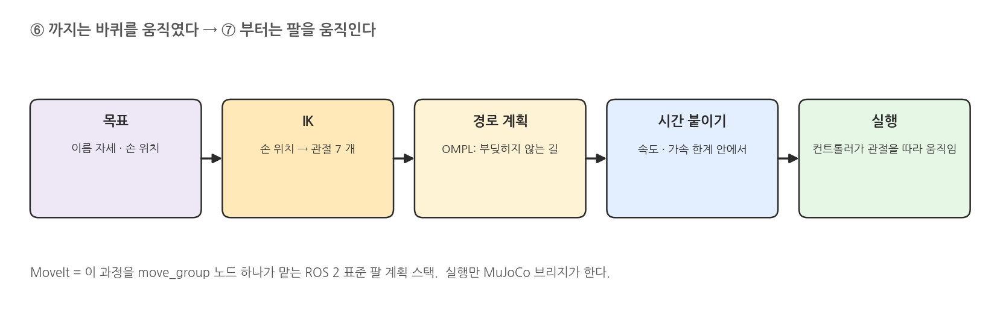{width=1000}

### MoveIt 구성

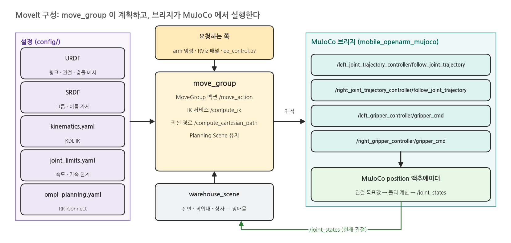{width=1000}

### Planning Group

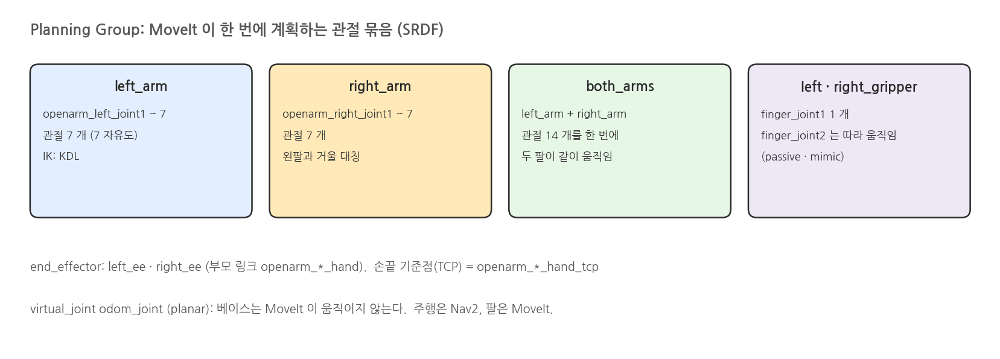{width=1000}

### 이름 자세 (SRDF group_state)

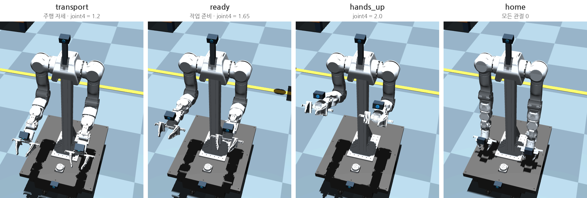{width=1000}

### Planning Scene: MoveIt 이 아는 장애물

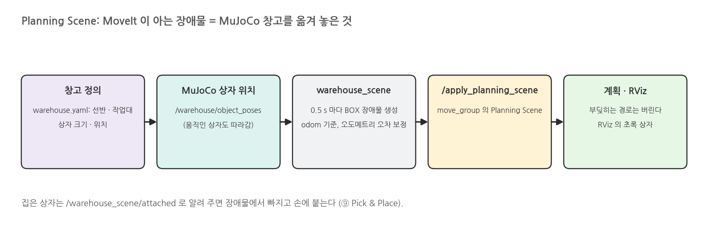{width=1000}

### 계획에서 실행까지

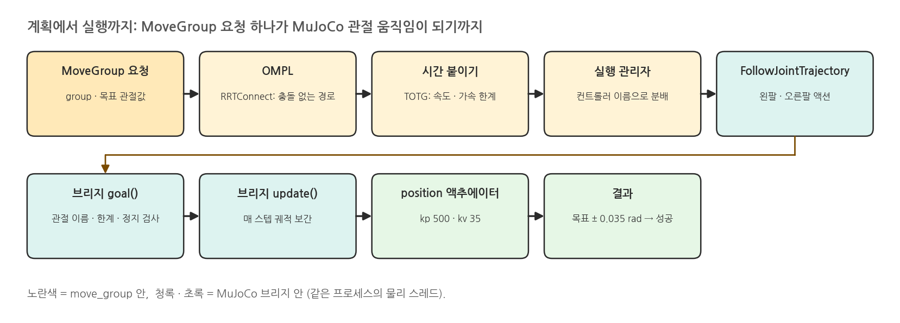{width=1000}

## 2. 실행: 이름 자세로 팔 움직이기

### moveit 모드가 띄우는 것

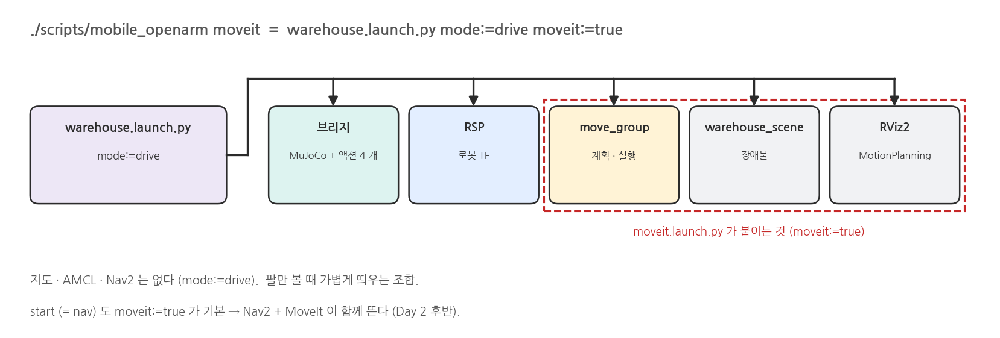{width=1000}

### 실행: 터미널 1 (moveit)

```bash
source /opt/ros/jazzy/setup.bash
source scripts/env.sh
./scripts/mobile_openarm moveit viewer:=true rviz:=true     # 시뮬레이터 + MoveIt (Nav2 없음)
```

### 실행 결과: 터미널 1

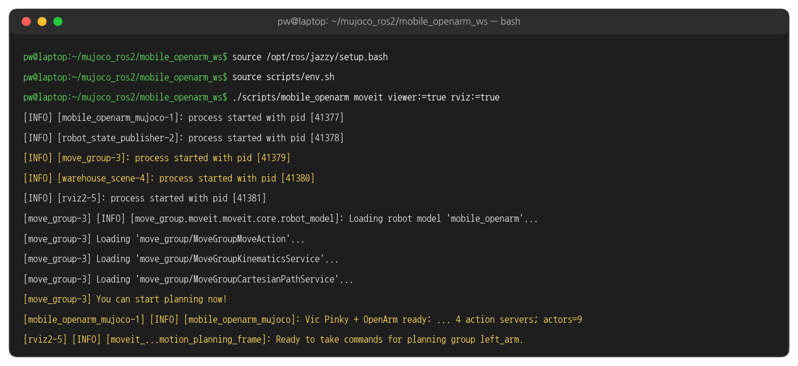{width=1000}

### 실행 결과: 시작 화면

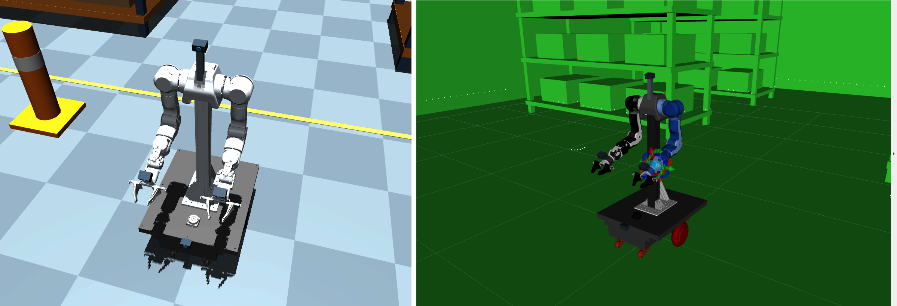{width=1000}

### 터미널 2: ros2 node list · action list

```bash
source /opt/ros/jazzy/setup.bash
source scripts/env.sh
ros2 node list
ros2 action list
```

### 실행 결과: node list · action list

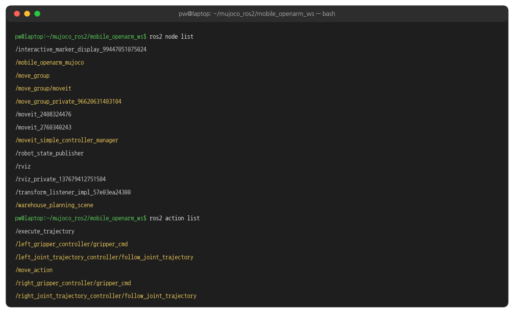{width=1000}

### 터미널 2: 액션 연결 · MoveIt 서비스

```bash
ros2 action info /left_joint_trajectory_controller/follow_joint_trajectory
ros2 service list | grep -E 'ik|cartesian|plan|scene' | grep -v warehouse_planning_scene/
```

### 실행 결과: action info · service list

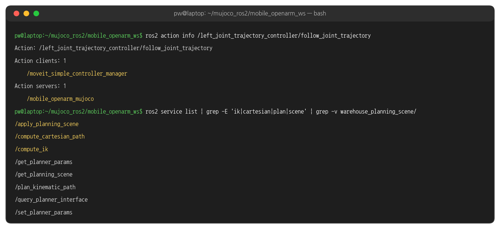{width=1000}

### 터미널 3: arm 명령

```bash
source /opt/ros/jazzy/setup.bash
source scripts/env.sh
time ./scripts/mobile_openarm arm both ready          # arm <left|right|both> <transport|ready|hands_up|home>
./scripts/mobile_openarm arm both hands_up
./scripts/mobile_openarm arm both transport
```

### 실행 결과: arm

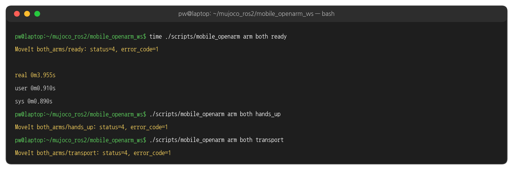{width=1000}

### 실행 결과: transport → ready

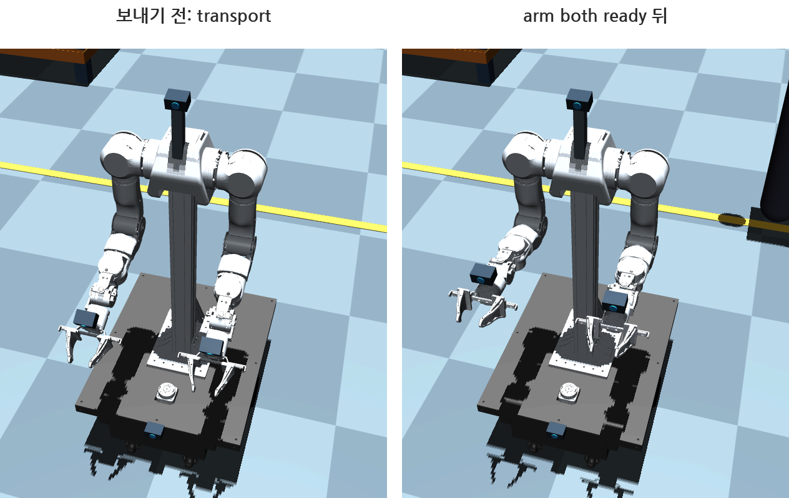{width=1000}

### 실행 결과: 터미널 1 로그

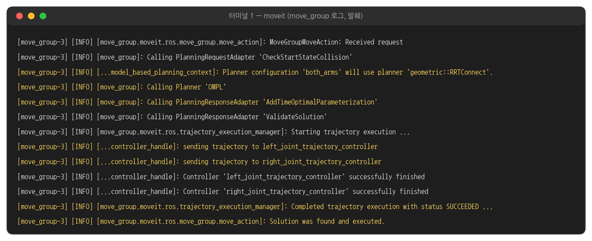{width=1000}

### 계획 궤적과 실제 관절

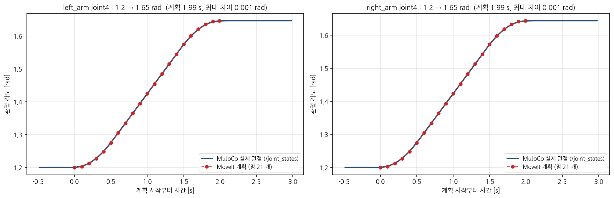{width=1000}

### RViz: MotionPlanning 패널

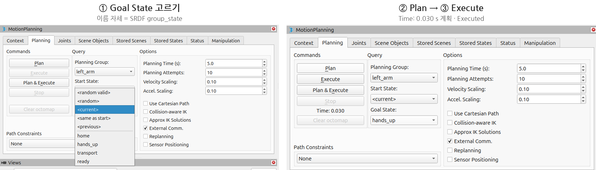{width=1000}

### 실행 결과: RViz 에서 Plan & Execute

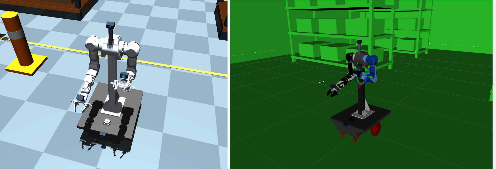{width=1000}

### RViz: Scene Objects

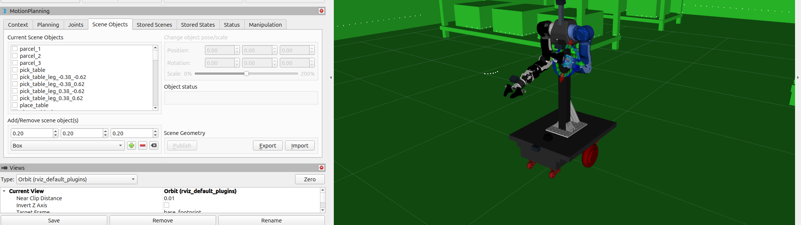{width=1000}

## 3. 계획은 됐는데 실행이 실패할 때

### 터미널 3: arm both home

```bash
./scripts/mobile_openarm arm both home      # 모든 관절 0
```

### 실행 결과: home

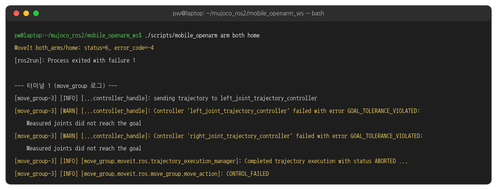{width=1000}

### 실행 결과: 화면

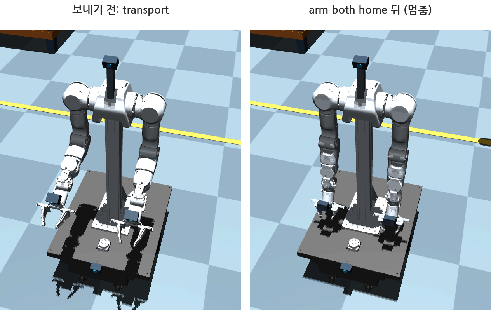{width=1000}

### 왜 MoveIt 은 성공이라고 했나

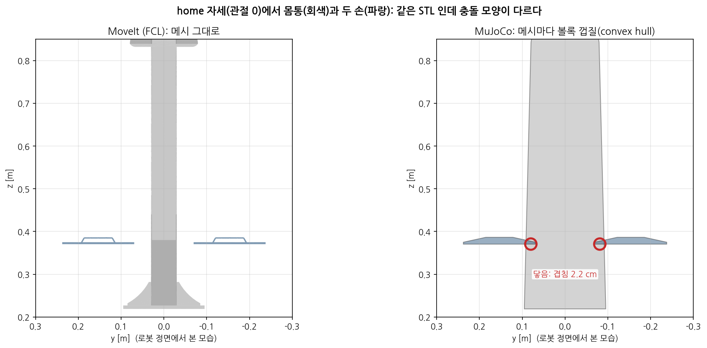{width=1000}

### 실패가 전해지는 순서

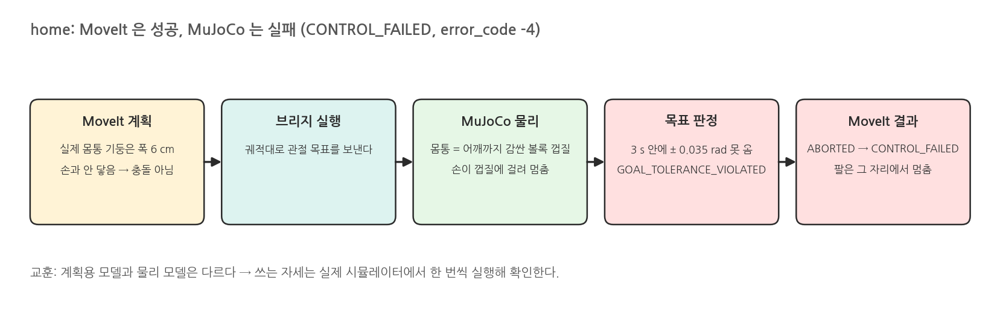{width=1000}

## 4. 코드와 설정

### arm 명령의 흐름

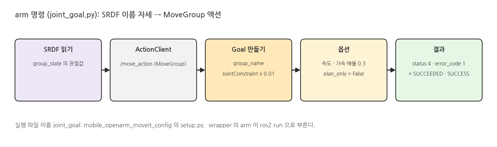{width=1000}

### 이름 자세로 MoveGroup 보내기 - joint_goal.py main 함수 발췌

```python
# mobile_openarm_moveit_config/joint_goal.py
def main(args=None):   # 발췌
    srdf = ET.parse(Path(get_package_share_directory("mobile_openarm_moveit_config")) / "config/mobile_openarm.srdf")
    client = ActionClient(node, MoveGroup, "/move_action")
    goal = MoveGroup.Goal()
    req = goal.request
    req.group_name = "both_arms" if options.side == "both" else options.side + "_arm"
    req.allowed_planning_time = 8.0
    req.num_planning_attempts = 5
    req.max_velocity_scaling_factor = 0.3                  # joint_limits.yaml 의 최대 속도 × 0.3
    req.max_acceleration_scaling_factor = 0.3
    req.start_state.is_diff = True                         # 시작 = 현재 관절
    constraint = Constraints(name=options.pose)
    for side in ["left", "right"] if options.side == "both" else [options.side]:
        state = srdf.find(f"group_state[@group='{side}_arm'][@name='{options.pose}']")
        for j in state.findall("joint"):                   # SRDF 이름 자세 → 관절 목표
            constraint.joint_constraints.append(JointConstraint(
                joint_name=j.get("name"), position=float(j.get("value")),
                tolerance_above=0.01, tolerance_below=0.01, weight=1.0))
    req.goal_constraints = [constraint]
    goal.planning_options.plan_only = options.plan_only    # False = 계획 + 실행
    future = client.send_goal_async(goal)
    ...
    code = result.result().result.error_code.val           # 1 = SUCCESS, -4 = CONTROL_FAILED
```

### 그룹과 이름 자세 - mobile_openarm.srdf 발췌

```xml
<!-- mobile_openarm_moveit_config/config/mobile_openarm.srdf (발췌) -->
<group name="left_arm">
  <joint name="openarm_left_joint1" />  <!-- ... joint7 까지 -->
</group>
<group name="left_gripper">
  <joint name="openarm_left_finger_joint1" />
</group>
<group name="both_arms">
  <group name="left_arm" />
  <group name="right_arm" />
</group>
<group_state name="ready" group="left_arm">
  <joint name="openarm_left_joint4" value="1.65" />   <!-- 나머지 관절은 0 -->
</group_state>
<end_effector name="left_ee" parent_link="openarm_left_hand" group="left_gripper" />
<virtual_joint name="odom_joint" type="planar" parent_frame="odom" child_link="base_footprint" />
<disable_collisions link1="openarm_left_hand" link2="openarm_left_link7" reason="Adjacent" />  <!-- 110 줄 -->
```

### MoveIt 파라미터 - config.py parameters 함수 발췌

```python
# mobile_openarm_moveit_config/config.py
def parameters(urdf=None):   # 발췌
    return {
        "robot_description": urdf or expand_urdf(),                       # ③ 의 URDF 그대로
        "robot_description_semantic": (folder / "mobile_openarm.srdf").read_text(),
        "robot_description_kinematics": load("kinematics.yaml"),          # KDL
        "robot_description_planning": load("joint_limits.yaml"),          # 속도 · 가속 한계
        "planning_pipelines": ["ompl"],
        "ompl": load("ompl_planning.yaml"),                               # RRTConnect
        **load("moveit_controllers.yaml"),
        "use_sim_time": True,                                             # MuJoCo /clock
        "moveit_manage_controllers": False,
        "trajectory_execution.allowed_start_tolerance": 0.05,
        "publish_planning_scene": True,
    }
```

### 컨트롤러 이름 = 브리지 액션 이름

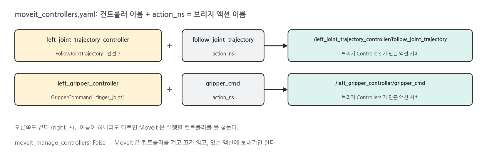{width=1000}

### moveit_controllers.yaml 발췌

```yaml
# mobile_openarm_moveit_config/config/moveit_controllers.yaml (발췌)
moveit_controller_manager: moveit_simple_controller_manager/MoveItSimpleControllerManager
moveit_simple_controller_manager:
  controller_names:
  - left_joint_trajectory_controller
  - left_gripper_controller
  - right_joint_trajectory_controller
  - right_gripper_controller
  left_joint_trajectory_controller:
    type: FollowJointTrajectory
    action_ns: follow_joint_trajectory          # → /left_joint_trajectory_controller/follow_joint_trajectory
    default: true
    joints: [openarm_left_joint1, ..., openarm_left_joint7]
  left_gripper_controller:
    type: GripperCommand
    action_ns: gripper_cmd
    joints: [openarm_left_finger_joint1]
```

### 브리지 액션 서버

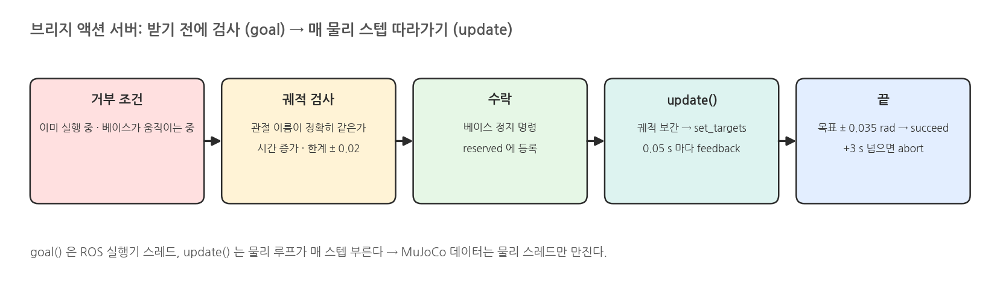{width=1000}

### 궤적 받기 - actions.py Controllers.goal 함수 발췌

```python
# mobile_openarm_mujoco/actions.py
def goal(self, key, request):   # 발췌
    p = self.physics
    if key in self.reserved or np.max(np.abs(p.twist)) > 0.04 or np.max(np.abs(p.command)) > 0.04:
        return GoalResponse.REJECT                                  # 실행 중 · 베이스가 움직이는 중
    try:
        if "trajectory" in key:
            limits = {n: p.model.jnt_range[p.model.joint(n).id] for n in self.names[key]}
            validate_trajectory(request.trajectory, self.names[key], limits, p.data.time)
    except ValueError as error:
        self.node.get_logger().warning(str(error))
        return GoalResponse.REJECT
    self.reserved.add(key)
    self.node.command = (0.0, 0.0)                                  # 베이스 정지
    return GoalResponse.ACCEPT
```

### 궤적 따라가기 - actions.py Controllers.update 함수 발췌

```python
# mobile_openarm_mujoco/actions.py
def update(self):   # 발췌: 물리 루프가 매 스텝 부른다
    for key, state in list(self.active.items()):
        t = p.data.time - state["start"]
        traj = state["trajectory"]
        desired = traj.sample(t)                                    # 궤적 점 사이 보간
        p.set_targets(state["names"], desired)                      # position 액추에이터 목표
        if t >= traj.times[-1] and not self.tolerance_failed(state, traj.positions[-1], True):
            result.error_code = result.SUCCESSFUL                   # 목표 ± 0.035 rad
            self.finish(key, state, result, "succeed")
        elif t > traj.times[-1] + timeout:                          # goal_time_tolerance 3 s
            result.error_code = result.GOAL_TOLERANCE_VIOLATED
            result.error_string = "Measured joints did not reach the goal"
            self.finish(key, state, result, "abort")
```

### 궤적 점 사이 보간

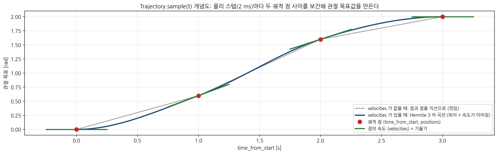{width=1000}

### 보간 - trajectory.py Trajectory.sample 함수

```python
# mobile_openarm_mujoco/trajectory.py
def sample(self, t):
    if t <= self.times[0]:
        return self.positions[0].copy()
    if t >= self.times[-1]:
        return self.positions[-1].copy()
    i = np.searchsorted(self.times, t, side="right") - 1          # t 가 들어 있는 구간
    dt = self.times[i + 1] - self.times[i]
    u = (t - self.times[i]) / dt                                   # 구간 안 위치 0 ~ 1
    a, b = self.positions[i : i + 2]
    if self.velocities is None:
        return a + (b - a) * u                                     # 직선
    va, vb = self.velocities[i : i + 2]
    return ((2 * u**3 - 3 * u**2 + 1) * a + (u**3 - 2 * u**2 + u) * dt * va
            + (-2 * u**3 + 3 * u**2) * b + (u**3 - u**2) * dt * vb)  # Hermite 3 차
```

### 팔과 바퀴의 인터록

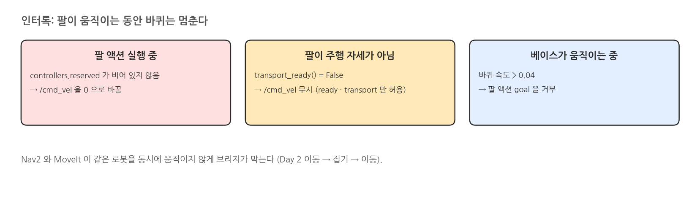{width=1000}

### 주행 명령 받기 - bridge.py receive_command 함수

```python
# mobile_openarm_mujoco/bridge.py
def receive_command(self, msg):
    if not all(math.isfinite(v) for v in [msg.linear.x, msg.angular.z]):
        return
    if self.controllers.reserved or not self.physics.transport_ready():
        self.command = (0.0, 0.0)                                  # 팔 실행 중 · 주행 자세 아님 → 정지
        return
    cfg = self.physics.settings["control"]
    self.command = (
        max(-cfg["max_linear"], min(cfg["max_linear"], msg.linear.x)),
        max(-cfg["max_angular"], min(cfg["max_angular"], msg.angular.z)),
    )
    self.command_time = time.monotonic()
```

### 해 볼 것

- `arm left ready` 와 `arm both ready` 를 차례로 실행 → 한 팔만 움직이는 그룹과 두 팔 그룹의 차이 확인
- `joint_goal.py` 의 `max_velocity_scaling_factor` 를 0.1 로 바꿔 `time` 으로 걸린 시간 비교
- RViz Planning 탭에서 Goal State 를 `<random valid>` 로 두고 Plan 만 여러 번 → OMPL 경로가 매번 달라지는 모습 확인
