## 1. 손끝(End-Effector)으로 움직이기

### 관절 공간에서 작업 공간으로

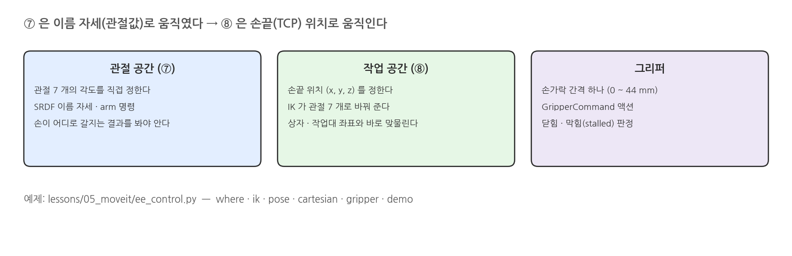{width=1000}

### 좌표계: base_footprint 와 TCP

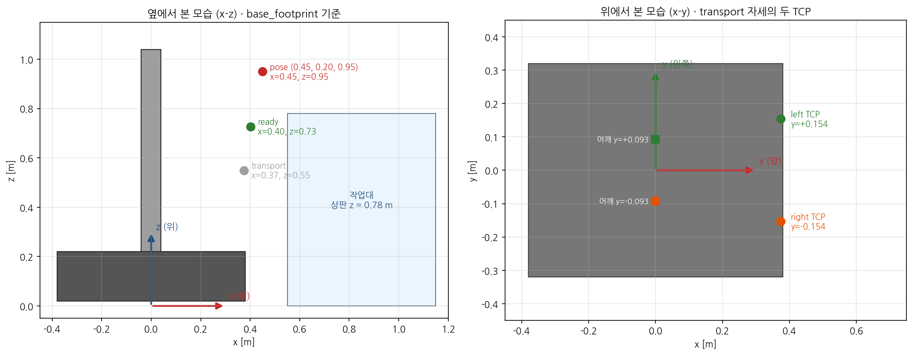{width=1000}

### 손의 방향: GRASP_FORWARD

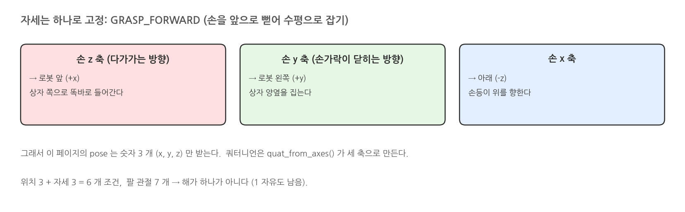{width=1000}

### IK: 손끝 자세 → 관절 7 개

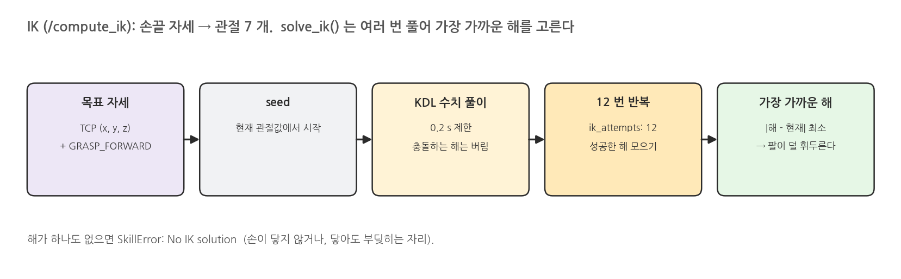{width=1000}

### 같은 손끝, 다른 팔 모양

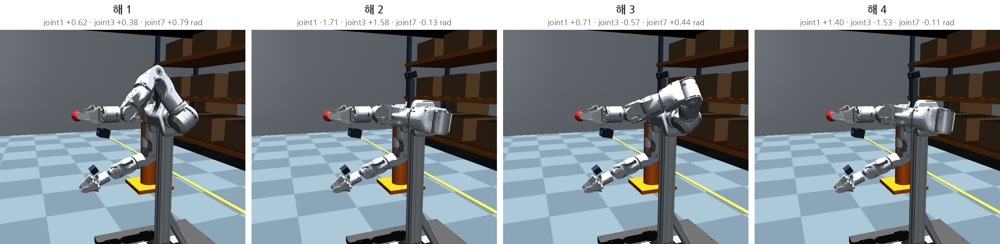{width=1000}

### 손이 닿는 범위

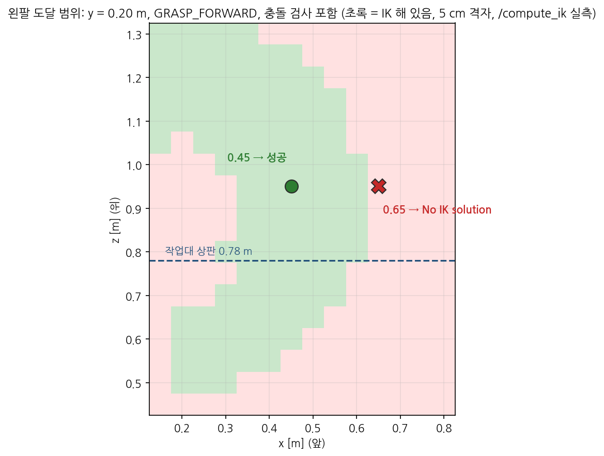{width=1000}

### pose goal 과 Cartesian path

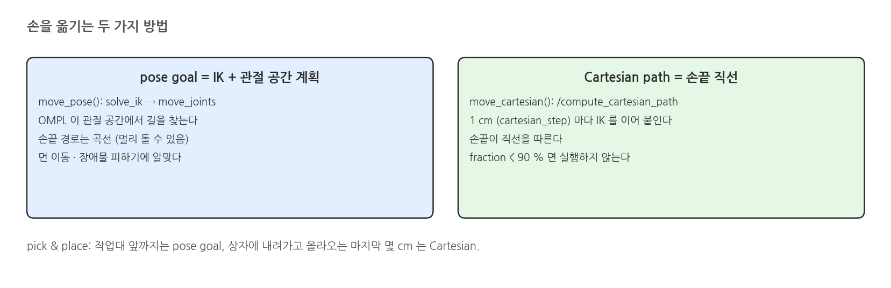{width=1000}

### 그리퍼

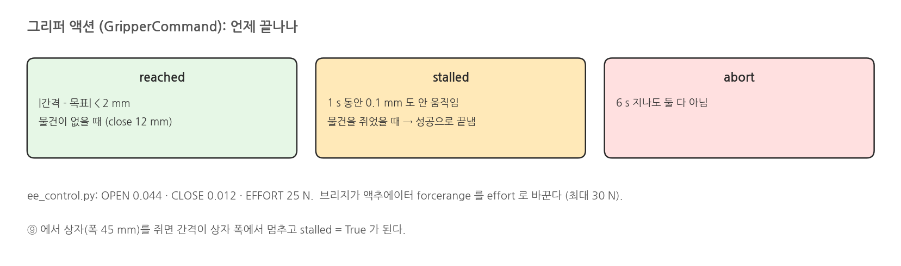{width=1000}

## 2. 실행: ee_control.py

### 실행: 터미널 1 (moveit)

```bash
source /opt/ros/jazzy/setup.bash
source scripts/env.sh
./scripts/mobile_openarm moveit viewer:=true rviz:=true     # ⑦ 과 같다
```

### 실행 결과: 터미널 1

{width=1000}

### 실행 결과: 시작 화면

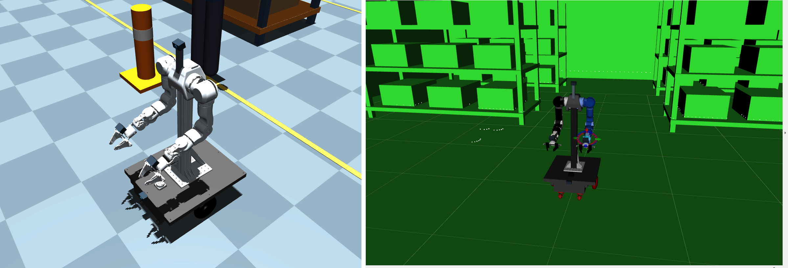{width=1000}

### 터미널 2: where · named

```bash
source /opt/ros/jazzy/setup.bash
source scripts/env.sh
./scripts/mobile_openarm exec python lessons/05_moveit/ee_control.py where              # 두 TCP 위치 (TF)
./scripts/mobile_openarm exec python lessons/05_moveit/ee_control.py named both ready   # ⑦ 의 이름 자세
```

### 실행 결과: where · named

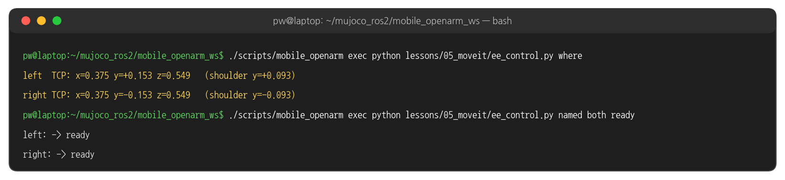{width=1000}

### 실행 결과: transport → ready

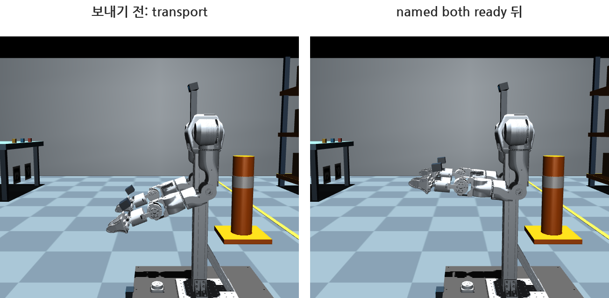{width=1000}

### 터미널 2: ik

```bash
./scripts/mobile_openarm exec python lessons/05_moveit/ee_control.py ik left 0.45 0.20 0.95   # 계산만, 팔은 안 움직인다
```

### 실행 결과: ik

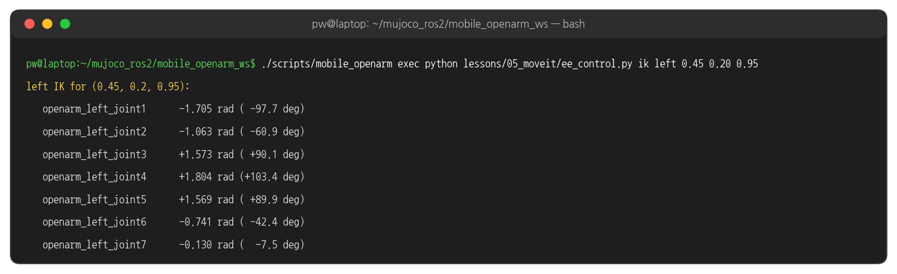{width=1000}

### 터미널 2: pose

```bash
time ./scripts/mobile_openarm exec python lessons/05_moveit/ee_control.py pose left 0.45 0.20 0.95
```

### 실행 결과: pose

{width=1000}

### 실행 결과: ready → pose

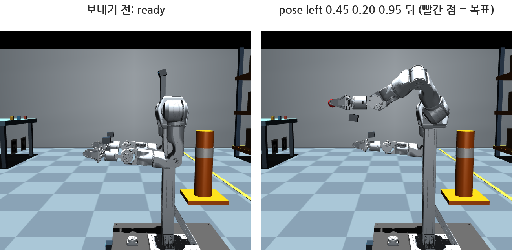{width=1000}

### 터미널 2: cartesian

```bash
time ./scripts/mobile_openarm exec python lessons/05_moveit/ee_control.py cartesian left 0 0 -0.05   # 지금 TCP 에서 5 cm 아래로 직선
```

### 실행 결과: cartesian

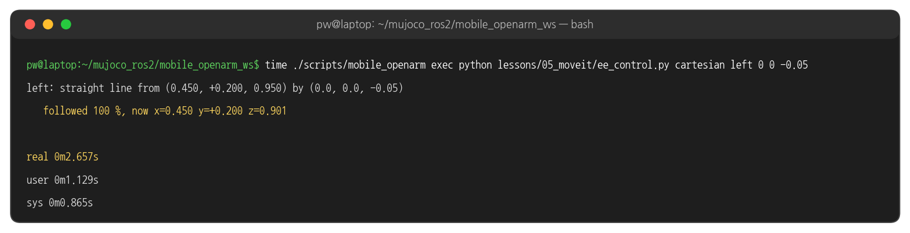{width=1000}

### 실행 결과: 5 cm 아래로

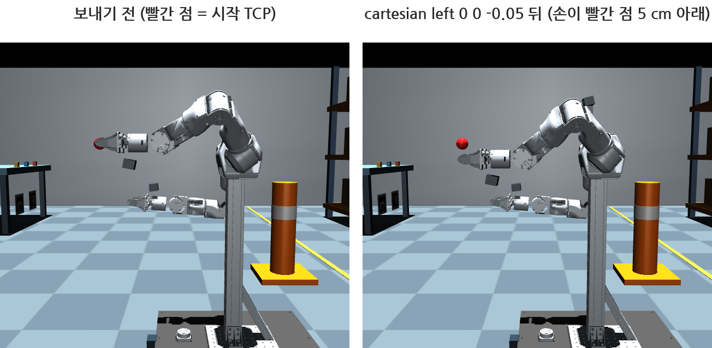{width=1000}

### 손끝이 지나간 길

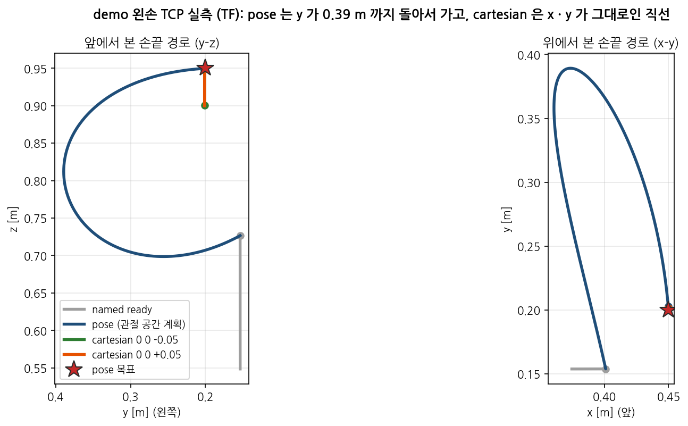{width=1000}

### pose 오차는 어디서 오나

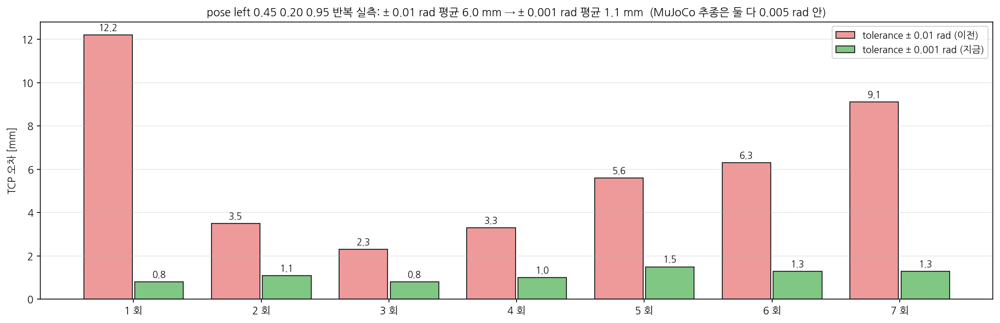{width=1000}

### 터미널 2: gripper

```bash
./scripts/mobile_openarm exec python lessons/05_moveit/ee_control.py gripper left close
./scripts/mobile_openarm exec python lessons/05_moveit/ee_control.py gripper left open
```

### 실행 결과: gripper

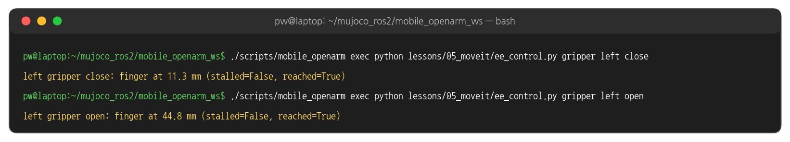{width=1000}

### 실행 결과: 열림 · 닫힘

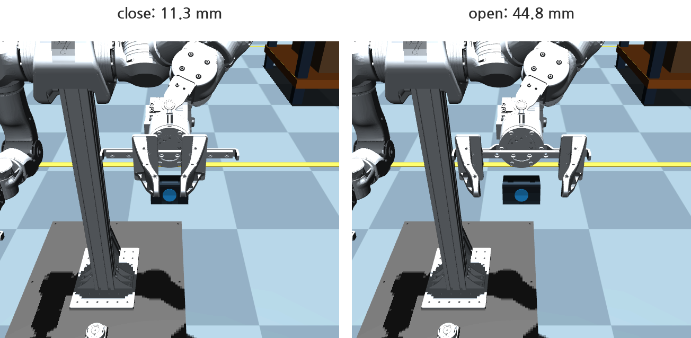{width=1000}

### 손가락 간격

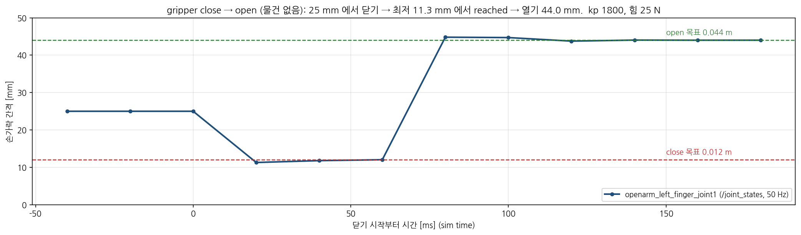{width=1000}

### 터미널 2: 실패하는 명령 두 가지

```bash
./scripts/mobile_openarm exec python lessons/05_moveit/ee_control.py pose left 0.65 0.20 0.95   # 너무 멀다
./scripts/mobile_openarm exec python lessons/05_moveit/ee_control.py cartesian left 0.3 0 0     # 앞으로 30 cm 직선
```

### 실행 결과: 실패

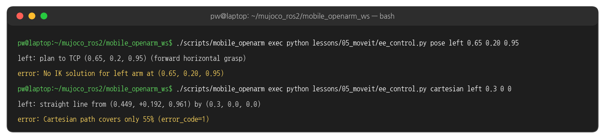{width=1000}

### 터미널 2: demo

```bash
time ./scripts/mobile_openarm exec python lessons/05_moveit/ee_control.py demo   # ready → pose → 아래 5 cm → 닫기 · 열기 → 위 5 cm → transport
```

### 실행 결과: demo

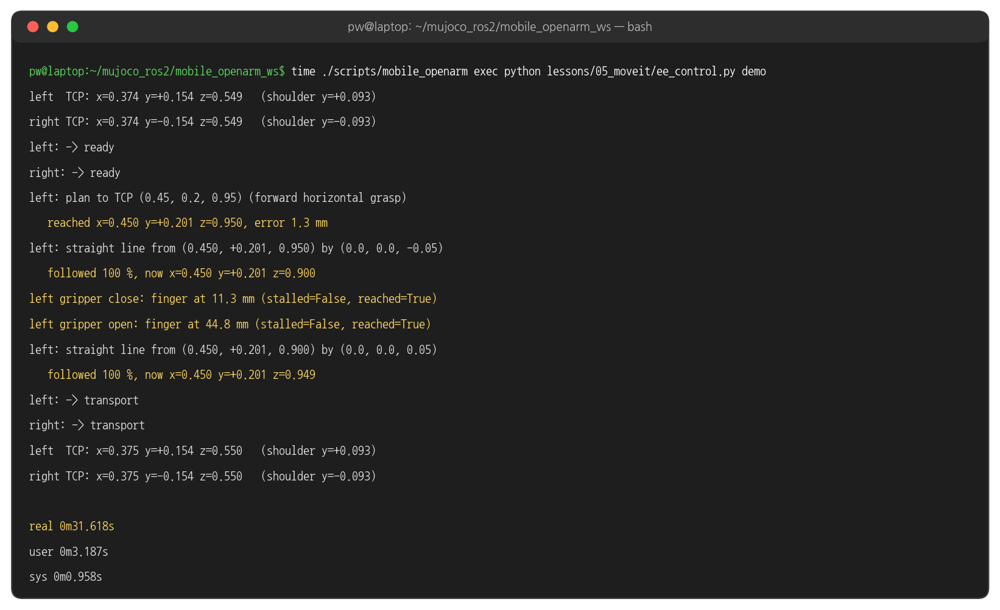{width=1000}

## 3. 코드와 설정

### 명령과 함수

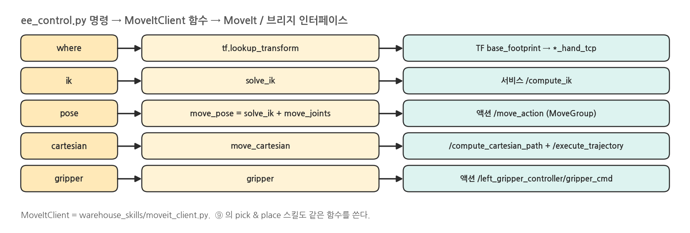{width=1000}

### 목표 자세 만들기 - moveit_client.py make_pose 함수

```python
# warehouse_skills/moveit_client.py
# Forward horizontal grasp: hand z (approach) -> +x, hand y (finger closing) -> +y, hand x -> -z.
GRASP_FORWARD = quat_from_axes(np.array([0, 0, -1.0]), np.array([0, 1.0, 0]), np.array([1.0, 0, 0]))


def make_pose(xyz, quat=GRASP_FORWARD):
    pose = Pose()
    pose.position.x, pose.position.y, pose.position.z = map(float, xyz)
    pose.orientation.x, pose.orientation.y, pose.orientation.z, pose.orientation.w = map(float, quat)
    return pose
```

### IK 풀기 - moveit_client.py solve_ik 함수

```python
# warehouse_skills/moveit_client.py
def solve_ik(self, side, pose, avoid_collisions=True):
    arm = self.arms[side]
    names = self.arm_joints(side)
    seed = np.array([self.joints.get(n, 0.0) for n in names])          # 현재 관절값
    best = None
    for _ in range(int(self.cfg["moveit"]["ik_attempts"])):            # 12 번
        req = GetPositionIK.Request()
        r = req.ik_request
        r.group_name, r.ik_link_name = arm["group"], arm["tcp_link"]   # left_arm, openarm_left_hand_tcp
        r.avoid_collisions = avoid_collisions
        r.timeout.nanosec = 200_000_000                                # 0.2 s
        r.pose_stamped = PoseStamped()
        r.pose_stamped.header.frame_id = "base_footprint"
        r.pose_stamped.pose = pose
        r.robot_state.is_diff = True
        r.robot_state.joint_state.name = names
        r.robot_state.joint_state.position = seed.tolist()
        res = wait(self.ik.call_async(req), 5.0, "compute_ik")         # 서비스 /compute_ik
        if res.error_code.val != MoveItErrorCodes.SUCCESS:
            continue
        q = dict(zip(res.solution.joint_state.name, res.solution.joint_state.position))
        sol = np.array([q[n] for n in names])
        cost = float(np.linalg.norm(sol - seed))                       # 지금 자세와의 거리
        if best is None or cost < best[0]:
            best = (cost, sol)
    if best is None:
        raise SkillError(f"No IK solution for {side} arm at (...)")
    return best[1]
```

### pose goal - moveit_client.py move_pose · move_joints 함수 발췌

```python
# warehouse_skills/moveit_client.py
def move_pose(self, side, pose):
    self.move_joints(side, self.solve_ik(side, pose))                 # IK → 관절 목표


def move_joints(self, side, positions, timeout=60.0):   # 발췌
    goal = MoveGroup.Goal()
    req = goal.request
    req.group_name = self.arms[side]["group"]
    m = self.cfg["moveit"]
    req.max_velocity_scaling_factor = float(m["velocity_scaling"])    # 0.35
    req.start_state.is_diff = True
    c = Constraints(name="skill")
    for name, value in zip(self.arm_joints(side), positions):
        c.joint_constraints.append(JointConstraint(joint_name=name, position=float(value),
                                                   tolerance_above=0.001, tolerance_below=0.001, weight=1.0))
    req.goal_constraints = [c]                                        # ± 0.001 rad → 손끝 약 1 mm (± 0.01 이면 수 mm ~ 1 cm)
    handle = wait(self.move.send_goal_async(goal), 10.0, "move_action goal")
    result = wait(handle.get_result_async(), timeout, "move_action result")
```

### Cartesian path - moveit_client.py move_cartesian 함수 발췌

```python
# warehouse_skills/moveit_client.py
def move_cartesian(self, side, waypoints, timeout=60.0):   # 발췌
    req = GetCartesianPath.Request()
    req.header.frame_id = "base_footprint"
    req.start_state.is_diff = True
    req.group_name, req.link_name = arm["group"], arm["tcp_link"]
    req.waypoints = list(waypoints)                                  # 끝점 (자세는 GRASP_FORWARD)
    req.max_step = float(m["cartesian_step"])                        # 1 cm 마다 IK
    req.jump_threshold = 0.0
    req.avoid_collisions = True
    res = wait(self.cartesian.call_async(req), 10.0, "compute_cartesian_path")
    if res.error_code.val != MoveItErrorCodes.SUCCESS or res.fraction < float(m["cartesian_min_fraction"]):
        raise SkillError(f"Cartesian path covers only {res.fraction * 100:.0f}% (error_code={res.error_code.val})")
    goal = ExecuteTrajectory.Goal(trajectory=res.solution)           # 계획된 궤적을 그대로 실행
    handle = wait(self.execute.send_goal_async(goal), 10.0, "execute_trajectory goal")
    result = wait(handle.get_result_async(), timeout, "execute_trajectory result")
    return res.fraction
```

### 그리퍼 - moveit_client.py gripper 함수

```python
# warehouse_skills/moveit_client.py
def gripper(self, side, position, effort, timeout=15.0):
    goal = GripperCommand.Goal()
    goal.command.position, goal.command.max_effort = float(position), float(effort)   # 0.012 m · 25 N
    handle = wait(self.grippers[side].send_goal_async(goal), 10.0, "gripper goal")
    if not handle.accepted:
        raise SkillError("Gripper goal rejected (is the base moving or an arm action active?)")
    result = wait(handle.get_result_async(), timeout, "gripper result").result
    return result                                                      # position · reached_goal · stalled
```

### 그리퍼가 끝나는 판정 - actions.py Controllers.update 함수 발췌

```python
# mobile_openarm_mujoco/actions.py
else:   # 그리퍼 (발췌)
    position = float(p.positions(state["names"])[0])
    reached = abs(position - h.request.command.position) < p.settings["gripper"]["goal_tolerance"]   # 2 mm
    if abs(position - state["last_position"]) > 0.0001:
        state["last_motion"] = p.data.time
        state["last_position"] = position
    stalled = p.data.time - state["last_motion"] > 1.0 and not reached                            # 1 s 정지
    result.position = position
    result.reached_goal = reached
    result.stalled = stalled
    if reached or stalled:
        self.finish(key, state, result, "succeed")
    elif t > 6:
        self.finish(key, state, result, "abort")
```

### skills.yaml 의 moveit 값

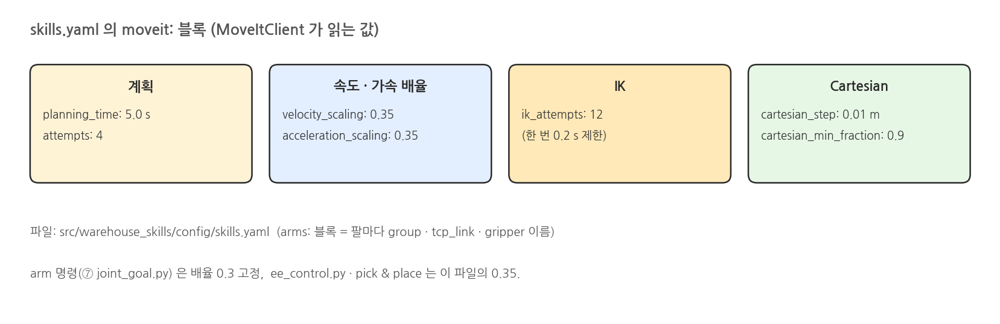{width=1000}

### skills.yaml 발췌

```yaml
# src/warehouse_skills/config/skills.yaml (발췌)
moveit:
  planning_time: 5.0
  attempts: 4
  velocity_scaling: 0.35
  acceleration_scaling: 0.35
  ik_attempts: 12
  cartesian_step: 0.01
  cartesian_min_fraction: 0.9
arms:
  left: {shoulder_y: 0.093, tcp_link: openarm_left_hand_tcp, group: left_arm, gripper: left_gripper_controller, hand_link: openarm_left_hand}
  right: {shoulder_y: -0.093, tcp_link: openarm_right_hand_tcp, group: right_arm, gripper: right_gripper_controller, hand_link: openarm_right_hand}
```

### 해 볼 것

- 도달 범위 그림을 보고 `pose left 0.35 0.20 1.15` 처럼 초록 칸의 끝을 골라 성공 · 실패 확인
- `cartesian left 0 0.1 0` (왼쪽으로 10 cm) 과 `cartesian left 0 -0.1 0` 을 비교 → 몸통 쪽으로는 몇 % 까지 가는지
- `move_joints` 의 `tolerance_above/below` 를 0.01 · 0.05 로 넓혀 `pose` 오차와 계획 시간 비교 (끝나면 0.001 로 되돌리기)
