## 0. 시작 전에

### 지원 환경 · 필요한 것 · 소요 시간

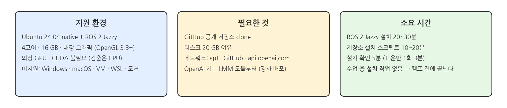{width=1000}

- Ubuntu 24.04 native + ROS 2 Jazzy. 4코어 · 16 GB · 내장 그래픽이면 된다.
- 외장 GPU와 CUDA는 필요 없다. 검출은 CPU로 돈다.
- Windows · macOS · VM · WSL · 도커는 지원하지 않는다.
- 저장소: https://github.com/PinkWink/pinklab_mobile_openarm_ros2_mujoco
- 디스크 20 GB 여유. 네트워크는 apt · GitHub · api.openai.com.
- 설치는 캠프 전에 끝낸다. 수업 중 설치 작업은 없다.

## 1. 환경 설정

### 설치 흐름

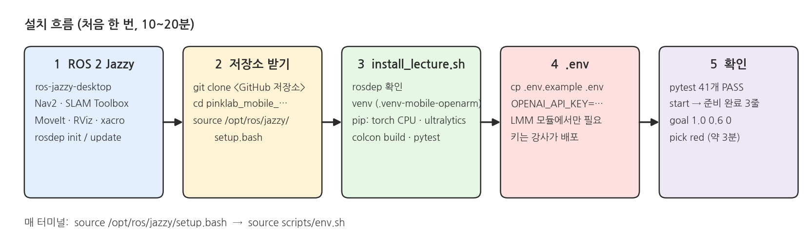{width=1000}

- 다섯 단계를 순서대로 한 번만 한다. 10~20분 걸린다.
- 매 터미널마다 `source /opt/ros/jazzy/setup.bash` → `source scripts/env.sh`.

### ① ROS 2 Jazzy + 추가 패키지

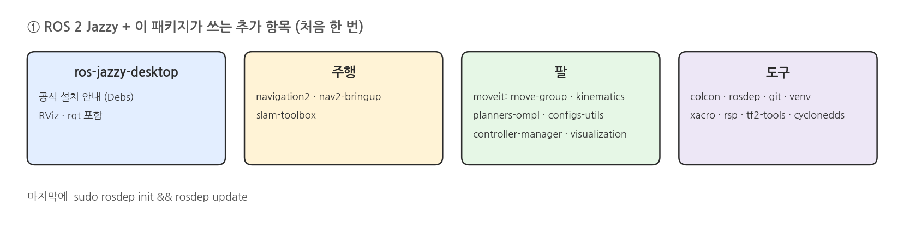{width=1000}

- 공식 안내대로 `ros-jazzy-desktop`을 설치한다: https://docs.ros.org/en/jazzy/Installation/Ubuntu-Install-Debs.html
- 이 패키지가 쓰는 항목을 추가한다.
```bash
sudo apt install python3-venv python3-colcon-common-extensions python3-rosdep git \
  ros-jazzy-navigation2 ros-jazzy-nav2-bringup ros-jazzy-slam-toolbox \
  ros-jazzy-moveit-ros-move-group ros-jazzy-moveit-kinematics ros-jazzy-moveit-planners-ompl \
  ros-jazzy-moveit-simple-controller-manager ros-jazzy-moveit-ros-visualization ros-jazzy-moveit-configs-utils \
  ros-jazzy-teleop-twist-keyboard ros-jazzy-rmw-cyclonedds-cpp ros-jazzy-xacro ros-jazzy-robot-state-publisher \
  ros-jazzy-rviz2 ros-jazzy-vision-msgs ros-jazzy-message-filters ros-jazzy-tf2-geometry-msgs ros-jazzy-tf2-tools
sudo rosdep init && rosdep update
```

### ② 저장소 받기 → ③ 설치 스크립트

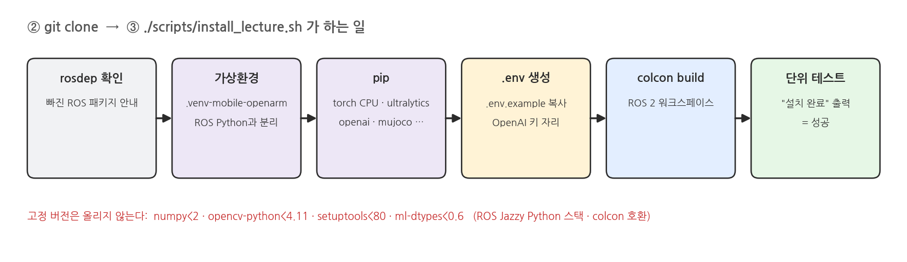{width=1000}

### ③ 설치 스크립트

```bash
git clone https://github.com/PinkWink/pinklab_mobile_openarm_ros2_mujoco.git
cd pinklab_mobile_openarm_ros2_mujoco
source /opt/ros/jazzy/setup.bash
./scripts/install_lecture.sh
```
- 스크립트가 rosdep 확인 → 가상환경 → pip → `.env` 생성 → `colcon build` → 단위 테스트를 한다.
- 마지막에 "설치 완료"가 찍히면 성공이다.
- 고정 버전(`numpy<2`, `opencv-python<4.11`, `setuptools<80`, `ml-dtypes<0.6`)은 올리지 않는다. ROS Jazzy Python 스택과 colcon 호환 때문이다.

### install_lecture.sh 가 하는 일

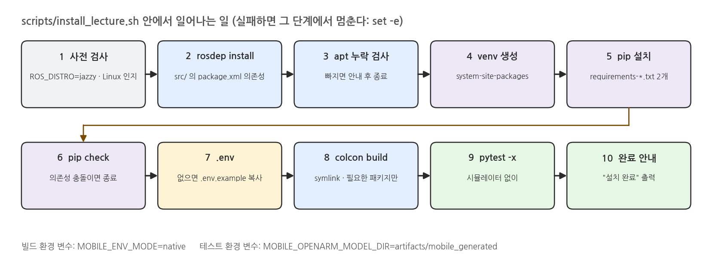{width=1000}

### OpenAI API 키 받는 법

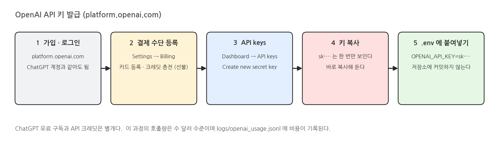{width=1000}

- 가입 · 로그인: https://platform.openai.com (ChatGPT 계정을 그대로 써도 된다.)
- 결제 수단 등록: https://platform.openai.com/settings/organization/billing/overview 에서 카드 등록 후 크레딧을 충전한다.
- 키 만들기: https://platform.openai.com/api-keys 에서 "Create new secret key"를 누른다.
- `sk-`로 시작하는 키는 만들 때 한 번만 보인다. 바로 복사해 둔다.
- 복사한 키를 `.env`의 `OPENAI_API_KEY=`에 붙여넣는다. 저장소에 커밋하지 않는다.
- ChatGPT 유료 구독과 API 크레딧은 별개다. 이 과정의 호출량은 수 달러 수준이다.

### ④ OpenAI 키

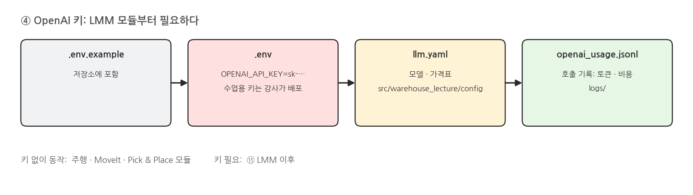{width=1000}

```bash
cp .env.example .env      # OPENAI_API_KEY=sk-...
```
- 수업용 키는 강사가 배포한다. LMM 모듈부터 필요하다.
- 주행 · MoveIt · Pick & Place 모듈은 키 없이 동작한다.
- 모델 · 가격표: `src/warehouse_lecture/config/llm.yaml`. 호출 기록: `logs/openai_usage.jsonl`.

### 새 터미널마다 (env.sh)

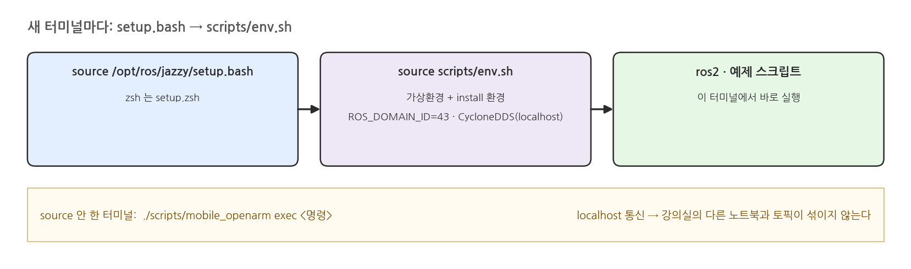{width=1000}

### 터미널을 열 때마다 하는 명령

```bash
cd ~/pinklab_mobile_openarm_ros2_mujoco
source /opt/ros/jazzy/setup.bash      # zsh 는 setup.zsh
source scripts/env.sh
```
- `env.sh`는 가상환경 + install 환경 + `ROS_DOMAIN_ID=43` + CycloneDDS(localhost)를 잡는다.
- source 안 한 터미널에서는 `./scripts/mobile_openarm exec <명령>`을 쓴다.
- localhost 통신이라 같은 강의실의 다른 노트북과 토픽이 섞이지 않는다.

### env.sh 가 하는 일

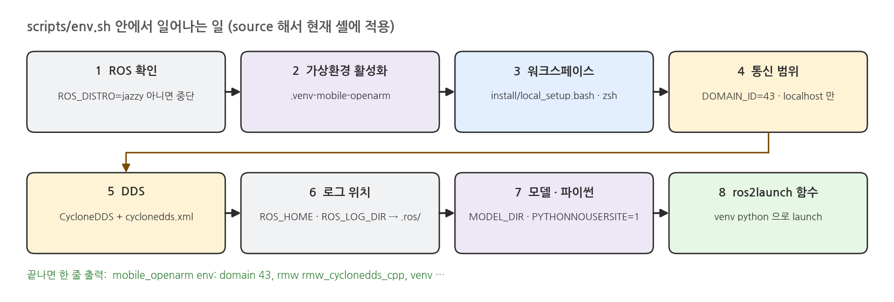{width=1000}

### env.sh 실행 결과

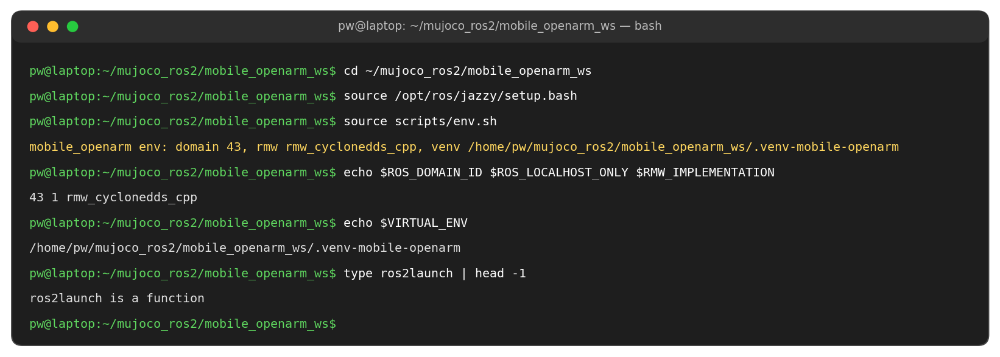{width=1000}

### ⑤ 설치 확인

- `./scripts/mobile_openarm start`의 실행 결과다. 왼쪽이 MuJoCo 창, 오른쪽이 RViz2다.

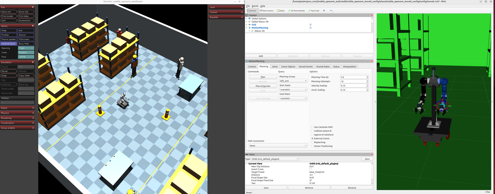{width=1000}

## 2. 실행 구조

### 터미널 두 개

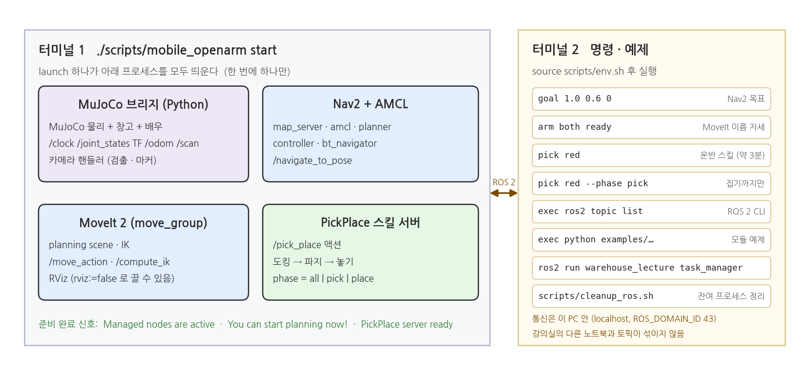{width=1000}

- 터미널 1: `./scripts/mobile_openarm start`. launch 하나가 모든 프로세스를 띄운다.
- 터미널 2: 명령과 예제. `source scripts/env.sh` 후 실행한다.

### wrapper 명령

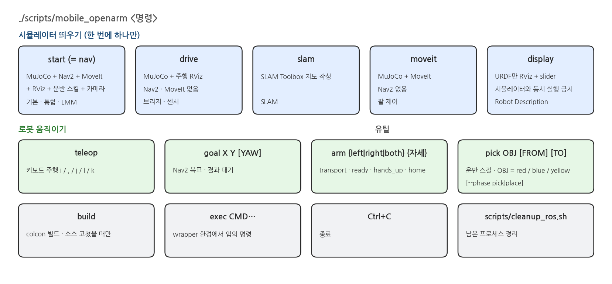{width=1000}

- 시뮬레이터는 한 번에 하나만 띄운다. lock 파일로 막힌다.
- 종료는 Ctrl+C. 남은 프로세스는 `./scripts/cleanup_ros.sh`로 정리한다.

### launch 인자

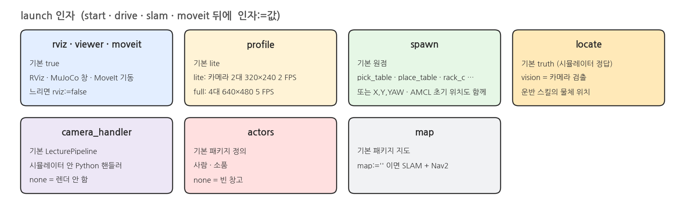{width=1000}

- `start`, `drive`, `slam`, `moveit` 뒤에 `인자:=값` 형식으로 붙인다.
- 느리면 `rviz:=false`. 카메라 기본은 `profile:=lite`(2대 320×240 2 FPS).

### description

- 시뮬레이터 없이 로봇 모델(URDF)만 RViz2에 띄운다. Joint · Link · TF 트리 구조를 확인하는 용도다.
- 슬라이더 창에서 관절을 움직이면 RViz2의 로봇과 TF가 따라 움직인다.
- 시뮬레이터가 떠 있을 때는 실행하지 않는다. 둘 다 `/joint_states`와 `/tf`를 발행한다.

```bash
source /opt/ros/jazzy/setup.bash
source scripts/env.sh
ros2 launch mobile_openarm_description display.launch.py              # RViz2 + 관절 슬라이더
ros2 launch mobile_openarm_description display.launch.py gui:=false   # 슬라이더 없이
# 같은 것: ./scripts/mobile_openarm display
```

### 실행결과

{width=1000}

## 3. 창고와 로봇

### 창고 배치도

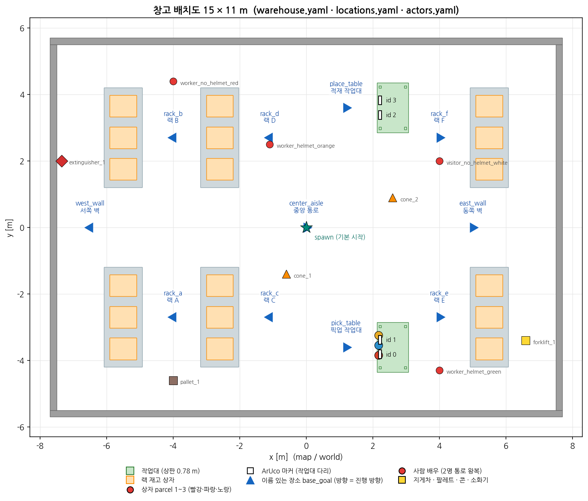{width=1000}

- 15 × 11 m 창고다. `warehouse.yaml` · `locations.yaml` · `actors.yaml`에서 온다.
- 별 = 기본 시작 위치. 삼각형 = 이름 있는 장소의 `base_goal`.

### 장소 이름 (locations.yaml)

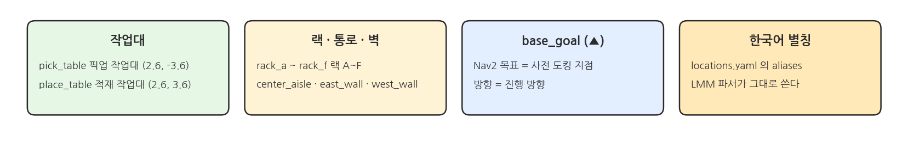{width=1000}

- `pick_table` 픽업 작업대 (2.6, −3.6). `place_table` 적재 작업대 (2.6, 3.6).
- `rack_a` ~ `rack_f` 랙 A~F. `center_aisle` · `east_wall` · `west_wall`.
- 삼각형 = `base_goal`. Nav2 목표이자 사전 도킹 지점이다.
- 한국어 별칭은 LMM 파서가 그대로 쓴다.

### 상자 · 작업대 · 마커

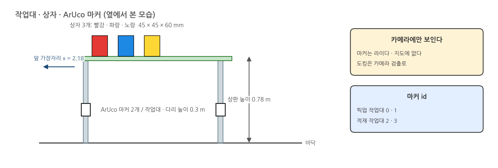{width=1000}

- 상자 3개: 빨강 · 파랑 · 노랑, 45 × 45 × 60 mm.
- 픽업 작업대 앞 가장자리 x = 2.18에서 시작한다. 상판 높이 0.78 m.
- ArUco 마커는 작업대마다 2개. id 0·1 픽업, 2·3 적재. 다리 높이 0.3 m.
- 마커는 카메라에만 보인다. 라이다 · 지도에는 없다.

### 배우 (actors.yaml)

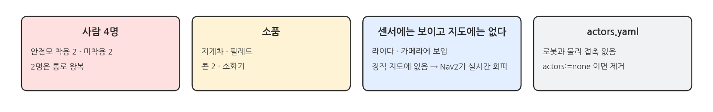{width=1000}

- 사람 4명: 안전모 착용 2 · 미착용 2. 2명은 통로를 왕복한다.
- 지게차 · 팔레트 · 콘 2 · 소화기.
- 라이다 · 카메라에 보이고 정적 지도에는 없다. Nav2가 실시간으로 회피한다.
- 로봇과 물리 접촉은 없다. `actors:=none`이면 제거된다.

## 4. ROS 2 인터페이스

### 인터페이스 한눈에

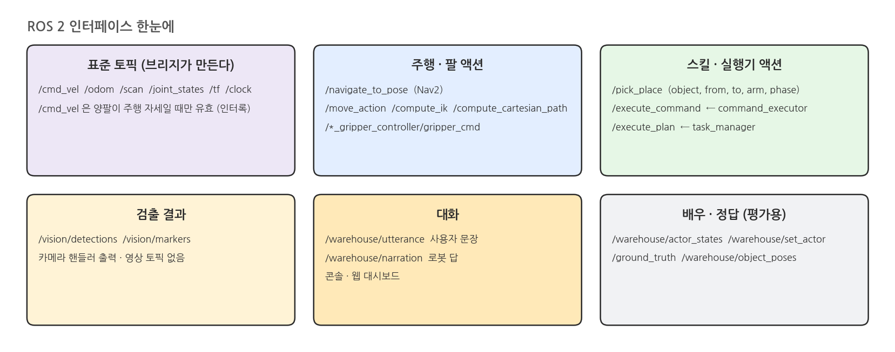{width=1000}

- 표준 토픽(`/cmd_vel` `/odom` `/scan` `/joint_states` `/tf` `/clock`)은 브리지가 만든다.
- `/cmd_vel`은 양팔이 주행 자세일 때만 유효하다(인터록).
- 액션: `/navigate_to_pose`, `/move_action`, `/pick_place`, `/execute_command`, `/execute_plan`.
- 검출 결과는 `/vision/detections` · `/vision/markers`뿐이다. 영상 토픽은 없다.
- 대화는 `/warehouse/utterance`(사용자) · `/warehouse/narration`(로봇).

## 5. 자주 수정하는 설정

### 설정 파일 지도 (src/ 아래)

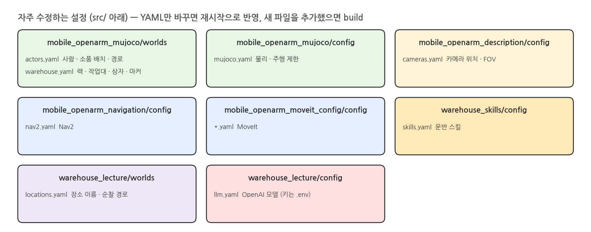{width=1000}

- YAML만 바꾸면 재시작으로 반영된다.
- 새 파일을 추가했으면 `build`한다.

## 6. 문제 해결

### 실행 환경 문제

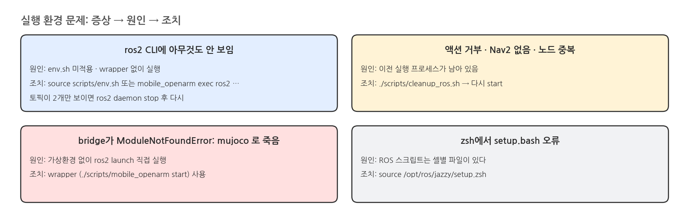{width=1000}

- ros2 CLI에 아무것도 안 보이면 `source scripts/env.sh`. 토픽이 2개만 보이면 `ros2 daemon stop` 후 다시.
- 액션 거부 · Nav2 없음 · 노드 중복이면 `./scripts/cleanup_ros.sh` 후 다시 `start`.
- bridge가 `ModuleNotFoundError: mujoco`로 죽으면 wrapper로 실행한다.
- zsh에서 `setup.bash` 오류가 나면 `source /opt/ros/jazzy/setup.zsh`.

### 동작 · 성능 · 키 문제

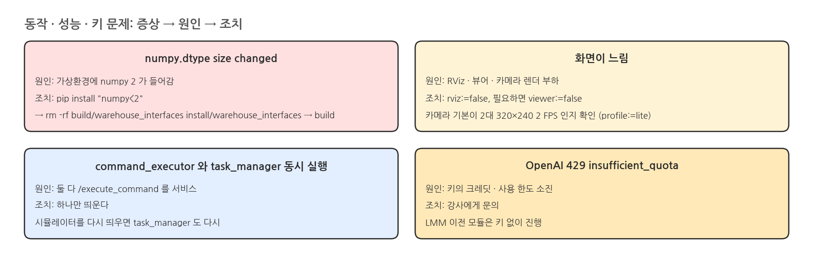{width=1000}

- `numpy.dtype size changed`: `pip install "numpy<2"` → `rm -rf build/warehouse_interfaces install/warehouse_interfaces` → `build`.
- 화면이 느리면 `rviz:=false`, 필요하면 `viewer:=false`.
- `command_executor`와 `task_manager`는 하나만 띄운다. 시뮬레이터를 다시 띄우면 `task_manager`도 다시.
- OpenAI 429 insufficient_quota는 강사에게 문의한다. LMM 이전 모듈은 키 없이 진행한다.
