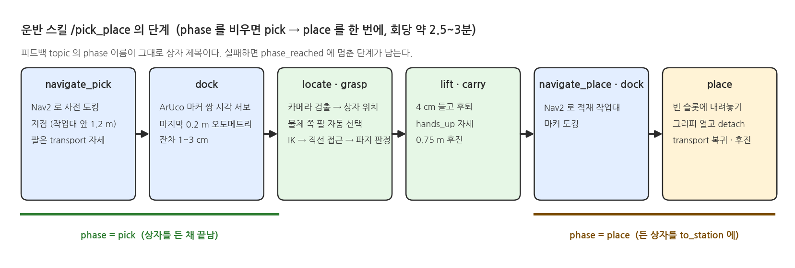

:::cards(3)
::card 지원 환경
- Ubuntu 24.04 native + ROS 2 Jazzy
- 4코어 · 16 GB · 내장 그래픽(OpenGL 3.3+)
- 외장 GPU · CUDA 불필요 (검출은 CPU)
- 미지원: Windows · macOS · VM · WSL · 도커
::card 필요한 것
- 저장소: https://github.com/PinkWink/pinklab_mobile_openarm_ros2_mujoco
- 디스크 20 GB 여유 (저장소 150 MB, Python 환경 2 GB, ROS 2 desktop 수 GB)
- 네트워크: apt · GitHub · api.openai.com
- OpenAI 키는 LMM 모듈부터 (강사 배포)
::card 소요 시간
- ROS 2 Jazzy 설치 20~30분
- 저장소 설치 스크립트 10~20분
- 설치 확인 5분 (+ 운반 1회 3분)
- 수업 중 설치 작업 없음: 캠프 전에 끝낸다
:::

## 1. 환경 설정

{width=1000}

:::cards(2)
::card ① ROS 2 Jazzy + 추가 패키지 (처음 한 번)
- 공식 안내대로 `ros-jazzy-desktop` 설치: https://docs.ros.org/en/jazzy/Installation/Ubuntu-Install-Debs.html
- 이 패키지가 쓰는 항목 추가:
```bash
sudo apt install python3-venv python3-colcon-common-extensions python3-rosdep git \
  ros-jazzy-navigation2 ros-jazzy-nav2-bringup ros-jazzy-slam-toolbox \
  ros-jazzy-moveit-ros-move-group ros-jazzy-moveit-kinematics ros-jazzy-moveit-planners-ompl \
  ros-jazzy-moveit-simple-controller-manager ros-jazzy-moveit-ros-visualization ros-jazzy-moveit-configs-utils \
  ros-jazzy-teleop-twist-keyboard ros-jazzy-rmw-cyclonedds-cpp ros-jazzy-xacro ros-jazzy-robot-state-publisher \
  ros-jazzy-rviz2 ros-jazzy-vision-msgs ros-jazzy-message-filters ros-jazzy-tf2-geometry-msgs ros-jazzy-tf2-tools
sudo rosdep init && rosdep update
```
::card ② 저장소 받기 → ③ 설치 스크립트
```bash
git clone https://github.com/PinkWink/pinklab_mobile_openarm_ros2_mujoco.git
cd pinklab_mobile_openarm_ros2_mujoco
source /opt/ros/jazzy/setup.bash
./scripts/install_lecture.sh
```
- 스크립트가 하는 일: rosdep 확인 → 가상환경 `.venv-mobile-openarm` → pip(torch CPU, ultralytics, openai …) → `.env` 생성 → `colcon build` → 단위 테스트
- 마지막에 "설치 완료"가 찍히면 성공
- 고정 버전(`numpy<2`, `opencv-python<4.11`, `setuptools<80`, `ml-dtypes<0.6`)은 올리지 않는다: ROS Jazzy Python 스택·colcon 호환 때문
:::

:::cards(2)
::card ④ OpenAI 키
```bash
cp .env.example .env      # OPENAI_API_KEY=sk-...
```
- 수업용 키는 강사가 배포
- 주행 · MoveIt · Pick & Place 모듈은 키 없이 동작
- 모델·가격표: `src/warehouse_lecture/config/llm.yaml`
- 호출 기록: `logs/openai_usage.jsonl` (토큰 · 비용)
::card 새 터미널마다
```bash
cd ~/pinklab_mobile_openarm_ros2_mujoco
source /opt/ros/jazzy/setup.bash      # zsh 는 setup.zsh
source scripts/env.sh
```
- `env.sh`: 가상환경 + install 환경 + `ROS_DOMAIN_ID=43` + CycloneDDS(localhost)
- source 안 한 터미널에서는 `./scripts/mobile_openarm exec <명령>`
- 같은 강의실의 다른 노트북과 토픽이 섞이지 않는 이유가 이 설정
:::

:::tip ⑤ 설치 확인 — 순서대로 네 가지
- `python -m pytest tests -q` → 41개 모두 PASS (시뮬레이터 불필요, 약 1.5분)
- `./scripts/mobile_openarm start` → MuJoCo 창 + RViz, 터미널에 준비 완료 3줄: `Managed nodes are active` · `You can start planning now!` · `PickPlace server ready`
- 다른 터미널 `./scripts/mobile_openarm goal 1.0 0.6 0` → 로봇이 자율주행
- `./scripts/mobile_openarm pick red` → 빨간 상자를 픽업 작업대에서 적재 작업대로 (약 3분, `success=True`)
:::

## 2. 실행 구조

{width=1000}

### 2-1. wrapper 명령 `./scripts/mobile_openarm <명령>`

| 명령 | 동작 | 언제 |
|---|---|---|
| `start` (= `nav`) | MuJoCo + Nav2(AMCL) + MoveIt + RViz + 운반 스킬 + 카메라 파이프라인 | 기본. 통합 · LMM 모듈 |
| `drive` | MuJoCo + 주행 RViz (Nav2 · MoveIt 없음) | 브리지 · 센서 모듈 |
| `slam` | SLAM Toolbox 지도 작성 | SLAM 모듈 |
| `moveit` | MuJoCo + MoveIt (Nav2 없음) | 팔 제어 모듈 |
| `display` | URDF 만 RViz + joint slider | Robot Description 모듈. 시뮬레이터와 동시 실행 금지 |
| `teleop` | 키보드 주행 (i / , / j / l / k) | 센서 · SLAM |
| `goal X Y [YAW]` | Nav2 목표 보내고 결과 대기 | Nav2 |
| `arm {left|right|both} {transport|ready|hands_up|home}` | MoveIt 이름 자세 | MoveIt |
| `pick OBJ [FROM] [TO] [--phase pick|place]` | 운반 스킬. OBJ = red / blue / yellow | Pick & Place · 통합 |
| `build` | colcon 빌드 | 소스를 고쳤을 때만 |
| `exec CMD…` | wrapper 환경에서 임의 명령 | ros2 CLI · 예제 스크립트 |

- 시뮬레이터는 한 번에 하나만 (lock 파일로 막힘)
- 종료는 Ctrl+C, 남은 프로세스는 `./scripts/cleanup_ros.sh`

### 2-2. launch 인자 (`start`, `drive`, `slam`, `moveit` 뒤에)

| 인자 | 기본 | 의미 |
|---|---|---|
| `rviz`, `viewer`, `moveit` | true | RViz · MuJoCo 창 · MoveIt 기동. 느리면 `rviz:=false` |
| `profile` | lite | lite: 카메라 2대 320×240 2 FPS · full: 4대 640×480 5 FPS |
| `spawn` | 원점 | 시작 위치: `pick_table` `place_table` `rack_c` … 또는 `X,Y,YAW`. AMCL 초기 위치도 함께 |
| `locate` | truth | 운반 스킬의 물체 위치: truth(시뮬레이터 정답) · vision(카메라 검출) |
| `camera_handler` | LecturePipeline | 시뮬레이터 안 Python 카메라 핸들러. `none` = 렌더 안 함 |
| `actors` | 패키지 기본 | 사람 · 소품 정의. `none` = 빈 창고 |
| `map` | 패키지 지도 | `map:=''` 이면 SLAM + Nav2 |

:::panel 자주 쓰는 조합
- 저사양: `./scripts/mobile_openarm start rviz:=false`
- 작업대 앞에서 바로 시작: `./scripts/mobile_openarm start spawn:=pick_table`
- 카메라 검출로 운반: `LECTURE_HANDLERS="warehouse_lecture.vision.aruco:ArucoDetector,warehouse_lecture.vision.yolo_detector:YoloDetector3D" ./scripts/mobile_openarm start camera_depth:=true locate:=vision`
- 화면 없이(headless): `viewer:=false rviz:=false`
:::

## 3. 창고와 로봇

{width=1000}

:::cards(3)
::card 장소 이름 (locations.yaml)
- `pick_table` 픽업 작업대 (2.6, −3.6)
- `place_table` 적재 작업대 (2.6, 3.6)
- `rack_a` ~ `rack_f` 랙 A~F
- `center_aisle` 중앙 통로 · `east_wall` · `west_wall`
- 삼각형 = `base_goal` (Nav2 목표, 사전 도킹 지점)
- 한국어 별칭은 LMM 파서가 그대로 쓴다
::card 상자 · 작업대 · 마커
- 상자 3개: 빨강 · 파랑 · 노랑, 45 × 45 × 60 mm
- 픽업 작업대 앞 가장자리 x = 2.18 에서 시작
- 상판 높이 0.78 m
- ArUco 마커 2개 / 작업대 (id 0·1 픽업, 2·3 적재), 다리 높이 0.3 m
- 마커는 카메라에만 보이고 라이다 · 지도에는 없음
::card 배우 (actors.yaml)
- 사람 4명: 안전모 착용 2 · 미착용 2, 2명은 통로 왕복
- 지게차 · 팔레트 · 콘 2 · 소화기
- 라이다 · 카메라에 보임, 정적 지도에는 없음 → Nav2 가 실시간 회피
- 로봇과 물리 접촉 없음
- `actors:=none` 이면 제거
:::

## 4. ROS 2 인터페이스

| 인터페이스 | 타입 | 내용 |
|---|---|---|
| `/cmd_vel` `/odom` `/scan` `/joint_states` `/tf` `/clock` | 표준 | 브리지가 만든다. `/cmd_vel` 은 양팔이 주행 자세일 때만 유효(인터록) |
| `/navigate_to_pose` | Nav2 액션 | 주행 |
| `/move_action` `/compute_ik` `/compute_cartesian_path` `/*_gripper_controller/gripper_cmd` | MoveIt · 그리퍼 | 팔 |
| `/pick_place` | `PickPlace` 액션 | 운반 스킬 (object, from_station, to_station, arm, phase) |
| `/execute_command` | `ExecuteCommand` 액션 | 한 문장 명령 실행기 `ros2 run warehouse_lecture command_executor` |
| `/execute_plan` | `ExecutePlan` 액션 | 작업 단계 목록 실행 `ros2 run warehouse_lecture task_manager` |
| `/vision/detections` `/vision/markers` | 검출 결과 | 카메라 핸들러 출력. 영상 토픽은 없음 |
| `/warehouse/utterance` `/warehouse/narration` | `Utterance` | 사용자 문장 · 로봇 답 (콘솔 · 웹 대시보드) |
| `/warehouse/actor_states` `/warehouse/set_actor` | 배우 | 실제 위치 · 속성, 이동 · 속성 변경 서비스 |
| `/ground_truth` `/warehouse/object_poses` | 정답 | 로봇 · 상자 실제 자세 (평가용) |

## 5. 운반 스킬

{width=1000}

:::cards(2)
::card 실행 예
```bash
./scripts/mobile_openarm pick red                              # pick_table → place_table 한 번에
./scripts/mobile_openarm pick red --phase pick                 # 집고 운반 자세까지 (든 채 멈춤)
./scripts/mobile_openarm pick red pick_table --phase place     # 든 상자를 같은 작업대에 다시
./scripts/mobile_openarm pick parcel_3 pick_table place_table --arm left
```
- 결과: `success=True`, 놓인 위치와 슬롯 오차(cm)
- 회당 약 2.5~3분, 슬롯 오차 1~4 cm
::card 주의
- 세계는 초기화되지 않는다 → 반복은 시뮬레이터 재시작
- `nothing is held` = place 만 보냈다 → pick 먼저
- 액션 거부 = 이전 실행이 남아 있다 → `cleanup_ros.sh`
- 파라미터: `src/warehouse_skills/config/skills.yaml` (도킹 거리 · 파지 높이 · 슬롯 오프셋)
:::

## 6. 모듈별 실행

| 모듈 | 시뮬레이터 | 명령 · 스크립트 |
|---|---|---|
| ② 브리지 · ④ 센서 | `drive` | `teleop`, `examples/m1_ros_vision/02_scan_odom_subscriber.py` |
| ③ Robot Description | `display` | `ros2 run tf2_tools view_frames` |
| ⑤ SLAM | `slam` | `teleop` 로 한 바퀴 → 지도 저장 |
| ⑥ Nav2 | `nav` | `goal X Y YAW`, RViz 2D Goal |
| ⑦ MoveIt · ⑧ EE 제어 | `moveit` | `arm both ready`, `lessons/05_moveit/ee_control.py demo` |
| ⑨ Pick & Place | `start spawn:=pick_table` | `lessons/06_pick_place/pick_then_place.py red` |
| ⑩ 통합 운반 | `start locate:=vision` | `pick red` |
| ⑪ LMM | 불필요 | `examples/m3_llm/04_openai_hello.py`, `examples/m4_command_dialog/02_nl_to_command.py`, `examples/m5_task_plan/02_nl_to_plan.py` |
| ⑫ Task Pipeline · ⑭ Final Mission | `start locate:=vision` | `ros2 run warehouse_lecture task_manager` + `examples/m5_task_plan/04_final_mission.py` |

- 각 `lessons/NN/README.md`: 목표 → 실행 → 화면에서 볼 것 → 핵심 코드 → 해 볼 것 → 문제 해결

## 7. 자주 수정하는 설정 (`src/` 아래)

| 대상 | 파일 |
|---|---|
| 사람 · 소품 배치, 경로 | `mobile_openarm_mujoco/worlds/actors.yaml` |
| 랙 · 작업대 · 상자 · 마커 | `mobile_openarm_mujoco/worlds/warehouse.yaml` |
| 물리, 주행 제한 | `mobile_openarm_mujoco/config/mujoco.yaml` |
| 카메라 위치 · FOV | `mobile_openarm_description/config/cameras.yaml` |
| Nav2 | `mobile_openarm_navigation/config/nav2.yaml` |
| MoveIt | `mobile_openarm_moveit_config/config/*.yaml` |
| 운반 스킬 | `warehouse_skills/config/skills.yaml` |
| 장소 이름 · 순찰 경로 | `warehouse_lecture/worlds/locations.yaml` |
| OpenAI 모델 | `warehouse_lecture/config/llm.yaml` (키는 `.env`) |

- YAML 만 바꾸면 재시작으로 반영
- 새 파일을 추가했으면 `build`

## 8. 문제 해결

:::cards(2)
::card ros2 CLI 에 아무것도 안 보임
- 원인: `scripts/env.sh` 미적용 또는 wrapper 없이 실행
- 조치: `source scripts/env.sh` 또는 `./scripts/mobile_openarm exec ros2 …`
- 토픽이 2개(rosout, parameter_events)만 보이면 `ros2 daemon stop` 후 다시
::card 액션 거부 · Nav2 없음 · 노드 중복
- 원인: 이전 실행 프로세스가 남아 있음
- 조치: `./scripts/cleanup_ros.sh` → 다시 `start`
::card bridge 가 `ModuleNotFoundError: mujoco` 로 죽음
- 원인: 가상환경 없이 `ros2 launch` 직접 실행
- 조치: wrapper(`./scripts/mobile_openarm start`) 사용
::card `numpy.dtype size changed`
- 원인: 가상환경에 numpy 2 가 들어감
- 조치: `pip install "numpy<2"` → `rm -rf build/warehouse_interfaces install/warehouse_interfaces` → `build`
::card 화면이 느림
- 조치: `rviz:=false`, 필요하면 `viewer:=false`
- 카메라 기본이 2대 320×240 2 FPS 인지 확인 (`profile:=lite`)
::card `command_executor` 와 `task_manager` 동시 실행
- 둘 다 `/execute_command` 를 서비스 → 하나만 띄운다
- 시뮬레이터를 다시 띄우면 `task_manager` 도 다시
::card OpenAI 429 insufficient_quota
- 원인: 키의 크레딧 · 사용 한도 소진
- 조치: 강사에게 문의. LMM 이전 모듈은 키 없이 진행
::card zsh 에서 `setup.bash` 오류
- ROS 스크립트는 셸별 파일이 있다 → `source /opt/ros/jazzy/setup.zsh`
:::
